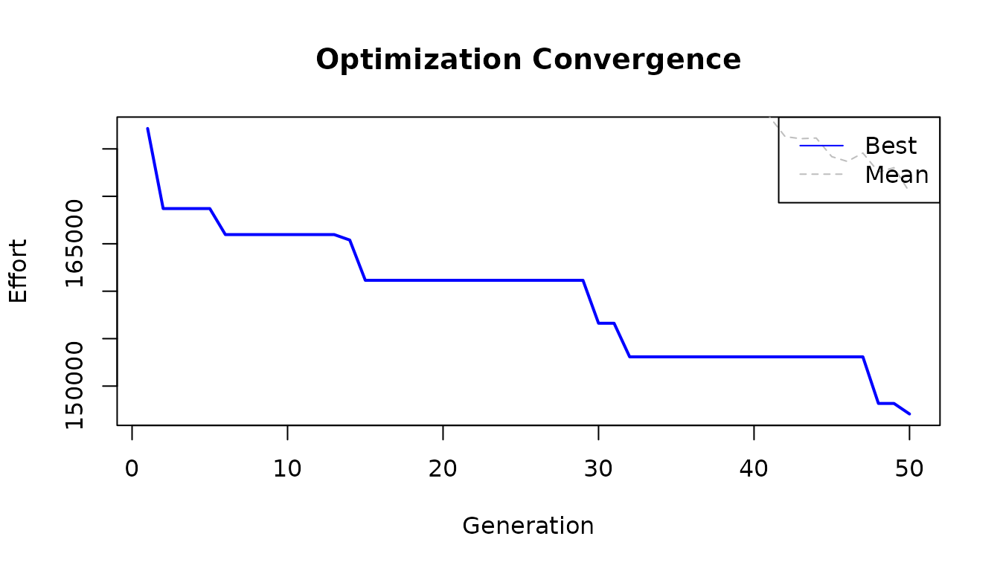

# Getting Started with lbkeyboard

This vignette provides a complete walkthrough of the lbkeyboard package,
demonstrating how to analyze, visualize, and optimize keyboard layouts.

## Setup

``` r
library(lbkeyboard)
```

## Understanding Keyboard Layouts

The package includes several built-in keyboard layouts:

- **afnor_bepo** - French BÉPO optimized layout
- **afnor_azerty** - French AZERTY layout
- **ch_qwertz** - Swiss QWERTZ layout

Visualize layouts with
[`ggkeyboard()`](https://b-rodrigues.github.io/lbkeyboard/reference/ggkeyboard.md):

``` r
# Visualize the QWERTZ layout commonly used in Luxembourg
ggkeyboard(keyboard = ch_qwertz, layout = "iso")
```

For quick console output, use
[`print_layout()`](https://b-rodrigues.github.io/lbkeyboard/reference/print_layout.md)
with the 26 letter keys:

``` r
# QWERTY layout (letters only)
qwerty <- c(
  "q", "w", "e", "r", "t", "y", "u", "i", "o", "p",
  "a", "s", "d", "f", "g", "h", "j", "k", "l",
  "z", "x", "c", "v", "b", "n", "m"
)
print_layout(qwerty)
#> ┌───┬───┬───┬───┬───┬───┬───┬───┬───┬───┐
#> │ Q │ W │ E │ R │ T │ Y │ U │ I │ O │ P │
#> ├───┼───┼───┼───┼───┼───┼───┼───┼───┘
#> │ A │ S │ D │ F │ G │ H │ J │ K │ L │
#> ├───┼───┼───┼───┼───┼───┼───┘
#> │ Z │ X │ C │ V │ B │ N │ M │
#> └───┴───┴───┴───┴───┴───┴───┘
```

## Letter Frequency Analysis

Before optimizing a layout, we need text samples to analyze. The package
includes sample texts in French, German, English, and Luxembourgish:

``` r
data("french")
data("german")
data("english")
data("luxembourguish")

# View first 200 characters of French sample
cat(substr(french, 1, 200), "...\n")
#> Warning in substr(french, 1, 200): input string 'Au commencement, Dieu créa les
#> cieux et la terre.' cannot be translated from 'ANSI_X3.4-1968' to UTF-8, but is
#> valid UTF-8
#> Warning in substr(french, 1, 200): input string 'La terre était informe et
#> vide: il y avait des ténèbres à la surface de l'abîme, et l'esprit de Dieu se
#> mouvait au-dessus des eaux.' cannot be translated from 'ANSI_X3.4-1968' to
#> UTF-8, but is valid UTF-8
#> Warning in substr(french, 1, 200): input string 'Dieu dit: Que la lumière soit!
#> Et la lumière fut.' cannot be translated from 'ANSI_X3.4-1968' to UTF-8, but is
#> valid UTF-8
#> Warning in substr(french, 1, 200): input string 'Dieu vit que la lumière était
#> bonne; et Dieu sépara la lumière d'avec les ténèbres.' cannot be translated
#> from 'ANSI_X3.4-1968' to UTF-8, but is valid UTF-8
#> Warning in substr(french, 1, 200): input string 'Dieu appela la lumière jour,
#> et il appela les ténèbres nuit. Ainsi, il y eut un soir, et il y eut un matin:
#> ce fut le premier jour.' cannot be translated from 'ANSI_X3.4-1968' to UTF-8,
#> but is valid UTF-8
#> Warning in substr(french, 1, 200): input string 'Dieu dit: Qu'il y ait une
#> étendue entre les eaux, et qu'elle sépare les eaux d'avec les eaux.' cannot be
#> translated from 'ANSI_X3.4-1968' to UTF-8, but is valid UTF-8
#> Warning in substr(french, 1, 200): input string 'Et Dieu fit l'étendue, et il
#> sépara les eaux qui sont au-dessous de l'étendue d'avec les eaux qui sont
#> au-dessus de l'étendue. Et cela fut ainsi.' cannot be translated from
#> 'ANSI_X3.4-1968' to UTF-8, but is valid UTF-8
#> Warning in substr(french, 1, 200): input string 'Dieu appela l'étendue ciel.
#> Ainsi, il y eut un soir, et il y eut un matin: ce fut le second jour.' cannot
#> be translated from 'ANSI_X3.4-1968' to UTF-8, but is valid UTF-8
#> Warning in substr(french, 1, 200): input string 'Dieu appela le sec terre, et
#> il appela l'amas des eaux mers. Dieu vit que cela était bon.' cannot be
#> translated from 'ANSI_X3.4-1968' to UTF-8, but is valid UTF-8
#> Warning in substr(french, 1, 200): input string 'Puis Dieu dit: Que la terre
#> produise de la verdure, de l'herbe portant de la semence, des arbres fruitiers
#> donnant du fruit selon leur espèce et ayant en eux leur semence sur la terre.
#> Et cela fut ainsi.' cannot be translated from 'ANSI_X3.4-1968' to UTF-8, but is
#> valid UTF-8
#> Warning in substr(french, 1, 200): input string 'La terre produisit de la
#> verdure, de l'herbe portant de la semence selon son espèce, et des arbres
#> donnant du fruit et ayant en eux leur semence selon leur espèce. Dieu vit que
#> cela était bon.' cannot be translated from 'ANSI_X3.4-1968' to UTF-8, but is
#> valid UTF-8
#> Warning in substr(french, 1, 200): input string 'Ainsi, il y eut un soir, et il
#> y eut un matin: ce fut le troisième jour.' cannot be translated from
#> 'ANSI_X3.4-1968' to UTF-8, but is valid UTF-8
#> Warning in substr(french, 1, 200): input string 'Dieu dit: Qu'il y ait des
#> luminaires dans l'étendue du ciel, pour séparer le jour d'avec la nuit; que ce
#> soient des signes pour marquer les époques, les jours et les années;' cannot be
#> translated from 'ANSI_X3.4-1968' to UTF-8, but is valid UTF-8
#> Warning in substr(french, 1, 200): input string 'et qu'ils servent de
#> luminaires dans l'étendue du ciel, pour éclairer la terre. Et cela fut ainsi.'
#> cannot be translated from 'ANSI_X3.4-1968' to UTF-8, but is valid UTF-8
#> Warning in substr(french, 1, 200): input string 'Dieu fit les deux grands
#> luminaires, le plus grand luminaire pour présider au jour, et le plus petit
#> luminaire pour présider à la nuit; il fit aussi les étoiles.' cannot be
#> translated from 'ANSI_X3.4-1968' to UTF-8, but is valid UTF-8
#> Warning in substr(french, 1, 200): input string 'Dieu les plaça dans l'étendue
#> du ciel, pour éclairer la terre,' cannot be translated from 'ANSI_X3.4-1968' to
#> UTF-8, but is valid UTF-8
#> Warning in substr(french, 1, 200): input string 'pour présider au jour et à la
#> nuit, et pour séparer la lumière d'avec les ténèbres. Dieu vit que cela était
#> bon.' cannot be translated from 'ANSI_X3.4-1968' to UTF-8, but is valid UTF-8
#> Warning in substr(french, 1, 200): input string 'Ainsi, il y eut un soir, et il
#> y eut un matin: ce fut le quatrième jour.' cannot be translated from
#> 'ANSI_X3.4-1968' to UTF-8, but is valid UTF-8
#> Warning in substr(french, 1, 200): input string 'Dieu dit: Que les eaux
#> produisent en abondance des animaux vivants, et que des oiseaux volent sur la
#> terre vers l'étendue du ciel.' cannot be translated from 'ANSI_X3.4-1968' to
#> UTF-8, but is valid UTF-8
#> Warning in substr(french, 1, 200): input string 'Dieu créa les grands poissons
#> et tous les animaux vivants qui se meuvent, et que les eaux produisirent en
#> abondance selon leur espèce; il créa aussi tout oiseau ailé selon son espèce.
#> Dieu vit que cela était bon.' cannot be translated from 'ANSI_X3.4-1968' to
#> UTF-8, but is valid UTF-8
#> Warning in substr(french, 1, 200): input string 'Dieu les bénit, en disant:
#> Soyez féconds, multipliez, et remplissez les eaux des mers; et que les oiseaux
#> multiplient sur la terre.' cannot be translated from 'ANSI_X3.4-1968' to UTF-8,
#> but is valid UTF-8
#> Warning in substr(french, 1, 200): input string 'Ainsi, il y eut un soir, et il
#> y eut un matin: ce fut le cinquième jour.' cannot be translated from
#> 'ANSI_X3.4-1968' to UTF-8, but is valid UTF-8
#> Warning in substr(french, 1, 200): input string 'Dieu dit: Que la terre
#> produise des animaux vivants selon leur espèce, du bétail, des reptiles et des
#> animaux terrestres, selon leur espèce. Et cela fut ainsi.' cannot be translated
#> from 'ANSI_X3.4-1968' to UTF-8, but is valid UTF-8
#> Warning in substr(french, 1, 200): input string 'Dieu fit les animaux de la
#> terre selon leur espèce, le bétail selon son espèce, et tous les reptiles de la
#> terre selon leur espèce. Dieu vit que cela était bon.' cannot be translated
#> from 'ANSI_X3.4-1968' to UTF-8, but is valid UTF-8
#> Warning in substr(french, 1, 200): input string 'Puis Dieu dit: Faisons l'homme
#> à notre image, selon notre ressemblance, et qu'il domine sur les poissons de la
#> mer, sur les oiseaux du ciel, sur le bétail, sur toute la terre, et sur tous
#> les reptiles qui rampent sur la terre.' cannot be translated from
#> 'ANSI_X3.4-1968' to UTF-8, but is valid UTF-8
#> Warning in substr(french, 1, 200): input string 'Dieu créa l'homme à son image,
#> il le créa à l'image de Dieu, il créa l'homme et la femme.' cannot be
#> translated from 'ANSI_X3.4-1968' to UTF-8, but is valid UTF-8
#> Warning in substr(french, 1, 200): input string 'Dieu les bénit, et Dieu leur
#> dit: Soyez féconds, multipliez, remplissez la terre, et l'assujettissez; et
#> dominez sur les poissons de la mer, sur les oiseaux du ciel, et sur tout animal
#> qui se meut sur la terre.' cannot be translated from 'ANSI_X3.4-1968' to UTF-8,
#> but is valid UTF-8
#> Warning in substr(french, 1, 200): input string 'Et Dieu dit: Voici, je vous
#> donne toute herbe portant de la semence et qui est à la surface de toute la
#> terre, et tout arbre ayant en lui du fruit d'arbre et portant de la semence: ce
#> sera votre nourriture.' cannot be translated from 'ANSI_X3.4-1968' to UTF-8,
#> but is valid UTF-8
#> Warning in substr(french, 1, 200): input string 'Et à tout animal de la terre,
#> à tout oiseau du ciel, et à tout ce qui se meut sur la terre, ayant en soi un
#> souffle de vie, je donne toute herbe verte pour nourriture. Et cela fut ainsi.'
#> cannot be translated from 'ANSI_X3.4-1968' to UTF-8, but is valid UTF-8
#> Warning in substr(french, 1, 200): input string 'Dieu vit tout ce qu'il avait
#> fait et voici, cela était très bon. Ainsi, il y eut un soir, et il y eut un
#> matin: ce fut le sixième jour.' cannot be translated from 'ANSI_X3.4-1968' to
#> UTF-8, but is valid UTF-8
#> Warning in substr(french, 1, 200): input string 'Joe Paterno, né le 21 décembre
#> 1926 à Brooklyn et mort le 22 janvier 2012 à State College, est un joueur et
#> entraîneur américain de football américain universitaire. Figure historique et
#> emblématique des Nittany Lions de Penn State entre 1966 et 2011, il est
#> l'entraîneur le plus victorieux de l'histoire du football américain
#> universitaire avec 409 succès en Division I. Son image est toutefois ternie en
#> fin de carrière à cause de soupçons de négligence dans une affaire d'agressions
#> sexuelles sur mineurs.' cannot be translated from 'ANSI_X3.4-1968' to UTF-8,
#> but is valid UTF-8
#> Warning in substr(french, 1, 200): input string 'Lors de ses brillantes études
#> de droit à l'université Brown, Joe Paterno joue au football américain et est
#> entraîné par Rip Engle. Ce dernier, embauché par l'université de Penn State, le
#> recrute comme entraîneur assistant en 1950. Pendant quinze saisons, l'assistant
#> fait ses preuves avant de devenir entraîneur principal des Nittany Lions en
#> 1965. Surnommé JoePa, il connaît rapidement le succès. Invaincu en 1968 et
#> 1969, il est désiré par plusieurs franchises de la National Football League
#> (NFL), mais refuse pour conserver son rôle d'éducateur. Entraîneur de l'équipe
#> universitaire championne en 1982 et 1986, vainqueur des quatre principaux Bowls
#> universitaires, il intègre le College Football Hall of Fame en 2007 alors qu'il
#> est encore en activité, un accomplissement rare.' cannot be translated from
#> 'ANSI_X3.4-1968' to UTF-8, but is valid UTF-8
#> Warning in substr(french, 1, 200): input string 'Reconnu pour ses succès
#> sportifs, académiques et son exemplarité, JoePa est adulé comme une icône
#> populaire dans la région de State College. Onze jours après avoir célébré sa
#> 409e victoire avec les Lions, il est démis de ses fonctions à la suite du
#> scandale des agressions sexuelles de l'Université d'État de Pennsylvanie.
#> Accusé d'avoir couvert les abus sexuels de Jerry Sandusky, son image est ternie
#> par cette affaire au retentissement international. Il meurt deux mois plus tard
#> des suites d'un cancer du poumon.' cannot be translated from 'ANSI_X3.4-1968'
#> to UTF-8, but is valid UTF-8
#> Warning in substr(french, 1, 200): input string 'Chacun peut publier
#> immédiatement du contenu en ligne, à condition de respecter les règles
#> essentielles établies par la Fondation Wikimedia et par la communauté ; par
#> exemple, la vérifiabilité du contenu, l'admissibilité des articles et garder
#> une attitude cordiale.' cannot be translated from 'ANSI_X3.4-1968' to UTF-8,
#> but is valid UTF-8
#> Warning in substr(french, 1, 200): input string 'De nombreuses pages d’aide
#> sont à votre disposition, notamment pour créer un article, modifier un article
#> ou insérer une image. N’hésitez pas à poser une question pour être aidé dans
#> vos premiers pas, notamment dans un des projets thématiques ou dans divers
#> espaces de discussion.' cannot be translated from 'ANSI_X3.4-1968' to UTF-8,
#> but is valid UTF-8
#> Warning in substr(french, 1, 200): input string 'Les pages de discussion
#> servent à centraliser les réflexions et les remarques permettant d’améliorer
#> les articles.' cannot be translated from 'ANSI_X3.4-1968' to UTF-8, but is
#> valid UTF-8
#> Warning in substr(french, 1, 200): input string 'En 1894, l’explorateur Gustav
#> Adolf von Götzen suivait les traces d’un missionnaire en provenance de la cote
#> orientale d’Afrique. Pendant qu’il se rendait au Rwanda, il découvre un petit
#> village des pécheurs appelé Ngoma qui traduit signifie tam tam, par déformation
#> il écrivit Goma. Ngoma devint un poste belge en face de celui de Rubavu (au
#> Rwanda) habité par les Allemands. Au début, la cohabitation entre ces deux
#> postes n’était pas facile. À un certain moment, les chefs coutumiers du Rwanda,
#> en complicité avec les Allemands attaquent les Belges de Goma. Ces derniers se
#> réfugient à Bukavu et laissent les envahisseurs occuper la ville. Après des
#> négociations, les Allemands replient vers le Rwanda et les Belges reprennent
#> leur position initiale comme poste colonial. L’afflux des colonisateurs dans ce
#> village joue un rôle important dans son évolution pour devenir une grande
#> agglomération. Les colonisateurs venaient d’installer le chef lieu du [...
#> truncated]
#> Warning in substr(french, 1, 200): input string 'En ce moment, Goma reste un
#> poste de transaction lacustre avec Bukavu qui était une ville minière. Plus
#> tard, Rutshuru, Masisi, Kalehe, Gisenyi, etc. déverseront leurs populations
#> dans Goma, à la rechercher de l’emploi au près des colonisateurs. C’est en
#> cette période que vu le jour le quartier Birere (un bidonville de Goma) autour
#> des entrepôts, bureaux et habitations des colons. Le nom Birere (littéralement
#> feuilles de bananier) vient du fait qu’à l’époque, les gens y construisaient en
#> feuilles des bananiers.' cannot be translated from 'ANSI_X3.4-1968' to UTF-8,
#> but is valid UTF-8
#> Warning in substr(french, 1, 200): input string 'La ville est la base arrière
#> de l'opération Turquoise organisée en 1994 à la fin du génocide rwandais.'
#> cannot be translated from 'ANSI_X3.4-1968' to UTF-8, but is valid UTF-8
#> Warning in substr(french, 1, 200): input string 'La ville et ses environs
#> abriteront dans des camps autour de 650 000 réfugiés hutus de 1994 jusqu'à la
#> chute du Zaïre, dont certains supposés anciens génocidaires. Selon des ONG,
#> l'AFDL procède à des massacres dans les camps entre 1996 et 19971.' cannot be
#> translated from 'ANSI_X3.4-1968' to UTF-8, but is valid UTF-8
#> Warning in substr(french, 1, 200): input string 'De 1998 à 2002/2003, la ville,
#> sous contrôle du Rassemblement congolais pour la démocratie (RCD) pro-rwandais
#> échappe au contrôle du gouvernement congolais.' cannot be translated from
#> 'ANSI_X3.4-1968' to UTF-8, but is valid UTF-8
#> Warning in substr(french, 1, 200): input string 'De nombreux viols, massacres
#> et crimes de guerre y ont été perpétrés entre 1996 et 2006 par les troupes des
#> généraux rebelles du RCD, essentiellement sous les généraux Nkundabatware et
#> Mutebusi.' cannot be translated from 'ANSI_X3.4-1968' to UTF-8, but is valid
#> UTF-8
#> Warning in substr(french, 1, 200): input string 'En 2002, le Nyiragongo entra
#> en éruption, et une coulée de lave atteignit le centre de la ville. La lave n'a
#> pas atteint le lac Kivu fort heureusement, en effet ce lac est un lac
#> méromictique et un changement brutal de chaleur aurait des conséquences graves
#> : Éruption limnique.' cannot be translated from 'ANSI_X3.4-1968' to UTF-8, but
#> is valid UTF-8
#> Warning in substr(french, 1, 200): input string 'Débordant de populations
#> fuyant les violences, Goma compte en 2012 plus de 400 000 habitants. Ceux qui
#> ne peuvent pas trouver d'abri remplissent les camps de réfugiés, où l'ONU et
#> les ONG se débattent pour leur fournir nourriture, eau et combustible.' cannot
#> be translated from 'ANSI_X3.4-1968' to UTF-8, but is valid UTF-8
#> Au commencement, Dieu créa les cieux et la terre. La terre était informe et vide: il y avait des ténèbres à la surface de l'abîme, et l'esprit de Dieu se mouvait au-dessus des eaux. Dieu dit: Que la lumière soit! Et la lumière fut. Dieu vit que la lumière était bonne; et Dieu sépara la lumière d'avec les ténèbres. Dieu appela la lumière jour, et il appela les ténèbres nuit. Ainsi, il y eut un soir, et il y eut un matin: ce fut le premier jour. Dieu dit: Qu'il y ait une étendue entre les eaux, et qu'elle sépare les eaux d'avec les eaux. Et Dieu fit l'étendue, et il sépara les eaux qui sont au-dessous de l'étendue d'avec les eaux qui sont au-dessus de l'étendue. Et cela fut ainsi. Dieu appela l'étendue ciel. Ainsi, il y eut un soir, et il y eut un matin: ce fut le second jour. Dieu dit: Que les eaux qui sont au-dessous du ciel se rassemblent en un seul lieu, et que le sec paraisse. Et cela fut ainsi. Dieu appela le sec terre, et il appela l'amas des eaux mers. Dieu vit que cela était bon. Puis Dieu dit: Que la terre produise de la verdure, de l'herbe portant de la semence, des arbres fruitiers donnant du fruit selon leur espèce et ayant en eux leur semence sur la terre. Et cela fut ain La terre produisit de la verdure, de l'herbe portant de la semence selon son espèce, et des arbres donnant du fruit et ayant en eux leur semence selon leur espèce. Dieu vit que cela était bon. Ainsi, il y eut un soir, et il y eut un matin: ce fut le troisième jour. Dieu dit: Qu'il y ait des luminaires dans l'étendue du ciel, pour séparer le jour d'avec la nuit; que ce soient des signes pour marquer les époques, les jours et les années; et qu'ils servent de luminaires dans l'étendue du ciel, pour éclairer la terre. Et cela fut ainsi. Dieu fit les deux grands luminaires, le plus grand luminaire pour présider au jour, et le plus petit luminaire pour présider à la nuit; il fit aussi les étoiles. Dieu les plaça dans l'étendue du ciel, pour éclairer la terre, pour présider au jour et à la nuit, et pour séparer la lumière d'avec les ténèbres. Dieu vit que cela était bon. Ainsi, il y eut un soir, et il y eut un matin: ce fut le quatrième jour. Dieu dit: Que les eaux produisent en abondance des animaux vivants, et que des oiseaux volent sur la terre vers l'étendue du ciel. Dieu créa les grands poissons et tous les animaux vivants qui se meuvent, et que les eaux produisirent en abondance selon leur espèce; il créa aussi tout oiseau ailé selon son espèce. Dieu vit que cel Dieu les bénit, en disant: Soyez féconds, multipliez, et remplissez les eaux des mers; et que les oiseaux multiplient sur la terre. Ainsi, il y eut un soir, et il y eut un matin: ce fut le cinquième jour. Dieu dit: Que la terre produise des animaux vivants selon leur espèce, du bétail, des reptiles et des animaux terrestres, selon leur espèce. Et cela fut ainsi. Dieu fit les animaux de la terre selon leur espèce, le bétail selon son espèce, et tous les reptiles de la terre selon leur espèce. Dieu vit que cela était bon. Puis Dieu dit: Faisons l'homme à notre image, selon notre ressemblance, et qu'il domine sur les poissons de la mer, sur les oiseaux du ciel, sur le bétail, sur toute la terre, et sur tous les reptiles Dieu créa l'homme à son image, il le créa à l'image de Dieu, il créa l'homme et la femme. Dieu les bénit, et Dieu leur dit: Soyez féconds, multipliez, remplissez la terre, et l'assujettissez; et dominez sur les poissons de la mer, sur les oiseaux du ciel, et sur tout animal qui se meut sur Et Dieu dit: Voici, je vous donne toute herbe portant de la semence et qui est à la surface de toute la terre, et tout arbre ayant en lui du fruit d'arbre et portant de la semence: ce sera votre nourr Et à tout animal de la terre, à tout oiseau du ciel, et à tout ce qui se meut sur la terre, ayant en soi un souffle de vie, je donne toute herbe verte pour nourriture. Et cela fut ainsi. Dieu vit tout ce qu'il avait fait et voici, cela était très bon. Ainsi, il y eut un soir, et il y eut un matin: ce fut le sixième jour. Joe Paterno, né le 21 décembre 1926 à Brooklyn et mort le 22 janvier 2012 à State College, est un joueur et entraîneur américain de football américain universitaire. Figure historique et emblématique   Lors de ses brillantes études de droit à l'université Brown, Joe Paterno joue au football américain et est entraîné par Rip Engle. Ce dernier, embauché par l'université de Penn State, le recrute comme  Reconnu pour ses succès sportifs, académiques et son exemplarité, JoePa est adulé comme une icône populaire dans la région de State College. Onze jours après avoir célébré sa 409e victoire avec les Li Chacun peut publier immédiatement du contenu en ligne, à condition de respecter les règles essentielles établies par la Fondation Wikimedia et par la communauté ; par exemple, la vérifiabilité du cont  De nombreuses pages d’aide sont à votre disposition, notamment pour créer un article, modifier un article ou insérer une image. N’hésitez pas à poser une question pour être aidé dans vos premiers pas,  Les pages de discussion servent à centraliser les réflexions et les remarques permettant d’améliorer les articles. En 1894, l’explorateur Gustav Adolf von Götzen suivait les traces d’un missionnaire en provenance de la cote orientale d’Afrique. Pendant qu’il se rendait au Rwanda, il découvre un petit village des p  En ce moment, Goma reste un poste de transaction lacustre avec Bukavu qui était une ville minière. Plus tard, Rutshuru, Masisi, Kalehe, Gisenyi, etc. déverseront leurs populations dans Goma, à la rech  La ville est la base arrière de l'opération Turquoise organisée en 1994 à la fin du génocide rwandais.  La ville et ses environs abriteront dans des camps autour de 650 000 réfugiés hutus de 1994 jusqu'à la chute du Zaïre, dont certains supposés anciens génocidaires. Selon des ONG, l'AFDL procède à des   De 1998 à 2002/2003, la ville, sous contrôle du Rassemblement congolais pour la démocratie (RCD) pro-rwandais échappe au contrôle du gouvernement congolais.  De nombreux viols, massacres et crimes de guerre y ont été perpétrés entre 1996 et 2006 par les troupes des généraux rebelles du RCD, essentiellement sous les généraux Nkundabatware et Mutebusi.  En 2002, le Nyiragongo entra en éruption, et une coulée de lave atteignit le centre de la ville. La lave n'a pas atteint le lac Kivu fort heureusement, en effet ce lac est un lac méromictique et un ch  Débordant de populations fuyant les violences, Goma compte en 2012 plus de 400 000 habitants. Ceux qui ne peuvent pas trouver d'abri remplissent les camps de réfugiés, où l'ONU et les ONG se débattent ...
```

Calculate letter frequencies:

``` r
freq_french <- letter_freq(french)
head(freq_french, 10)
#>    characters total    scaled frequencies
#> 1           e  1128 1.0000000  0.15401420
#> 2           s   572 0.5066548  0.07809940
#> 3           i   559 0.4951198  0.07632441
#> 4           t   551 0.4880213  0.07523211
#> 5           a   547 0.4844720  0.07468596
#> 6           u   515 0.4560781  0.07031677
#> 7           r   494 0.4374445  0.06744948
#> 8           n   491 0.4347826  0.06703987
#> 9           l   462 0.4090506  0.06308028
#> 10          o   347 0.3070098  0.04737848
```

## Creating Heatmaps

Visualize which keys are used most frequently with heatmaps:

``` r
heatmap_data <- heatmapize(ch_qwertz, freq_french)
ggkeyboard(heatmap_data)
```

The color intensity shows key usage - brighter colors indicate more
frequent keys. An ideal layout would have the brightest keys on the home
row.

## Calculating Typing Effort

The package uses a Carpalx-inspired effort model. Calculate effort for
any layout:

``` r
effort <- calculate_layout_effort(
  keyboard = ch_qwertz,
  text_samples = french,
  breakdown = TRUE
)

effort
#> $base_effort
#> [1] 19294.56
#> 
#> $same_finger_effort
#> [1] 4883.69
#> 
#> $same_hand_effort
#> [1] 1999.5
#> 
#> $row_change_effort
#> [1] 967.8
#> 
#> $trigram_effort
#> [1] 3456
#> 
#> $total_effort
#> [1] 37465.83
#> 
#> $same_finger_bigrams
#> [1] 866
#> 
#> $same_hand_bigrams
#> [1] 2690
#> 
#> $hand_alternations
#> [1] 3546
#> 
#> $same_hand_trigrams
#> [1] 1833
```

The effort components are:

- **base_effort** - Cost of reaching each key
- **same_finger_effort** - Penalty for consecutive keys using same
  finger
- **same_hand_effort** - Penalty for same-hand sequences
- **row_change_effort** - Penalty for switching rows within hand

## Comparing Layouts

Compare multiple layouts to find the best for your text:

``` r
comparison <- compare_layouts(
  keyboards = list(
    QWERTZ = ch_qwertz,
    BEPO = afnor_bepo,
    AZERTY = afnor_azerty
  ),
  text_samples = french
)

comparison
#>   layout   effort rank relative
#> 1   BEPO 17949.71    1 100.0000
#> 2 AZERTY 37377.11    2 208.2324
#> 3 QWERTZ 37465.83    3 208.7267
```

Lower effort is better. The `relative` column shows effort as a
percentage of the best layout.

## Optimizing a Layout

Now let’s optimize a layout using the genetic algorithm:

``` r
result <- optimize_layout(
  text_samples = c(french, luxembourguish),
  generations = 50,  # Use more (200-500) for better results
  population_size = 50,
  verbose = FALSE
)
#> Warning: input string 'é' cannot be translated from 'ANSI_X3.4-1968' to UTF-8,
#> but is valid UTF-8
#> Warning: input string 'è' cannot be translated from 'ANSI_X3.4-1968' to UTF-8,
#> but is valid UTF-8
#> Warning: input string 'ä' cannot be translated from 'ANSI_X3.4-1968' to UTF-8,
#> but is valid UTF-8
#> Warning: input string 'ü' cannot be translated from 'ANSI_X3.4-1968' to UTF-8,
#> but is valid UTF-8
#> Warning: input string 'é' cannot be translated from 'ANSI_X3.4-1968' to UTF-8,
#> but is valid UTF-8
#> Warning: input string 'è' cannot be translated from 'ANSI_X3.4-1968' to UTF-8,
#> but is valid UTF-8
#> Warning: input string 'ä' cannot be translated from 'ANSI_X3.4-1968' to UTF-8,
#> but is valid UTF-8
#> Warning: input string 'ü' cannot be translated from 'ANSI_X3.4-1968' to UTF-8,
#> but is valid UTF-8
#> Warning in optimize_layout(text_samples = c(french, luxembourguish),
#> generations = 50, : input string '26 De Jesus sot zu sengen Apostelen: "Fäert
#> d’Mënschen net! Et ass nämlech näischt zougedeckt, wat net géif opgedeckt ginn,
#> an et ass näischt verbuergen, wat net géif bekannt ginn.' cannot be translated
#> from 'ANSI_X3.4-1968' to UTF-8, but is valid UTF-8
#> Warning in optimize_layout(text_samples = c(french, luxembourguish),
#> generations = 50, : input string '27 Wat ech iech an der däischterer Nuecht
#> soen, dat verzielt am hellen Do! A wat dir an d’Ouer gepëspert kritt, dat
#> verkënnegt op den Diech!' cannot be translated from 'ANSI_X3.4-1968' to UTF-8,
#> but is valid UTF-8
#> Warning in optimize_layout(text_samples = c(french, luxembourguish),
#> generations = 50, : input string '28 Fäert net déi, déi zwar de Kierper
#> doutmaachen, ma déi d’Séil net doutmaache kënnen! Fäert villméi deen, deen
#> esouwuel d’Séil wéi och de Kierper an der Häll zerstéiere kann!' cannot be
#> translated from 'ANSI_X3.4-1968' to UTF-8, but is valid UTF-8
#> Warning in optimize_layout(text_samples = c(french, luxembourguish),
#> generations = 50, : input string '29 Ginn net zwéi Spatze fir een Zantimm
#> verkaaft? An dach, ouni äre Papp fällt net een eenzege vun hinnen op de Buedem
#> erof.' cannot be translated from 'ANSI_X3.4-1968' to UTF-8, but is valid UTF-8
#> Warning in optimize_layout(text_samples = c(french, luxembourguish),
#> generations = 50, : input string '30 Bei iech awer sinn esouguer d’Hoer um Kapp
#> alleguer gezielt.' cannot be translated from 'ANSI_X3.4-1968' to UTF-8, but is
#> valid UTF-8
#> Warning in optimize_layout(text_samples = c(french, luxembourguish),
#> generations = 50, : input string '31 Fäert also net! Dir sidd méi wäert wéi déi
#> sëllege Spatzen.' cannot be translated from 'ANSI_X3.4-1968' to UTF-8, but is
#> valid UTF-8
#> Warning in optimize_layout(text_samples = c(french, luxembourguish),
#> generations = 50, : input string '32 Wien zu mir hält bei de Mënschen, zu deem
#> halen och ech bei mengem Papp am Himmel.' cannot be translated from
#> 'ANSI_X3.4-1968' to UTF-8, but is valid UTF-8
#> Warning in optimize_layout(text_samples = c(french, luxembourguish),
#> generations = 50, : input string '33 Wie mech awer verleegent virun de
#> Mënschen, dee verleegenen och ech viru mengem Papp am Himmel."' cannot be
#> translated from 'ANSI_X3.4-1968' to UTF-8, but is valid UTF-8
#> Warning in optimize_layout(text_samples = c(french, luxembourguish),
#> generations = 50, : input string '38 De Jesus sot zu senge Jünger: "Dir hutt
#> héieren, datt gesot ginn ass: A fir A, an Zant fir Zant.' cannot be translated
#> from 'ANSI_X3.4-1968' to UTF-8, but is valid UTF-8
#> Warning in optimize_layout(text_samples = c(french, luxembourguish),
#> generations = 50, : input string '39 Ech awer soen iech: Leescht deem Béise kee
#> Widderstand! Am Géigendeel: Wann een dir eng op dee rietse Bak gëtt, dann hal
#> him och deen aneren duer!' cannot be translated from 'ANSI_X3.4-1968' to UTF-8,
#> but is valid UTF-8
#> Warning in optimize_layout(text_samples = c(french, luxembourguish),
#> generations = 50, : input string '40 A wann een dir de Prozess maachen an däin
#> Hiem huele wëllt, da looss him och de Mantel!' cannot be translated from
#> 'ANSI_X3.4-1968' to UTF-8, but is valid UTF-8
#> Warning in optimize_layout(text_samples = c(french, luxembourguish),
#> generations = 50, : input string '41 A wann een dech zwéngt, eng Meil mat him
#> ze goen, da géi der zwou mat him!' cannot be translated from 'ANSI_X3.4-1968'
#> to UTF-8, but is valid UTF-8
#> Warning in optimize_layout(text_samples = c(french, luxembourguish),
#> generations = 50, : input string '42 A wann een dech fir eppes freet, da gëff
#> him et, a wann een eppes vun dir léine wëllt, dann dréi him net de Réck!'
#> cannot be translated from 'ANSI_X3.4-1968' to UTF-8, but is valid UTF-8
#> Warning in optimize_layout(text_samples = c(french, luxembourguish),
#> generations = 50, : input string '43 Dir hutt héieren, datt gesot ginn ass: Du
#> solls däin Nächste gär hunn, an du solls däi Feind haassen!' cannot be
#> translated from 'ANSI_X3.4-1968' to UTF-8, but is valid UTF-8
#> Warning in optimize_layout(text_samples = c(french, luxembourguish),
#> generations = 50, : input string '44 Ech awer soen iech: Hutt är Feinde gär a
#> biet fir déi, déi iech verfollegen,' cannot be translated from 'ANSI_X3.4-1968'
#> to UTF-8, but is valid UTF-8
#> Warning in optimize_layout(text_samples = c(french, luxembourguish),
#> generations = 50, : input string '45 fir datt dir Kanner vun ärem Papp am
#> Himmel gitt! Hie léisst nämlech seng Sonn opgoen iwwer deene Béise grad ewéi
#> iwwer deene Gudden, an hie léisst et reenen op déi Gerecht grad ewéi op déi
#> Ongerecht.' cannot be translated from 'ANSI_X3.4-1968' to UTF-8, but is valid
#> UTF-8
#> Warning in optimize_layout(text_samples = c(french, luxembourguish),
#> generations = 50, : input string '46 Wann dir nëmmen déi gär hutt, déi iech gär
#> hunn, wat fir e Loun sollt dir duerfir kréien? Maachen net och
#> d’Steierandreiwer dat?' cannot be translated from 'ANSI_X3.4-1968' to UTF-8,
#> but is valid UTF-8
#> Warning in optimize_layout(text_samples = c(french, luxembourguish),
#> generations = 50, : input string '47 A wann dir nëmmen är Gesëschter gréisst,
#> wat maacht dir dann Extraes? Maachen net och d’Heeden dat?' cannot be
#> translated from 'ANSI_X3.4-1968' to UTF-8, but is valid UTF-8
#> Warning in optimize_layout(text_samples = c(french, luxembourguish),
#> generations = 50, : input string '48 Dir sollt also vollkomme sinn, esou wéi
#> äre Papp am Himmel vollkommen ass."' cannot be translated from 'ANSI_X3.4-1968'
#> to UTF-8, but is valid UTF-8
#> Warning in optimize_layout(text_samples = c(french, luxembourguish),
#> generations = 50, : input string '13 Wéi de Jesus aus Galiläa erof un de Jordan
#> bei de Johannes komm ass, fir sech vun him deefen ze loossen,' cannot be
#> translated from 'ANSI_X3.4-1968' to UTF-8, but is valid UTF-8
#> Warning in optimize_layout(text_samples = c(french, luxembourguish),
#> generations = 50, : input string '14 wollt de Johannes hien dovun ofhalen a sot
#> zu him: “Ech hätt et néideg, fir mech vun dir deefen ze loossen, an du kënns
#> bei mech?”' cannot be translated from 'ANSI_X3.4-1968' to UTF-8, but is valid
#> UTF-8
#> Warning in optimize_layout(text_samples = c(french, luxembourguish),
#> generations = 50, : input string '15 De Jesus huet him geäntwert: “Looss
#> gewäerden! Et ass nämlech un äis, déi ganz Gerechtegkeet z’erfëllen.” Dunn huet
#> de Johannes de Jesus gewäerde gelooss.' cannot be translated from
#> 'ANSI_X3.4-1968' to UTF-8, but is valid UTF-8
#> Warning in optimize_layout(text_samples = c(french, luxembourguish),
#> generations = 50, : input string '16 Soubal wéi de Jesus gedeeft war, ass hien
#> aus dem Waasser eropkomm. A kuck, den Himmel ass opgemaach ginn, an de Jesus
#> huet dem Herrgott säi Geescht gesinn op sech erofkomme wéi eng Dauf.' cannot be
#> translated from 'ANSI_X3.4-1968' to UTF-8, but is valid UTF-8
#> Warning in optimize_layout(text_samples = c(french, luxembourguish),
#> generations = 50, : input string '17 An eng Stëmm aus dem Himmel sot: “Dat hei
#> ass mäi Jong, an ech hunn hie gär; hie steet a menger Gonscht!”' cannot be
#> translated from 'ANSI_X3.4-1968' to UTF-8, but is valid UTF-8
#> Warning in optimize_layout(text_samples = c(french, luxembourguish),
#> generations = 50, : input string '1 Wéi et deen éischten Dag vun der Woch, also
#> den Dag nom Sabbat, hell ginn ass, sinn d’Maria vu Magdala an déi aner Maria
#> nom Graf kucke gaang.' cannot be translated from 'ANSI_X3.4-1968' to UTF-8, but
#> is valid UTF-8
#> Warning in optimize_layout(text_samples = c(french, luxembourguish),
#> generations = 50, : input string '2 An hei, op eemol huet de Buedem ugefaang,
#> ferm ze zidderen: Dem Här säin Engel ass nämlech vum Himmel erofkomm, hien ass
#> dohi gaang, huet de Steen ewechgerullt an huet sech dropgesat.' cannot be
#> translated from 'ANSI_X3.4-1968' to UTF-8, but is valid UTF-8
#> Warning in optimize_layout(text_samples = c(french, luxembourguish),
#> generations = 50, : input string '3 Hien huet ausgesi wéi e Blëtz, an säi Kleed
#> war wäiss wéi Schnéi.' cannot be translated from 'ANSI_X3.4-1968' to UTF-8, but
#> is valid UTF-8
#> Warning in optimize_layout(text_samples = c(french, luxembourguish),
#> generations = 50, : input string '4 D’Wiechter hu geziddert, esou eng Angscht
#> haten si virun him, an si ware wéi dout.' cannot be translated from
#> 'ANSI_X3.4-1968' to UTF-8, but is valid UTF-8
#> Warning in optimize_layout(text_samples = c(french, luxembourguish),
#> generations = 50, : input string '5 Dunn huet den Engel zu de Frae gesot:
#> "Fäert net! Ech weess, dir sicht de Jesus, dee Gekräizegten.' cannot be
#> translated from 'ANSI_X3.4-1968' to UTF-8, but is valid UTF-8
#> Warning in optimize_layout(text_samples = c(french, luxembourguish),
#> generations = 50, : input string '6 Hien ass net hei: Hien ass aus dem Doud
#> erwächt ginn, esou wéi hie gesot hat. Kommt heihinner, kuckt d’Plaz, wou hie
#> louch!' cannot be translated from 'ANSI_X3.4-1968' to UTF-8, but is valid UTF-8
#> Warning in optimize_layout(text_samples = c(french, luxembourguish),
#> generations = 50, : input string '7 An da gitt séier a sot senge Jünger: ’Hien
#> ass aus dem Doud erwächt ginn! Hie geet iech viraus a Galiläa; do kritt dir
#> hien ze gesinn.’ Kuckt, ech hunn iech et gesot!"' cannot be translated from
#> 'ANSI_X3.4-1968' to UTF-8, but is valid UTF-8
#> Warning in optimize_layout(text_samples = c(french, luxembourguish),
#> generations = 50, : input string '8 Huerteg sinn si vum Graf fortgaang, voller
#> Angscht, ma och mat grousser Freed, an si si gelaf, fir de Jünger et ze
#> verzielen.' cannot be translated from 'ANSI_X3.4-1968' to UTF-8, but is valid
#> UTF-8
#> Warning in optimize_layout(text_samples = c(french, luxembourguish),
#> generations = 50, : input string '9 A kuck, de Jesus ass hinne begéint a sot:
#> “Freet iech!” Si sinn op hien duergaang, hunn sech virun him niddergehäit an
#> hunn hien ugebiet.' cannot be translated from 'ANSI_X3.4-1968' to UTF-8, but is
#> valid UTF-8
#> Warning in optimize_layout(text_samples = c(french, luxembourguish),
#> generations = 50, : input string '10 Du sot de Jesus zu hinnen: “Fäert net!
#> Gitt a sot menge Bridder, datt si a Galiläa goe sollen; do kréien si mech ze
#> gesinn.”' cannot be translated from 'ANSI_X3.4-1968' to UTF-8, but is valid
#> UTF-8
#> Warning in optimize_layout(text_samples = c(french, luxembourguish),
#> generations = 50, : input string '5 De Jesus ass bis bei eng Stad a Samaria
#> komm, déi Sychar heescht an déi no bei deem Stéck läit, dat de Jakob sengem
#> Jong Jouseph ginn hat.' cannot be translated from 'ANSI_X3.4-1968' to UTF-8,
#> but is valid UTF-8
#> Warning in optimize_layout(text_samples = c(french, luxembourguish),
#> generations = 50, : input string '6 Do war de Jakobsbur. Well de Jesus midd war
#> vun der Rees, huet hien sech bei de Bur gesat; et war ëm déi sechst Stonn.'
#> cannot be translated from 'ANSI_X3.4-1968' to UTF-8, but is valid UTF-8
#> Warning in optimize_layout(text_samples = c(french, luxembourguish),
#> generations = 50, : input string '7 Du koum eng Fra aus Samaria, fir Waasser ze
#> schäffen. De Jesus sot zu hir: “Gëff mir ze drénken!”' cannot be translated
#> from 'ANSI_X3.4-1968' to UTF-8, but is valid UTF-8
#> Warning in optimize_layout(text_samples = c(french, luxembourguish),
#> generations = 50, : input string '8 Seng Jünger waren nämlech fort an d’Stad
#> gaang, fir eppes z’iessen ze kafen.' cannot be translated from 'ANSI_X3.4-1968'
#> to UTF-8, but is valid UTF-8
#> Warning in optimize_layout(text_samples = c(french, luxembourguish),
#> generations = 50, : input string '9 Du sot déi samaritesch Fra zu him: “Wéi
#> kënnt et, datt s du, e Judd, mech, eng samaritesch Fra, fir eppes ze drénke
#> frees?” – D’Judden halen sech nämlech net mat de Samariter op. –' cannot be
#> translated from 'ANSI_X3.4-1968' to UTF-8, but is valid UTF-8
#> Warning in optimize_layout(text_samples = c(french, luxembourguish),
#> generations = 50, : input string '10 De Jesus huet hir geäntwert: “Wann s du
#> dem Herrgott seng Gof kenne géifs a wann s du wéisst, wien et ass, deen zu dir
#> seet: ’Gëff mir ze drénken!’, da géifs du hie froen, an hie géif dir liewegt
#> Waasser ginn!”' cannot be translated from 'ANSI_X3.4-1968' to UTF-8, but is
#> valid UTF-8
#> Warning in optimize_layout(text_samples = c(french, luxembourguish),
#> generations = 50, : input string '11 D’Fra sot zu him: "Här, du hues näischt
#> fir ze schäffen, an de Pëtz ass déif. Wou hues du dann dat liewegt Waasser
#> hier?' cannot be translated from 'ANSI_X3.4-1968' to UTF-8, but is valid UTF-8
#> Warning in optimize_layout(text_samples = c(french, luxembourguish),
#> generations = 50, : input string '12 Bass du éire méi dichteg wéi eise Papp, de
#> Jakob, deen äis de Pëtz ginn huet a selwer draus gedronk huet, grad ewéi seng
#> Jongen an all säi Véi?”' cannot be translated from 'ANSI_X3.4-1968' to UTF-8,
#> but is valid UTF-8
#> Warning in optimize_layout(text_samples = c(french, luxembourguish),
#> generations = 50, : input string '13 De Jesus huet hir geäntwert: "Jiddereen,
#> dee vun dësem Waasser drénkt, gëtt nees duuschtereg.' cannot be translated from
#> 'ANSI_X3.4-1968' to UTF-8, but is valid UTF-8
#> Warning in optimize_layout(text_samples = c(french, luxembourguish),
#> generations = 50, : input string '14 Wien awer vun deem Waasser drénkt, dat ech
#> him ginn, dee gëtt an all Éiwegkeet net méi duuschtereg, ma dat Waasser, dat
#> ech him ginn, gëtt an him eng Quell mat spruddelegem Waasser, dat éiwegt Liewe
#> schenkt.”' cannot be translated from 'ANSI_X3.4-1968' to UTF-8, but is valid
#> UTF-8
#> Warning in optimize_layout(text_samples = c(french, luxembourguish),
#> generations = 50, : input string '15 D’Fra sot zu him: "Här, gëff mir däers
#> Waasser, fir datt ech net méi duuschtereg ginn an net méi heihinner ze komme
#> brauch, fir Waasser ze schäffen!”' cannot be translated from 'ANSI_X3.4-1968'
#> to UTF-8, but is valid UTF-8
#> Warning in optimize_layout(text_samples = c(french, luxembourguish),
#> generations = 50, : input string '16 Hie sot zu hir: "Géi, ruff däi Mann a komm
#> nees zréck!”' cannot be translated from 'ANSI_X3.4-1968' to UTF-8, but is valid
#> UTF-8
#> Warning in optimize_layout(text_samples = c(french, luxembourguish),
#> generations = 50, : input string '17 D’Fra huet him geäntwert: “Ech hu kee
#> Mann.” De Jesus sot zu hir: "Dat hues du gutt gesot: ’E Mann hunn ech net.’'
#> cannot be translated from 'ANSI_X3.4-1968' to UTF-8, but is valid UTF-8
#> Warning in optimize_layout(text_samples = c(french, luxembourguish),
#> generations = 50, : input string '18 Fënnef Männer hues du nämlech gehat, an
#> deejéinegen, deen s du elo hues, ass net däi Mann. Dat, wat s du gesot hues,
#> ass wouer.”' cannot be translated from 'ANSI_X3.4-1968' to UTF-8, but is valid
#> UTF-8
#> Warning in optimize_layout(text_samples = c(french, luxembourguish),
#> generations = 50, : input string '19 D’Fra sot zu him: "Här, ech gesinn, datt s
#> du e Prophéit bass.' cannot be translated from 'ANSI_X3.4-1968' to UTF-8, but
#> is valid UTF-8
#> Warning in optimize_layout(text_samples = c(french, luxembourguish),
#> generations = 50, : input string '20 Eis Pappen hunn op dësem Bierg ugebiet.
#> Dir awer sot, datt Jerusalem déi Plaz ass, wou een ubiede muss.”' cannot be
#> translated from 'ANSI_X3.4-1968' to UTF-8, but is valid UTF-8
#> Warning in optimize_layout(text_samples = c(french, luxembourguish),
#> generations = 50, : input string '21 De Jesus sot zu hir: "Gleef mir es, Fra,
#> d’Stonn kënnt, wou dir de Papp weder op dësem Bierg nach zu Jerusalem ubiet!'
#> cannot be translated from 'ANSI_X3.4-1968' to UTF-8, but is valid UTF-8
#> Warning in optimize_layout(text_samples = c(french, luxembourguish),
#> generations = 50, : input string '22 Dir biet un, wat dir net kennt; mir bieden
#> un, wat mir kennen. D’Rettung kënnt nämlech vun de Judden.' cannot be
#> translated from 'ANSI_X3.4-1968' to UTF-8, but is valid UTF-8
#> Warning in optimize_layout(text_samples = c(french, luxembourguish),
#> generations = 50, : input string '23 Ma et kënnt eng Stonn – an se ass elo
#> schonn do –, wou déijéineg, déi wierklech ubieden, de Papp am Geescht an an der
#> Wourecht ubieden, well där Mënschen, déi hien esou ubieden, sicht de Papp.'
#> cannot be translated from 'ANSI_X3.4-1968' to UTF-8, but is valid UTF-8
#> Warning in optimize_layout(text_samples = c(french, luxembourguish),
#> generations = 50, : input string '24 Den Herrgott ass Geescht, an déijéineg,
#> déi hien ubieden, mussen am Geescht an an der Wourecht ubieden.”' cannot be
#> translated from 'ANSI_X3.4-1968' to UTF-8, but is valid UTF-8
#> Warning in optimize_layout(text_samples = c(french, luxembourguish),
#> generations = 50, : input string '25 Du sot d’Fra zu him: “Ech weess, datt de
#> Messias kënnt, dee Christus genannt gëtt. Wann hie kënnt, da verkënnegt hien
#> äis alles.”' cannot be translated from 'ANSI_X3.4-1968' to UTF-8, but is valid
#> UTF-8
#> Warning in optimize_layout(text_samples = c(french, luxembourguish),
#> generations = 50, : input string '26 De Jesus sot zu hir: “Ech sinn et, ech,
#> dee mat dir schwätzt.”' cannot be translated from 'ANSI_X3.4-1968' to UTF-8,
#> but is valid UTF-8
#> Warning in optimize_layout(text_samples = c(french, luxembourguish),
#> generations = 50, : input string '27 Iwwerdeems waren dem Jesus seng Jünger
#> zréckkomm. Si hunn sech gewonnert, datt hie mat enger Fra geschwat huet.
#> Trotzdem huet kee gefrot: “Wat sichs du?” oder “Wat schwätz du mat hir?”'
#> cannot be translated from 'ANSI_X3.4-1968' to UTF-8, but is valid UTF-8
#> Warning in optimize_layout(text_samples = c(french, luxembourguish),
#> generations = 50, : input string '28 D’Fra awer huet hire Waasserkrou stoe
#> gelooss an ass fortgaang, hannescht an d’Stad. Do sot si zu de Leit:' cannot be
#> translated from 'ANSI_X3.4-1968' to UTF-8, but is valid UTF-8
#> Warning in optimize_layout(text_samples = c(french, luxembourguish),
#> generations = 50, : input string '29 “Kommt kucken! Do ass e Mënsch, dee mir
#> alles gesot huet, wat ech gemaach hunn! Soll hien éiren de Christus sinn?”'
#> cannot be translated from 'ANSI_X3.4-1968' to UTF-8, but is valid UTF-8
#> Warning in optimize_layout(text_samples = c(french, luxembourguish),
#> generations = 50, : input string '30 Dueropshi sinn d’Leit aus der Stad
#> erausgaang a bei de Jesus komm.' cannot be translated from 'ANSI_X3.4-1968' to
#> UTF-8, but is valid UTF-8
#> Warning in optimize_layout(text_samples = c(french, luxembourguish),
#> generations = 50, : input string '31 An der Tëschenzäit hunn dem Jesus seng
#> Jünger him gefléift: “Rabbi, iess eppes!”' cannot be translated from
#> 'ANSI_X3.4-1968' to UTF-8, but is valid UTF-8
#> Warning in optimize_layout(text_samples = c(french, luxembourguish),
#> generations = 50, : input string '32 Hien awer sot zu hinnen: “Ech hunn e
#> Kascht, deen dir net kennt.”' cannot be translated from 'ANSI_X3.4-1968' to
#> UTF-8, but is valid UTF-8
#> Warning in optimize_layout(text_samples = c(french, luxembourguish),
#> generations = 50, : input string '33 Dunn hunn d’Jünger een deen anere gefrot:
#> “Soll éiren een him eppes z’iesse bruecht hunn?”' cannot be translated from
#> 'ANSI_X3.4-1968' to UTF-8, but is valid UTF-8
#> Warning in optimize_layout(text_samples = c(french, luxembourguish),
#> generations = 50, : input string '34 De Jesus sot zu hinnen: "Mäi Kascht ass
#> et, dat ze maachen, wat deejéinege wëllt, dee mech geschéckt huet, an säi Wierk
#> fäerdeg ze maachen.' cannot be translated from 'ANSI_X3.4-1968' to UTF-8, but
#> is valid UTF-8
#> Warning in optimize_layout(text_samples = c(french, luxembourguish),
#> generations = 50, : input string '35 Sot dir net: ’Et sinn nach véier Méint, an
#> da kënnt d’Rekolt’? Ech awer soen iech: Hieft äre Bléck a kuckt d’Felder, wéi
#> se zeideg si fir d’Rekolt!' cannot be translated from 'ANSI_X3.4-1968' to
#> UTF-8, but is valid UTF-8
#> Warning in optimize_layout(text_samples = c(french, luxembourguish),
#> generations = 50, : input string '36 Scho kritt deen, deen d’Rekolt eranhëlt,
#> säi Loun a sammelt Fruucht fir d’éiwegt Liewen, esou datt si sech allebéid
#> freeën: deen, dee séit, an deen, deen d’Rekolt eranhëlt.' cannot be translated
#> from 'ANSI_X3.4-1968' to UTF-8, but is valid UTF-8
#> Warning in optimize_layout(text_samples = c(french, luxembourguish),
#> generations = 50, : input string '37 An dësem Sënn ass d’Spréchwuert wouer:
#> Deen ee séit, an deen aneren hëlt d’Rekolt eran.' cannot be translated from
#> 'ANSI_X3.4-1968' to UTF-8, but is valid UTF-8
#> Warning in optimize_layout(text_samples = c(french, luxembourguish),
#> generations = 50, : input string '38 Ech hunn iech geschéckt, fir eng Rekolt
#> eranzehuelen, fir déi dir iech net midd gemaach hutt. Anerer hunn sech midd
#> gemaach, an dir profitéiert vun hirer Méi.”' cannot be translated from
#> 'ANSI_X3.4-1968' to UTF-8, but is valid UTF-8
#> Warning in optimize_layout(text_samples = c(french, luxembourguish),
#> generations = 50, : input string '39 Vill vun de Samariter aus där Stad hunn un
#> de Jesus gegleeft wéinst der Fra hirem Wuert. Si hat jo bezeit: “Hien huet mir
#> alles gesot, wat ech gemaach hunn.”' cannot be translated from 'ANSI_X3.4-1968'
#> to UTF-8, but is valid UTF-8
#> Warning in optimize_layout(text_samples = c(french, luxembourguish),
#> generations = 50, : input string '40 Wéi d’Samariter elo bei hie koumen, hunn
#> si hie gebieden, bei hinnen ze bleiwen, an hien ass zwéin Deeg do bliwwen.'
#> cannot be translated from 'ANSI_X3.4-1968' to UTF-8, but is valid UTF-8
#> Warning in optimize_layout(text_samples = c(french, luxembourguish),
#> generations = 50, : input string '41 An et hunn der nach vill méi gegleeft
#> wéinst sengem eegene Wuert,' cannot be translated from 'ANSI_X3.4-1968' to
#> UTF-8, but is valid UTF-8
#> Warning in optimize_layout(text_samples = c(french, luxembourguish),
#> generations = 50, : input string '42 an zu der Fra soten si: “Et ass net méi
#> wéinst denger Ausso, wou mir gleewen – mir hu jo selwer héieren a mir wëssen,
#> datt deen heite wierklech de Retter vun der Welt ass.”' cannot be translated
#> from 'ANSI_X3.4-1968' to UTF-8, but is valid UTF-8
#> Warning in optimize_layout(text_samples = c(french, luxembourguish),
#> generations = 50, : input string '9 Där Deeg een huet de Jesus e Mann, dee
#> Matthäus geheescht huet, beim Oktroishaische sëtze gesinn, an hie sot zu him:
#> “Komm mir no!” Dunn ass de Mann opgestan an ass him nogaang.' cannot be
#> translated from 'ANSI_X3.4-1968' to UTF-8, but is valid UTF-8
#> Warning in optimize_layout(text_samples = c(french, luxembourguish),
#> generations = 50, : input string '10 A wéi de Jesus am Haus bei Dësch war,
#> kuck, du si vill Steierandreiwer a Sënner komm an hunn sech mat him an senge
#> Jünger un den Dësch gesat.' cannot be translated from 'ANSI_X3.4-1968' to
#> UTF-8, but is valid UTF-8
#> Warning in optimize_layout(text_samples = c(french, luxembourguish),
#> generations = 50, : input string '11 D’Pharisäer, déi dat gesinn hunn, soten zu
#> de Jünger: “Firwat ësst äre Meeschter mat de Steierandreiwer an de Sënner?”'
#> cannot be translated from 'ANSI_X3.4-1968' to UTF-8, but is valid UTF-8
#> Warning in optimize_layout(text_samples = c(french, luxembourguish),
#> generations = 50, : input string '12 De Jesus awer huet et héieren a sot: "Et
#> sinn net déi Gesond, déi en Dokter brauchen, ma déi Krank.' cannot be
#> translated from 'ANSI_X3.4-1968' to UTF-8, but is valid UTF-8
#> Warning in optimize_layout(text_samples = c(french, luxembourguish),
#> generations = 50, : input string '13 Dir awer gitt a léiert, wat et heescht:
#> Baarmhäerzegkeet wëll ech, an net Affer! Ech sinn nämlech net komm, fir déi
#> Gerecht ze ruffen, ma d’Sënner."' cannot be translated from 'ANSI_X3.4-1968' to
#> UTF-8, but is valid UTF-8
#> Warning in optimize_layout(text_samples = c(french, luxembourguish),
#> generations = 50, : input string '19 Um Owend vun deem éischten Dag vun der
#> Woch, wéi d’Jünger sech aus Angscht virun de Judden hanner zouenen Dieren
#> opgehal hunn, ass de Jesus komm an huet sech an hir Mëtt gestallt. Hie sot zu
#> hinnen: “Fridde sief mat iech!”' cannot be translated from 'ANSI_X3.4-1968' to
#> UTF-8, but is valid UTF-8
#> Warning in optimize_layout(text_samples = c(french, luxembourguish),
#> generations = 50, : input string '20 Nodeems hien dat gesot hat, huet hien
#> hinnen seng Hänn an seng Säit gewisen. D’Jünger hunn sech gefreet, wéi si den
#> Här gesinn hunn.' cannot be translated from 'ANSI_X3.4-1968' to UTF-8, but is
#> valid UTF-8
#> Warning in optimize_layout(text_samples = c(french, luxembourguish),
#> generations = 50, : input string '21 Du sot de Jesus nach eng Kéier zu hinnen:
#> “Fridde sief mat iech! Wéi de Papp mech geschéckt huet, esou schécken ech
#> iech.”' cannot be translated from 'ANSI_X3.4-1968' to UTF-8, but is valid UTF-8
#> Warning in optimize_layout(text_samples = c(french, luxembourguish),
#> generations = 50, : input string '22 Nodeems hien dat gesot hat, huet hien si
#> ugehaucht a sot zu hinnen: "Emfänkt hellege Geescht!' cannot be translated from
#> 'ANSI_X3.4-1968' to UTF-8, but is valid UTF-8
#> Warning in optimize_layout(text_samples = c(french, luxembourguish),
#> generations = 50, : input string '23 Wiem dir d’Sënnen noloosst, deem sinn se
#> nogelooss; wiem dir se net noloosst, deem sinn se net nogelooss."' cannot be
#> translated from 'ANSI_X3.4-1968' to UTF-8, but is valid UTF-8
#> Warning in optimize_layout(text_samples = c(french, luxembourguish),
#> generations = 50, : input string '24 Den Thomas, ee vun deenen Zwielef, deen
#> Zwilling genannt gouf, war net bei hinnen, wéi de Jesus komm ass.' cannot be
#> translated from 'ANSI_X3.4-1968' to UTF-8, but is valid UTF-8
#> Warning in optimize_layout(text_samples = c(french, luxembourguish),
#> generations = 50, : input string '25 Déi aner Jünger soten zu him: “Mir hunn
#> den Här gesinn!” Hien awer sot zu hinnen: “Wann ech net un sengen Hänn d’Wonn
#> vun den Neel gesinn, a wann ech net mäi Fanger an d’Wonn vun den Neel leeë
#> kann, a wann ech net meng Hand an seng Säit leeë kann, da gleewen ech net!”'
#> cannot be translated from 'ANSI_X3.4-1968' to UTF-8, but is valid UTF-8
#> Warning in optimize_layout(text_samples = c(french, luxembourguish),
#> generations = 50, : input string '26 Aacht Deeg drop waren d’Jünger nees
#> dobannen zesummen, an den Thomas war bei hinnen. Obschonns d’Dieren zougespaart
#> waren, ass de Jesus komm, huet sech an hir Mëtt gestallt a sot: “Fridde sief
#> mat iech!”' cannot be translated from 'ANSI_X3.4-1968' to UTF-8, but is valid
#> UTF-8
#> Warning in optimize_layout(text_samples = c(french, luxembourguish),
#> generations = 50, : input string '27 Du sot hien zum Thomas: “Komm hier mat
#> dengem Fanger, kuck meng Hänn; komm hier mat denger Hand, lee se a meng Säit –
#> a sief net méi ongleeweg, ma gleeweg!”' cannot be translated from
#> 'ANSI_X3.4-1968' to UTF-8, but is valid UTF-8
#> Warning in optimize_layout(text_samples = c(french, luxembourguish),
#> generations = 50, : input string '28 Den Thomas huet him geäntwert: “Mäin Här a
#> mäi Gott!”' cannot be translated from 'ANSI_X3.4-1968' to UTF-8, but is valid
#> UTF-8
#> Warning in optimize_layout(text_samples = c(french, luxembourguish),
#> generations = 50, : input string '29 De Jesus sot zu him: “Well s du mech
#> gesinn hues, gleefs du. Glécklech déi, déi net gesinn an dach gleewen!”' cannot
#> be translated from 'ANSI_X3.4-1968' to UTF-8, but is valid UTF-8
#> Warning in optimize_layout(text_samples = c(french, luxembourguish),
#> generations = 50, : input string '30 Nach vill aner Zeechen, déi net an dësem
#> Buch opgeschriwwe sinn, huet de Jesus bei senge Jünger zou gemaach.' cannot be
#> translated from 'ANSI_X3.4-1968' to UTF-8, but is valid UTF-8
#> Warning in optimize_layout(text_samples = c(french, luxembourguish),
#> generations = 50, : input string '31 Déi hei awer sinn opgeschriwwen, fir datt
#> dir gleeft, datt de Jesus de Christus ass, dem Herrgott säi Jong, a fir datt
#> dir, wann dir gleeft, d’Liewen hutt an sengem Numm.' cannot be translated from
#> 'ANSI_X3.4-1968' to UTF-8, but is valid UTF-8
#> Warning in optimize_layout(text_samples = c(french, luxembourguish),
#> generations = 50, : input string '2 De Johannes hat am Prisong vum Christus
#> senge Wierker héieren. Duerfir huet hien seng Jünger dohi geschéckt,' cannot be
#> translated from 'ANSI_X3.4-1968' to UTF-8, but is valid UTF-8
#> Warning in optimize_layout(text_samples = c(french, luxembourguish),
#> generations = 50, : input string '3 fir hien ze froen: “Bass du deen, dee komme
#> soll, oder solle mir op en anere waarden?”' cannot be translated from
#> 'ANSI_X3.4-1968' to UTF-8, but is valid UTF-8
#> Warning in optimize_layout(text_samples = c(french, luxembourguish),
#> generations = 50, : input string '4 De Jesus huet hinne geäntwert: "Gitt hin an
#> erzielt dem Johannes, wat dir héiert a gesitt:' cannot be translated from
#> 'ANSI_X3.4-1968' to UTF-8, but is valid UTF-8
#> Warning in optimize_layout(text_samples = c(french, luxembourguish),
#> generations = 50, : input string '5 Déi Blann gesinn nees, an déi Schlamm
#> kënnen erëm goen; déi Aussätzeg gi gerengegt, an déi Daf héieren op en Neis;
#> déi Doudeg ginn erwächt, an deenen Aarme gëtt eng gutt Noriicht verkënnegt.'
#> cannot be translated from 'ANSI_X3.4-1968' to UTF-8, but is valid UTF-8
#> Warning in optimize_layout(text_samples = c(french, luxembourguish),
#> generations = 50, : input string '6 A glécklech ass dann deen, deen u mir keen
#> Ustouss hëlt.“7 Wéi dem Johannes seng Jünger fort waren, huet de Jesus
#> ugefaang, mat de Leit iwwer hien ze schwätzen. Hie sot:”Wat wollt dir iech
#> ukucken, wéi dir an d’Wüüst erausgaang sidd? En Hallem, dee vum Wand hin an
#> hier geblose gëtt?' cannot be translated from 'ANSI_X3.4-1968' to UTF-8, but is
#> valid UTF-8
#> Warning in optimize_layout(text_samples = c(french, luxembourguish),
#> generations = 50, : input string '8 Oder wat wollt dir gesinn, wéi dir
#> erausgaang sidd? E Mënsch, deen a Seid a Samett gekleet ass? Kuckt, Leit, déi a
#> Seid a Samett gekleet sinn, déi sinn an de Kinnekshaiser.' cannot be translated
#> from 'ANSI_X3.4-1968' to UTF-8, but is valid UTF-8
#> Warning in optimize_layout(text_samples = c(french, luxembourguish),
#> generations = 50, : input string '9 Oder wat wollt dir gesinn, wéi dir
#> erausgaang sidd? E Prophéit? Jo, ech soen iech, esouguer méi wéi e Prophéit.'
#> cannot be translated from 'ANSI_X3.4-1968' to UTF-8, but is valid UTF-8
#> Warning in optimize_layout(text_samples = c(french, luxembourguish),
#> generations = 50, : input string '10 De Johannes ass et, iwwer dee geschriwwe
#> steet: Kuck, ech schécke mäi Buet virun dir hier: Hie geet virun dir a bereet
#> däi Wee vir.' cannot be translated from 'ANSI_X3.4-1968' to UTF-8, but is valid
#> UTF-8
#> Warning in optimize_layout(text_samples = c(french, luxembourguish),
#> generations = 50, : input string '11 Amen, ech soen iech: Vun all deenen, déi
#> jee vun enger Fra gebuer goufen, ass kee méi grouss wéi de Johannes den Deefer
#> – an dach ass dee Klengsten am Himmelräich méi grouss wéi hien."' cannot be
#> translated from 'ANSI_X3.4-1968' to UTF-8, but is valid UTF-8
#> Warning in optimize_layout(text_samples = c(french, luxembourguish),
#> generations = 50, : input string '15 Wéi d’Engele vun den Hierde fortgaang
#> waren an den Himmel, soten d’Hierden zueneen: “Loosse mer dach bis op Bethlehem
#> goen an äis dat ukucken, wat geschitt ass a wat den Här äis matgedeelt huet!”'
#> cannot be translated from 'ANSI_X3.4-1968' to UTF-8, but is valid UTF-8
#> Warning in optimize_layout(text_samples = c(french, luxembourguish),
#> generations = 50, : input string '16 Si hunn sech geflass, fir dohinner ze
#> goen, an si hunn d’Maria an de Jouseph fonnt an d’Këndchen, dat an enger Krëpp
#> louch.' cannot be translated from 'ANSI_X3.4-1968' to UTF-8, but is valid UTF-8
#> Warning in optimize_layout(text_samples = c(french, luxembourguish),
#> generations = 50, : input string '17 Wéi si dat gesinn hunn, hunn si erzielt,
#> wat hinnen iwwer dëst Kand gesot gi war.' cannot be translated from
#> 'ANSI_X3.4-1968' to UTF-8, but is valid UTF-8
#> Warning in optimize_layout(text_samples = c(french, luxembourguish),
#> generations = 50, : input string '18 All déi, déi et héieren hunn, hunn sech
#> iwwer dat gewonnert, wat d’Hierden hinne soten.' cannot be translated from
#> 'ANSI_X3.4-1968' to UTF-8, but is valid UTF-8
#> Warning in optimize_layout(text_samples = c(french, luxembourguish),
#> generations = 50, : input string '19 D’Maria awer huet sech all dës Wierder
#> gemierkt an an hirem Häerz driwwer nogeduecht.' cannot be translated from
#> 'ANSI_X3.4-1968' to UTF-8, but is valid UTF-8
#> Warning in optimize_layout(text_samples = c(french, luxembourguish),
#> generations = 50, : input string '20 Wéi d’Hierden hannescht bei hir Häerd
#> gaang sinn, hunn si den Herrgott verherrlecht a gelueft fir dat, wat si héieren
#> a gesinn haten – et ass alles esou gewiescht, wéi et hinne gesot gi war.'
#> cannot be translated from 'ANSI_X3.4-1968' to UTF-8, but is valid UTF-8
#> Warning in optimize_layout(text_samples = c(french, luxembourguish),
#> generations = 50, : input string '13 De Jesus sot zu senge Jünger: "Dir sidd
#> d’Salz vun der Äerd! Wann awer dat Salz fad ginn ass, wouduerch kann et dann
#> nees salzeg gemaach ginn? Et daacht näischt méi, et ass just nach gutt, fir
#> erausgehäit a vun de Leit zertrëppelt ze ginn.' cannot be translated from
#> 'ANSI_X3.4-1968' to UTF-8, but is valid UTF-8
#> Warning in optimize_layout(text_samples = c(french, luxembourguish),
#> generations = 50, : input string '14 Dir sidd d’Liicht vun der Welt! Eng Stad,
#> déi uewen um Bierg läit, kann een net verstoppen.' cannot be translated from
#> 'ANSI_X3.4-1968' to UTF-8, but is valid UTF-8
#> Warning in optimize_layout(text_samples = c(french, luxembourguish),
#> generations = 50, : input string '15 Et fänkt ee jo och net eng Luucht un an ’t
#> stellt een se dann ënner e Sieschter, ma ’t stellt een se op de Liichter, an da
#> liicht se fir all déi, déi am Haus sinn.' cannot be translated from
#> 'ANSI_X3.4-1968' to UTF-8, but is valid UTF-8
#> Warning in optimize_layout(text_samples = c(french, luxembourguish),
#> generations = 50, : input string '16 Esou soll äert Liicht virun de Leit
#> liichten, fir datt si är gutt Wierker gesinn an äre Papp am Himmel
#> verherrlechen."' cannot be translated from 'ANSI_X3.4-1968' to UTF-8, but is
#> valid UTF-8
#> Warning in optimize_layout(text_samples = c(french, luxembourguish),
#> generations = 50, : input string '24 De Jesus huet de Leit dat Gläichnes hei
#> erzielt: "D’Himmelräich ass ze vergläiche mat engem Mënsch, dee gudde Som op
#> säi Stéck geséit huet.' cannot be translated from 'ANSI_X3.4-1968' to UTF-8,
#> but is valid UTF-8
#> Warning in optimize_layout(text_samples = c(french, luxembourguish),
#> generations = 50, : input string '25 Wéi alles geschlof huet, koum säi Feind,
#> huet matzen ënner de Weess Onkraut geséit an huet sech ewechgemaach.' cannot be
#> translated from 'ANSI_X3.4-1968' to UTF-8, but is valid UTF-8
#> Warning in optimize_layout(text_samples = c(french, luxembourguish),
#> generations = 50, : input string '26 Wéi d’Hällem grouss gi sinn a Fruucht
#> gedroen hunn, huet och d’Onkraut sech gewisen.' cannot be translated from
#> 'ANSI_X3.4-1968' to UTF-8, but is valid UTF-8
#> Warning in optimize_layout(text_samples = c(french, luxembourguish),
#> generations = 50, : input string '27 Du sinn dem Haushär seng Kniecht bei hie
#> komm a soten zu him: ’Här, hues du net gudde Som op däi Stéck geséit? Wou kënnt
#> dann dat Onkraut hier?’' cannot be translated from 'ANSI_X3.4-1968' to UTF-8,
#> but is valid UTF-8
#> Warning in optimize_layout(text_samples = c(french, luxembourguish),
#> generations = 50, : input string '28 Hien huet hinne geäntwert: ’Dat huet e
#> Feind gemaach!’ Du soten d’Kniecht zu him: ’Solle mir higoen an et
#> zesummerafen?’' cannot be translated from 'ANSI_X3.4-1968' to UTF-8, but is
#> valid UTF-8
#> Warning in optimize_layout(text_samples = c(french, luxembourguish),
#> generations = 50, : input string '29 Hie sot: ’Neen, soss rappt dir, wann dir
#> d’Onkraut zesummeraaft, an engems de Weess mat eraus.' cannot be translated
#> from 'ANSI_X3.4-1968' to UTF-8, but is valid UTF-8
#> Warning in optimize_layout(text_samples = c(french, luxembourguish),
#> generations = 50, : input string '30 Loosst béides matenee wuesse bis d’Rekolt!
#> Da soen ech deenen, déi d’Rekolt eranhuele kommen: Raaft fir d’éischt d’Onkraut
#> a bannt et a Bëndelen zesummen, fir et ze verbrennen; de Weess awer sammelt fir
#> a meng Scheier!”' cannot be translated from 'ANSI_X3.4-1968' to UTF-8, but is
#> valid UTF-8
#> Warning in optimize_layout(text_samples = c(french, luxembourguish),
#> generations = 50, : input string '31 Nach en anert Gläichnes huet de Jesus
#> hinne matginn. Hie sot: "Mat dem Himmelräich ass et wéi mat engem Moschterkär,
#> deen e Mënsch op säi Stéck séit.' cannot be translated from 'ANSI_X3.4-1968' to
#> UTF-8, but is valid UTF-8
#> Warning in optimize_layout(text_samples = c(french, luxembourguish),
#> generations = 50, : input string '32 De Moschterkär ass wuel dee klengste vun
#> alle Somkären, ma wann e bis gewuess ass, gëtt e méi grouss wéi all déi aner
#> Gaardeplanzen – e gëtt e Bam, esou datt d’Vigel vum Himmel kommen an an sengen
#> Äscht hir Näschter bauen.”' cannot be translated from 'ANSI_X3.4-1968' to
#> UTF-8, but is valid UTF-8
#> Warning in optimize_layout(text_samples = c(french, luxembourguish),
#> generations = 50, : input string '33 An nach en anert Gläichnes huet hien hinne
#> verzielt: “Mat dem Himmelräich ass et wéi mat Deessem, deen eng Fra ënner dräi
#> Moosse Miel mëscht, bis dat Ganzt duerchsaiert ass.”' cannot be translated from
#> 'ANSI_X3.4-1968' to UTF-8, but is valid UTF-8
#> Warning in optimize_layout(text_samples = c(french, luxembourguish),
#> generations = 50, : input string '34 Dat alles huet de Jesus deene sëllege Leit
#> a Gläichnesser verzielt – ouni Gläichnesser huet hien hinnen näischt verzielt,'
#> cannot be translated from 'ANSI_X3.4-1968' to UTF-8, but is valid UTF-8
#> Warning in optimize_layout(text_samples = c(french, luxembourguish),
#> generations = 50, : input string '35 fir datt sech dat erfëlle géif, wat duerch
#> de Prophéit gesot gi war: “Dann doen ech mäi Mond op [a schwätzen] a
#> Gläichnesser, da ruffen ech dat aus, wat zënter dem Ufank [vun der Welt]
#> verstoppt war.”' cannot be translated from 'ANSI_X3.4-1968' to UTF-8, but is
#> valid UTF-8
#> Warning in optimize_layout(text_samples = c(french, luxembourguish),
#> generations = 50, : input string '36 Duerno huet de Jesus d’Leit heemgeschéckt
#> an ass hannescht an d’Haus gaang. Seng Jünger si bei hie komm a soten zu him:
#> “Erklär äis d’Gläichnes vum Onkraut um Feld!”' cannot be translated from
#> 'ANSI_X3.4-1968' to UTF-8, but is valid UTF-8
#> Warning in optimize_layout(text_samples = c(french, luxembourguish),
#> generations = 50, : input string '37 Hien huet hinne geäntwert: "Deejéinegen,
#> deen dee gudde Som séit, dat ass de Mënschejong,' cannot be translated from
#> 'ANSI_X3.4-1968' to UTF-8, but is valid UTF-8
#> Warning in optimize_layout(text_samples = c(french, luxembourguish),
#> generations = 50, : input string '38 an d’Feld, dat ass d’Welt; dee gudde Som,
#> dat sinn d’Kanner vum Räich, an d’Onkraut, dat sinn d’Kanner vum Béisen.'
#> cannot be translated from 'ANSI_X3.4-1968' to UTF-8, but is valid UTF-8
#> Warning in optimize_layout(text_samples = c(french, luxembourguish),
#> generations = 50, : input string '39 De Feind, deen et geséit huet, ass den
#> Däiwel, d’Rekolt ass d’Enn vun dëser Welt, an déi, déi d’Rekolt eranhuelen,
#> sinn d’Engelen.' cannot be translated from 'ANSI_X3.4-1968' to UTF-8, but is
#> valid UTF-8
#> Warning in optimize_layout(text_samples = c(french, luxembourguish),
#> generations = 50, : input string '40 Esou wéi d’Onkraut zesummegeraaft an am
#> Feier verbrannt gëtt, esou geet et och um Enn vun dëser Welt.' cannot be
#> translated from 'ANSI_X3.4-1968' to UTF-8, but is valid UTF-8
#> Warning in optimize_layout(text_samples = c(french, luxembourguish),
#> generations = 50, : input string '41 De Mënschejong schéckt dann seng Engelen,
#> an si rafen all dat aus sengem Räich eraus, wat een zum Béise verféiert, an och
#> all déi, déi Onrecht gedoen hunn,' cannot be translated from 'ANSI_X3.4-1968'
#> to UTF-8, but is valid UTF-8
#> Warning in optimize_layout(text_samples = c(french, luxembourguish),
#> generations = 50, : input string '42 an si geheien si an en Uewen, an deem
#> Feier ass ; do gëtt gejéimert a mat den Zänn gegrätscht.' cannot be translated
#> from 'ANSI_X3.4-1968' to UTF-8, but is valid UTF-8
#> Warning in optimize_layout(text_samples = c(french, luxembourguish),
#> generations = 50, : input string '43 Da liichten déi Gerecht wéi d’Sonn an
#> hirem Papp sengem Räich. Wien Oueren huet, dee soll lauschteren!"' cannot be
#> translated from 'ANSI_X3.4-1968' to UTF-8, but is valid UTF-8
#> Warning in optimize_layout(text_samples = c(french, luxembourguish),
#> generations = 50, : input string '25 Där Deeg een huet de Jesus gesot: "Ech
#> luewen dech, Papp, Här vum Himmel a vun der Äerd, well s du dat hei virun deene
#> Verstännegen a Gescheite verbuerge gehal an et deene Klenge bekannt gemaach
#> hues.' cannot be translated from 'ANSI_X3.4-1968' to UTF-8, but is valid UTF-8
#> Warning in optimize_layout(text_samples = c(french, luxembourguish),
#> generations = 50, : input string '27 Ech krut vu mengem Papp alles uvertraut.
#> Et erkennt keen de Jong, ausser dem Papp, an et erkennt keen de Papp, ausser
#> dem Jong an deemjéinegen, deem de Jong et bekannt maache wëllt.' cannot be
#> translated from 'ANSI_X3.4-1968' to UTF-8, but is valid UTF-8
#> Warning in optimize_layout(text_samples = c(french, luxembourguish),
#> generations = 50, : input string '28 Kommt all hier bei mech, déi dir iech
#> kristillegt a schwéier Laaschten ze droen hutt; bei mir kënnt dir raschten.'
#> cannot be translated from 'ANSI_X3.4-1968' to UTF-8, but is valid UTF-8
#> Warning in optimize_layout(text_samples = c(french, luxembourguish),
#> generations = 50, : input string '29 Huelt mäi Jach op iech a léiert vu mir,
#> well ech si vu ganzem Häerz duuss an damiddeg, an dir fannt Rou fir är Séil.'
#> cannot be translated from 'ANSI_X3.4-1968' to UTF-8, but is valid UTF-8
#> Warning in optimize_layout(text_samples = c(french, luxembourguish),
#> generations = 50, : input string '30 Mäi Jach ass nämlech net schwéier ze
#> droen, a meng Laascht ass liicht."' cannot be translated from 'ANSI_X3.4-1968'
#> to UTF-8, but is valid UTF-8
#> Warning in optimize_layout(text_samples = c(french, luxembourguish),
#> generations = 50, : input string '22 Nodeems de Jesus deene ville Leit eppes
#> z’iesse verschaaft hat, huet hien seng Jünger gedoen an den Naache klammen an
#> op déi aner Säit virfueren. Iwwerdeems si fortgefuer sinn, huet hien d’Leit
#> fortgeschéckt.' cannot be translated from 'ANSI_X3.4-1968' to UTF-8, but is
#> valid UTF-8
#> Warning in optimize_layout(text_samples = c(french, luxembourguish),
#> generations = 50, : input string '24 Den Naache war scho vill Stadie vum Land
#> ewech a gouf vun de Wellen hin an hier gerappt, well et war Géigewand.' cannot
#> be translated from 'ANSI_X3.4-1968' to UTF-8, but is valid UTF-8
#> Warning in optimize_layout(text_samples = c(french, luxembourguish),
#> generations = 50, : input string '25 An där véierter Nuetswuecht ass de Jesus
#> iwwer de Séi op d’Jünger duerkomm.' cannot be translated from 'ANSI_X3.4-1968'
#> to UTF-8, but is valid UTF-8
#> Warning in optimize_layout(text_samples = c(french, luxembourguish),
#> generations = 50, : input string '26 Wéi si hien iwwer de Séi komme gesinn
#> hunn, waren si ausser sech a soten: “Et ass e Geescht!”, an si hu vun Angscht
#> Kreesch gedoen.' cannot be translated from 'ANSI_X3.4-1968' to UTF-8, but is
#> valid UTF-8
#> Warning in optimize_layout(text_samples = c(french, luxembourguish),
#> generations = 50, : input string '27 De Jesus huet direkt ugefaang, mat hinnen
#> ze schwätzen, a sot: “Kuraasch, ech sinn et; fäert net!”' cannot be translated
#> from 'ANSI_X3.4-1968' to UTF-8, but is valid UTF-8
#> Warning in optimize_layout(text_samples = c(french, luxembourguish),
#> generations = 50, : input string '28 De Péitrus huet him geäntwert: “Här, wann
#> s du et bass, da gebitt mir, iwwer d’Waasser bei dech ze kommen!”' cannot be
#> translated from 'ANSI_X3.4-1968' to UTF-8, but is valid UTF-8
#> Warning in optimize_layout(text_samples = c(french, luxembourguish),
#> generations = 50, : input string '29 De Jesus sot: “Komm!” Nodeems de Péitrus
#> aus dem Naachen erausgeklomm war, ass hien iwwer d’Waasser op de Jesus
#> duergaang.' cannot be translated from 'ANSI_X3.4-1968' to UTF-8, but is valid
#> UTF-8
#> Warning in optimize_layout(text_samples = c(french, luxembourguish),
#> generations = 50, : input string '30 Wéi hien awer dee staarke Wand gesinn
#> huet, huet hien et mat der Angscht ze doe kritt, a wéi hien ugefaang huet
#> ënnerzegoen, huet hie Kreesch gedoen: “Här, rett mech!”' cannot be translated
#> from 'ANSI_X3.4-1968' to UTF-8, but is valid UTF-8
#> Warning in optimize_layout(text_samples = c(french, luxembourguish),
#> generations = 50, : input string '31 De Jesus huet eenzock d’Hand ausgestreckt
#> an de Péitrus gepaakt. Hie sot zu him: “Du Klenggleewegen! Firwat hues du
#> gezweiwelt?”' cannot be translated from 'ANSI_X3.4-1968' to UTF-8, but is valid
#> UTF-8
#> Warning in optimize_layout(text_samples = c(french, luxembourguish),
#> generations = 50, : input string '33 Déi am Naachen hunn de Jesus ugebiet a
#> soten: “Wierklech, du bass dem Herrgott säi Jong!”' cannot be translated from
#> 'ANSI_X3.4-1968' to UTF-8, but is valid UTF-8
#> Warning in optimize_layout(text_samples = c(french, luxembourguish),
#> generations = 50, : input string '15 De Jesus ass deenen Eelef erschéngen a sot
#> zu hinnen: "Gitt eraus an d’ganz Welt, verkënnegt der ganzer Schëpfung
#> d’Evangelium!' cannot be translated from 'ANSI_X3.4-1968' to UTF-8, but is
#> valid UTF-8
#> Warning in optimize_layout(text_samples = c(french, luxembourguish),
#> generations = 50, : input string '16 Deen, dee gleeft an sech deefe léisst,
#> gëtt gerett; deen awer, deen net gleeft, gëtt veruerteelt.' cannot be
#> translated from 'ANSI_X3.4-1968' to UTF-8, but is valid UTF-8
#> Warning in optimize_layout(text_samples = c(french, luxembourguish),
#> generations = 50, : input string '17 Dës Zeeche begleeden déi, déi gleewen: A
#> mengem Numm dreiwen si Dämonen aus; si schwätzen an neie Sproochen;' cannot be
#> translated from 'ANSI_X3.4-1968' to UTF-8, but is valid UTF-8
#> Warning in optimize_layout(text_samples = c(french, luxembourguish),
#> generations = 50, : input string '18 si huele Schlaangen an d’Hand, a wann si
#> eppes Gëfteges drénken, schuet et hinnen net; si leeë Kranken d’Hänn op, an déi
#> gi gesond."' cannot be translated from 'ANSI_X3.4-1968' to UTF-8, but is valid
#> UTF-8
#> Warning in optimize_layout(text_samples = c(french, luxembourguish),
#> generations = 50, : input string '19 Nodeems eiser Här Jesus dat zu hinne gesot
#> hat, gouf hien op an den Himmel geholl, an hien huet sech op dem Herrgott seng
#> riets Säit gesat.' cannot be translated from 'ANSI_X3.4-1968' to UTF-8, but is
#> valid UTF-8
#> Warning in optimize_layout(text_samples = c(french, luxembourguish),
#> generations = 50, : input string '20 Si awer hunn sech op de Wee gemaach an
#> hunn iwwerall [d’Evangelium] verkënnegt. Den Här war mat hinnen an allem, wat
#> si gemaach hunn, an hien huet d’Wuert bestätegt duerch déi Zeechen, déi et
#> begleet hunn.' cannot be translated from 'ANSI_X3.4-1968' to UTF-8, but is
#> valid UTF-8
#> Warning in optimize_layout(text_samples = c(french, luxembourguish),
#> generations = 50, : input string '7 De Johannes den Deefer ass an der Wüüst
#> opgetratt an huet verkënnegt: "No mir kënnt een, dee méi staark ass wéi ech;
#> ech sinn et net wäert, mech ze bécken an d’Stréckele vun senge Sandale
#> lasszemaachen.' cannot be translated from 'ANSI_X3.4-1968' to UTF-8, but is
#> valid UTF-8
#> Warning in optimize_layout(text_samples = c(french, luxembourguish),
#> generations = 50, : input string '9 Déi Zäit koum de Jesus vun Nazareth a
#> Galiläa erfort, an hie gouf vum Johannes am Jordan gedeeft.' cannot be
#> translated from 'ANSI_X3.4-1968' to UTF-8, but is valid UTF-8
#> Warning in optimize_layout(text_samples = c(french, luxembourguish),
#> generations = 50, : input string '10 Soubal wéi hien aus dem Waasser eropkomm
#> ass, huet hie gesinn, wéi den Himmel opgerappt ginn ass an de Geescht wéi eng
#> Dauf op hien erofkomm ass.' cannot be translated from 'ANSI_X3.4-1968' to
#> UTF-8, but is valid UTF-8
#> Warning in optimize_layout(text_samples = c(french, luxembourguish),
#> generations = 50, : input string '11 An eng Stëmm koum aus dem Himmel: “Du bass
#> mäi Jong, an ech hunn dech gär; du stees a menger Gonscht!”' cannot be
#> translated from 'ANSI_X3.4-1968' to UTF-8, but is valid UTF-8
#> Warning in optimize_layout(text_samples = c(french, luxembourguish),
#> generations = 50, : input string '35 De Jakobus an de Johannes, dem Zebedäus
#> seng Jongen, si bei de Jesus komm an hunn zu him gesot: “Meeschter, mir hätte
#> gär, datt s du äis dat an d’Rei méchs, wat mir dech elo froen.”' cannot be
#> translated from 'ANSI_X3.4-1968' to UTF-8, but is valid UTF-8
#> Warning in optimize_layout(text_samples = c(french, luxembourguish),
#> generations = 50, : input string '36 Hie sot zu hinnen: “Wat soll ech da fir
#> iech an d’Rei maachen?”' cannot be translated from 'ANSI_X3.4-1968' to UTF-8,
#> but is valid UTF-8
#> Warning in optimize_layout(text_samples = c(french, luxembourguish),
#> generations = 50, : input string '37 Si soten zu him: “Looss äis an denger
#> Herrlechkeet deen een op denger rietser Säit an deen aneren op denger lénkser
#> Säit sëtzen!”' cannot be translated from 'ANSI_X3.4-1968' to UTF-8, but is
#> valid UTF-8
#> Warning in optimize_layout(text_samples = c(french, luxembourguish),
#> generations = 50, : input string '38 De Jesus awer huet hinne geäntwert: “Dir
#> wësst net, wat dir do frot! Kënnt dir dann dee Kielech drénken, deen ech
#> drénken, oder mat där Daf gedeeft ginn, mat där ech gedeeft ginn?”' cannot be
#> translated from 'ANSI_X3.4-1968' to UTF-8, but is valid UTF-8
#> Warning in optimize_layout(text_samples = c(french, luxembourguish),
#> generations = 50, : input string '39 Dueropshin hunn si zu him gesot: “Dat
#> kënne mir!” Du sot de Jesus zu hinnen: "Dee Kielech, deen ech drénken, kritt
#> dir ze drénken, a mat där Daf, mat där ech gedeeft ginn, gitt dir gedeeft.'
#> cannot be translated from 'ANSI_X3.4-1968' to UTF-8, but is valid UTF-8
#> Warning in optimize_layout(text_samples = c(french, luxembourguish),
#> generations = 50, : input string '40 Et ass awer net u mir, fir d’Plaz op
#> menger rietser oder menger lénkser Säit ze verginn; duer kommen déi sëtzen, fir
#> déi dës Plaze virbereet gi sinn."' cannot be translated from 'ANSI_X3.4-1968'
#> to UTF-8, but is valid UTF-8
#> Warning in optimize_layout(text_samples = c(french, luxembourguish),
#> generations = 50, : input string '41 Wéi déi zéng aner Jünger dat héieren hunn,
#> hunn si ugefaang, sech iwwer de Jakobus an de Johannes ze iergeren.' cannot be
#> translated from 'ANSI_X3.4-1968' to UTF-8, but is valid UTF-8
#> Warning in optimize_layout(text_samples = c(french, luxembourguish),
#> generations = 50, : input string '42 Dunn huet de Jesus si bei sech geruff a
#> sot zu hinnen: "Dir wësst, datt déijéineg, déi als déi Iewescht gëllen, iwwer
#> hir Vëlleker herrschen, an datt déi Grouss hir Muecht iwwer d’Leit
#> mëssbrauchen.' cannot be translated from 'ANSI_X3.4-1968' to UTF-8, but is
#> valid UTF-8
#> Warning in optimize_layout(text_samples = c(french, luxembourguish),
#> generations = 50, : input string '43 Bei iech awer soll et net esou sinn! Wien
#> ënner iech dee Gréisste gi wëllt, dee soll ären Dénger ginn,' cannot be
#> translated from 'ANSI_X3.4-1968' to UTF-8, but is valid UTF-8
#> Warning in optimize_layout(text_samples = c(french, luxembourguish),
#> generations = 50, : input string '44 a wien ënner iech deen Éischte si wëllt,
#> dee soll de Kniecht vun en alleguer sinn.' cannot be translated from
#> 'ANSI_X3.4-1968' to UTF-8, but is valid UTF-8
#> Warning in optimize_layout(text_samples = c(french, luxembourguish),
#> generations = 50, : input string '45 De Mënschejong ass nämlech net komm, fir
#> bedéngt ze ginn, ma fir ze déngen an säi Liewen hierzeginn als Léisegeld fir
#> der vill."' cannot be translated from 'ANSI_X3.4-1968' to UTF-8, but is valid
#> UTF-8
#> Warning in optimize_layout(text_samples = c(french, luxembourguish),
#> generations = 50, : input string '22 Wéi et un der Zäit war, fir sech dem Moses
#> sengem Gesetz no rengegen ze loossen, hunn de Jouseph an d’Maria de Jesus erop
#> op Jerusalem bruecht, fir hien dem Här ze weien' cannot be translated from
#> 'ANSI_X3.4-1968' to UTF-8, but is valid UTF-8
#> Warning in optimize_layout(text_samples = c(french, luxembourguish),
#> generations = 50, : input string '23 – esou wéi am Här sengem Gesetz geschriwwe
#> steet: All männlecht Kand, dat der Mamm hire Schouss opmécht, soll helleg
#> genannt an dem Här geweit ginn –' cannot be translated from 'ANSI_X3.4-1968' to
#> UTF-8, but is valid UTF-8
#> Warning in optimize_layout(text_samples = c(french, luxembourguish),
#> generations = 50, : input string '24 a fir Affer duerzebréngen – esou wéi am
#> Här sengem Gesetz gesot gëtt: eng Koppel Duerteldauwen oder zwou jonk Dauwen.'
#> cannot be translated from 'ANSI_X3.4-1968' to UTF-8, but is valid UTF-8
#> Warning in optimize_layout(text_samples = c(french, luxembourguish),
#> generations = 50, : input string '25 Zu Jerusalem war e Mann, dee Simeon
#> geheescht huet. Dëse war gerecht a fromm, hien huet drop gewaart, datt Israel
#> getréischt géif, an den hellege Geescht war op him.' cannot be translated from
#> 'ANSI_X3.4-1968' to UTF-8, but is valid UTF-8
#> Warning in optimize_layout(text_samples = c(french, luxembourguish),
#> generations = 50, : input string '26 Vum hellege Geescht war him virausgesot
#> ginn, hie geséich der Doud net, éier hien dem Här säi Christus gesinn hätt.'
#> cannot be translated from 'ANSI_X3.4-1968' to UTF-8, but is valid UTF-8
#> Warning in optimize_layout(text_samples = c(french, luxembourguish),
#> generations = 50, : input string '27 Geleet vum Geescht, ass hien elo an den
#> Tempel komm, a wéi d’Elteren hiert Kand, de Jesus, erabruecht hunn, fir dat,
#> wat vum Gesetz fir hie virgeschriwwe war, ze maachen,' cannot be translated
#> from 'ANSI_X3.4-1968' to UTF-8, but is valid UTF-8
#> Warning in optimize_layout(text_samples = c(french, luxembourguish),
#> generations = 50, : input string '28 huet de Simeon d’Kand an seng Äerm geholl,
#> huet den Herrgott gelueft a sot:' cannot be translated from 'ANSI_X3.4-1968' to
#> UTF-8, but is valid UTF-8
#> Warning in optimize_layout(text_samples = c(french, luxembourguish),
#> generations = 50, : input string '29 "Elo kanns du däin Dénger, Här, a Fridde
#> goe loossen, esou wéi s du gesot hues,' cannot be translated from
#> 'ANSI_X3.4-1968' to UTF-8, but is valid UTF-8
#> Warning in optimize_layout(text_samples = c(french, luxembourguish),
#> generations = 50, : input string '30 well meng Aen hunn d’Rettung gesinn, déi
#> vun dir kënnt' cannot be translated from 'ANSI_X3.4-1968' to UTF-8, but is
#> valid UTF-8
#> Warning in optimize_layout(text_samples = c(french, luxembourguish),
#> generations = 50, : input string '31 an déi s du fir all d’Vëlleker bestëmmt
#> hues,' cannot be translated from 'ANSI_X3.4-1968' to UTF-8, but is valid UTF-8
#> Warning in optimize_layout(text_samples = c(french, luxembourguish),
#> generations = 50, : input string '32 e Liicht, dat Offenbarung bréngt fir
#> d’Heeden an Herrlechkeet fir däi Vollek Israel."' cannot be translated from
#> 'ANSI_X3.4-1968' to UTF-8, but is valid UTF-8
#> Warning in optimize_layout(text_samples = c(french, luxembourguish),
#> generations = 50, : input string '33 Dem Jesus säi Papp an seng Mamm hunn sech
#> gewonnert iwwer dat, wat iwwer d’Kand gesot gouf.' cannot be translated from
#> 'ANSI_X3.4-1968' to UTF-8, but is valid UTF-8
#> Warning in optimize_layout(text_samples = c(french, luxembourguish),
#> generations = 50, : input string '34 Dunn huet de Simeon si geseent, an hie sot
#> zu der Maria, dem Jesus senger Mamm: "Kuck, deen heiten ass agesat, fir datt
#> duerch hien der vill an Israel falen an datt vill anerer opgeriicht ginn, an
#> hien ass agesat, fir en Zeechen ze sinn, deem widdersprach gëtt' cannot be
#> translated from 'ANSI_X3.4-1968' to UTF-8, but is valid UTF-8
#> Warning in optimize_layout(text_samples = c(french, luxembourguish),
#> generations = 50, : input string '35 – dir selwer awer fiert och e Schwäert
#> duerch d’Séil. Esou solle ville Mënschen hir Gedanke bekannt gemaach ginn."'
#> cannot be translated from 'ANSI_X3.4-1968' to UTF-8, but is valid UTF-8
#> Warning in optimize_layout(text_samples = c(french, luxembourguish),
#> generations = 50, : input string '36 Do war och d’Hanna, eng Prophéitin, dem
#> Penuël aus dem Stamm Ascher seng Duechter. Si war scho bei Alter. Als jonkt
#> Meedchen hat si sech bestuet a siwe Joer laang mat hirem Mann gelieft.' cannot
#> be translated from 'ANSI_X3.4-1968' to UTF-8, but is valid UTF-8
#> Warning in optimize_layout(text_samples = c(french, luxembourguish),
#> generations = 50, : input string '37 Elo war si eng Witfra vu 84 Joer, déi net
#> vum Tempel fortgaang ass an dem Herrgott Dag an Nuecht mat Faaschten a Biede
#> gedéngt huet.' cannot be translated from 'ANSI_X3.4-1968' to UTF-8, but is
#> valid UTF-8
#> Warning in optimize_layout(text_samples = c(french, luxembourguish),
#> generations = 50, : input string '38 An dësem Ament ass si dohi komm, huet den
#> Herrgott gelueft an huet all deenen, déi op d’Erléisung vu Jerusalem gewaart
#> hunn, vum Kand erzielt.' cannot be translated from 'ANSI_X3.4-1968' to UTF-8,
#> but is valid UTF-8
#> Warning in optimize_layout(text_samples = c(french, luxembourguish),
#> generations = 50, : input string '39 Nodeems d’Maria an de Jouseph alles
#> erfëllt haten, wat vum Här sengem Gesetz virgeschriwwe war, sinn si a Galiläa
#> an hir Stad Nazareth hanneschtgaang.' cannot be translated from
#> 'ANSI_X3.4-1968' to UTF-8, but is valid UTF-8
#> Warning in optimize_layout(text_samples = c(french, luxembourguish),
#> generations = 50, : input string '40 D’Kand awer ass gewuess an ass staark
#> ginn, et war erfëllt mat Weisheet, an dem Herrgott seng Gnod war op him.'
#> cannot be translated from 'ANSI_X3.4-1968' to UTF-8, but is valid UTF-8
```

View the results:

``` r
cat("Improvement:", round(result$improvement, 2), "%\n")
#> Improvement: 26.14 %
cat("Final effort:", round(result$effort, 2), "\n")
#> Final effort: 147060.5

# View the optimized layout
print_layout(result$layout)
#> ┌───┬───┬───┬───┬───┬───┬───┬───┬───┬───┐
#> │ O │ Z │ F │ H │ B │ I │ K │ C │ V │ X │
#> ├───┼───┼───┼───┼───┼───┼───┼───┼───┘
#> │ D │ U │ M │ R │ E │ T │ S │ N │ W │
#> ├───┼───┼───┼───┼───┼───┼───┘
#> │ J │ L │ P │ A │ Q │ Y │ G │
#> └───┴───┴───┴───┴───┴───┴───┘
```

## Using Fixed Keys

Keep certain keys in place while optimizing the rest:

``` r
result_fixed <- optimize_layout(
  text_samples = french,
  fixed_keys = c("z", "x", "c", "v"),  # Keep Ctrl shortcuts
  generations = 50,
  verbose = FALSE
)
```

``` r
cat("Fixed keys:", result_fixed$n_fixed, "\n")
#> Fixed keys: 4
cat("Optimized keys:", result_fixed$n_optimized, "\n")
#> Optimized keys: 22
print_layout(result_fixed$layout)
#> ┌───┬───┬───┬───┬───┬───┬───┬───┬───┬───┐
#> │ J │ Q │ L │ H │ O │ M │ P │ B │ Y │ G │
#> ├───┼───┼───┼───┼───┼───┼───┼───┼───┘
#> │ R │ N │ A │ U │ E │ S │ I │ T │ D │
#> ├───┼───┼───┼───┼───┼───┼───┘
#> │ Z │ X │ C │ V │ F │ K │ W │
#> └───┴───┴───┴───┴───┴───┴───┘
```

## Tracking Convergence

The optimization returns history data you can plot:

``` r
plot(result$history$generation, result$history$best,
     type = "l", col = "blue", lwd = 2,
     xlab = "Generation", ylab = "Effort",
     main = "Optimization Convergence")
lines(result$history$generation, result$history$mean, 
      col = "gray", lty = 2)
legend("topright", c("Best", "Mean"), 
       col = c("blue", "gray"), lty = c(1, 2))
```



## Including Accented Characters

For languages with frequent accented characters (French, German,
Luxembourgish), you can optimize a 30-key layout that includes é, è, ä,
ü as first-class keys:

``` r
result_accents <- optimize_layout(
  text_samples = french,
  include_accents = TRUE,  # Adds é, è, ä, ü to the optimization
  generations = 200
)
```

This eliminates the need for dead keys or AltGr for the most common
accents.

## Next Steps

For more advanced optimization with custom constraints, see the
**Composable Rules System** vignette:

``` r
vignette("rules-system", package = "lbkeyboard")
```

This covers:

- Soft preferences (hand balance, row placement)
- Combining multiple rules
- Fine-tuning rule weights
