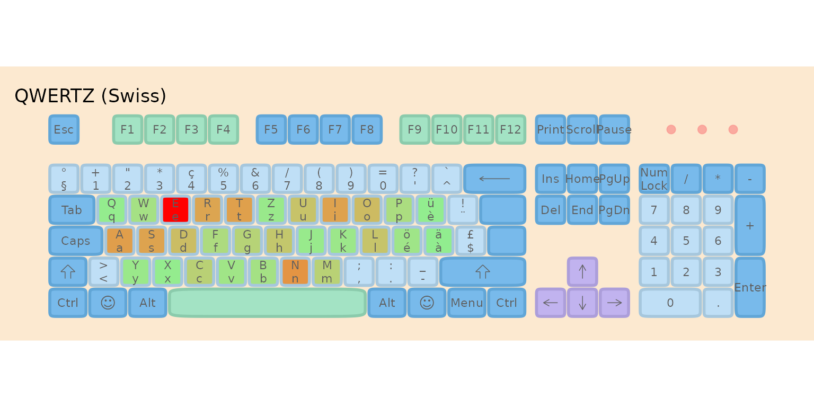
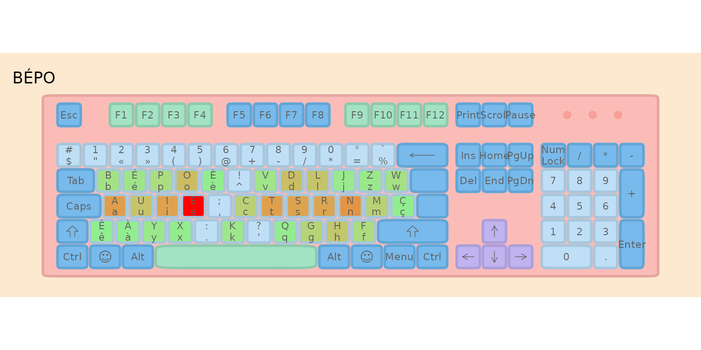
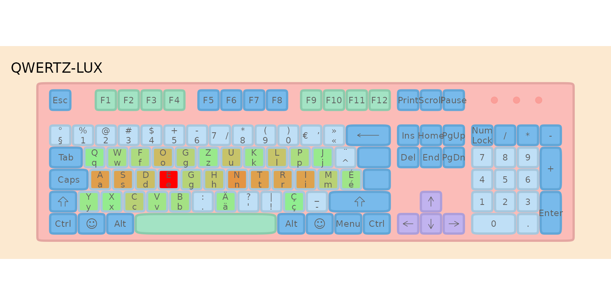

# Introducing QWERTZ-LUX: A Better Keyboard Layout for Luxembourg

## TL;DR

I’ve been thinking about keyboard layouts for a while. QWERTZ isn’t
great, and France recently adopted BÉPO as an official standard
alongside a revised AZERTY. What would such an optimized layout look
like for Luxembourg? Here’s my proposal: **QWERTZ-LUX**.

## The Problem with QWERTZ

If you’ve ever wondered why you’re typing “E” with your middle finger
stretched up to the top row while “J” (which you barely use) sits
comfortably on the home row… well, you’re not alone. The QWERTZ layout,
like its QWERTY cousin, was designed in the 1870s for typewriters. The
primary concern wasn’t typing efficiency—it was preventing mechanical
jamming of type bars.

**Fast forward 150 years**: we’re still using essentially the same
layout, even though the mechanical constraints disappeared decades ago.

The home row—where your fingers naturally rest—should contain the most
frequently used letters. But look at QWERTZ’s home row:

    A S D F G H J K L

For a multilingual environment like Luxembourg (where we type in French,
German, Luxembourgish, and English), this means:

- **E** (the most frequent letter in all four languages) is on the top
  row
- **T, N, R, I** (all extremely common) are scattered or require
  reaching
- **J, K** (rarely used) take prime real estate on the home row

This is objectively inefficient.

## France Shows the Way

In 2019, France officially adopted two new keyboard standards:

1.  **A revised AZERTY** that fixes many issues while maintaining
    familiarity
2.  **BÉPO** — a completely redesigned layout optimized for French

I’ve been using BÉPO for years, and I can honestly say it’s a
game-changer. Typing feels more natural, there’s less finger movement,
and the learning curve, while steep at first, pays off significantly.

But here’s the thing: BÉPO was designed primarily for French. Luxembourg
is unique— we need something that works for French *and* German *and*
Luxembourgish *and* English.

## The QWERTZ-LUX Approach

So I started wondering: what would an optimized keyboard layout for
Luxembourg look like?

I had two options:

1.  **Go full BÉPO** and adapt it for Luxembourgish needs
2.  **Keep QWERTZ as a base** and optimize only what’s necessary

I chose a middle path. QWERTZ-LUX is essentially a fork of BÉPO’s
structure, but with modifications that:

- Keep familiar elements for QWERTZ users (Ctrl+Z, Ctrl+X, Ctrl+C,
  Ctrl+V shortcuts)
- Optimize the letter arrangement for our multilingual corpus
- Provide direct access to accented characters (é, à, ü, ö, ç, ä)
  without dead keys

The home row had to change substantially—QWERTZ’s home row is simply too
inefficient. But I tried to minimize disruption elsewhere.

## The Corpus: What Does Luxembourg Type?

To evaluate keyboard layouts fairly, we need text that reflects what
people actually type in Luxembourg. I created a balanced multilingual
corpus with:

- **30% French** — Administrative and business language
- **30% English** — International communication  
- **20% German** — Media and education
- **20% Luxembourgish** — Daily life and national identity

This weighting roughly matches language usage patterns in Luxembourg
workplaces and daily communication. The top letters across all
languages? **E, N, S, T, R, I, A** — exactly what you’d want on your
home row.

## The Effort Model Explained

Before comparing layouts, let’s understand how we measure “typing
effort.” The **lbkeyboard** package uses a Carpalx-inspired model that
considers five components:

### 1. Base Effort (Weight: 3.0)

Every key has an inherent effort based on position. Home row keys (where
fingers rest) have the lowest effort; reaching up to the top row or down
to the bottom row costs more. Finger strength matters too—index fingers
are stronger than pinkies.

**Example**: Typing “e” on QWERTZ (top row, middle finger reach) costs
more than typing “j” (home row, index finger)—even though we use “e”
100× more often!

### 2. Same-Finger Bigram Penalty (Weight: 3.0)

Using the same finger twice in a row is slow and uncomfortable. The
model heavily penalizes these sequences.

**Example**: Typing “de” on QWERTZ uses the same finger (middle finger,
D→E). This is penalized. On BÉPO, these letters are on different hands,
so no penalty.

### 3. Same-Hand Penalty (Weight: 0.5)

Consecutive keys on the same hand are slightly harder than alternating
hands, because one hand must do all the work.

### 4. Row Change Penalty (Weight: 0.5)

Jumping between rows (e.g., top→bottom) requires more finger travel than
staying on the same row.

### 5. Layer Penalties

Characters requiring modifier keys (Shift, AltGr, dead keys) incur extra
effort: - **Shift**: +5% effort - **AltGr**: +20% effort  
- **Dead key** (e.g., ˆ + o = ô): +40% effort (two keystrokes!)

### Putting It Together

The total effort formula is:

    Total = Σ (base × frequency) + Σ (same_finger_penalty) + Σ (same_hand_penalty) 
            + Σ (row_change_penalty) + Σ (layer_penalties)

**Numerical Example**: Consider typing “the” (one of the most common
English trigrams):

| Layout | Key Positions             | Same-Finger? | Row Changes | Effort   |
|--------|---------------------------|--------------|-------------|----------|
| QWERTZ | T(top), H(home), E(top)   | No           | 2           | Moderate |
| BÉPO   | T(home), H(home), E(home) | No           | 0           | **Low**  |

BÉPO places all three letters on the home row, eliminating row changes
entirely.

### A Concrete Example: The Pangram

Let’s calculate actual effort scores for “the quick brown fox jumps over
the lazy dog” (a pangram using every letter of the alphabet):

``` r
# Load layouts
data("ch_qwertz")
data("afnor_bepo")
qwertz_lux <- create_qwertz_lux_keyboard()

# Effort weights (same as used throughout)
effort_weights <- list(
  base = 3.0,
  same_finger = 3.0,
  same_hand = 0.5,
  row_change = 0.5,
  trigram = 0.3
)

pangram <- "the quick brown fox jumps over the lazy dog"

# Calculate effort for each layout
pangram_qwertz <- calculate_layout_effort(ch_qwertz, pangram, 
                                          keys_to_evaluate = letters,
                                          effort_weights = effort_weights)
pangram_bepo <- calculate_layout_effort(afnor_bepo, pangram,
                                        keys_to_evaluate = letters,
                                        effort_weights = effort_weights)
pangram_lux <- calculate_layout_effort(qwertz_lux$base, pangram,
                                       keys_to_evaluate = letters,
                                       effort_weights = effort_weights)

data.frame(
  Layout = c("QWERTZ", "BÉPO", "QWERTZ-LUX"),
  Effort = round(c(pangram_qwertz, pangram_bepo, pangram_lux), 2),
  `vs QWERTZ` = paste0(round((1 - c(pangram_qwertz, pangram_bepo, pangram_lux) / 
                               pangram_qwertz) * 100, 1), "%"),
  check.names = FALSE
)
#>       Layout Effort vs QWERTZ
#> 1     QWERTZ 338.69        0%
#> 2       BÉPO 268.79     20.6%
#> 3 QWERTZ-LUX 303.08     10.5%
```

Even for this short 35-letter sentence, the optimized layouts require
measurably less effort.

## How Much Better Is It?

Using this effort model (with the weights shown above), here’s how the
layouts compare:

    #>           Layout Effort Score Hand Balance (L/R %) Relative (%)
    #> 1           BÉPO     633624.9            43.6/56.4        100.0
    #> 2     QWERTZ-LUX     642547.9            52.1/47.9        101.4
    #> 3 QWERTZ (Swiss)    1094468.2                59/41        172.7
    #>   Improvement vs QWERTZ
    #> 1                 42.1%
    #> 2                 41.3%
    #> 3                    0%

## Visualizing the Difference: Heatmaps

Heatmaps show where your fingers spend time. Brighter colors = more
keystrokes. Ideally, you want the brightness concentrated on the home
row.






Notice how BÉPO and QWERTZ-LUX concentrate activity on the home row,
while QWERTZ spreads effort across all rows.

## The QWERTZ-LUX Layout

Here’s what the optimized layout looks like:



### Key Features

| Feature | Benefit |
|----|----|
| **Optimized home row** | High-frequency letters (E, T, N, R, I, S) within easy reach |
| **Direct accents** | é, à, ü, ö, ç, ä accessible without dead key combinations |
| **ZXCV preserved** | Common shortcuts (Ctrl+Z/X/C/V) stay in familiar positions |
| **BÉPO-compatible** | Same modifier layer philosophy as BÉPO |

## Should You Switch?

That depends on your priorities:

- **If you value efficiency**: Yes. The numbers don’t lie—QWERTZ-LUX
  requires meaningfully less effort for the same typing tasks.

- **If you’re a touch typist**: You’ll need to relearn the layout, but
  the investment pays off. I’d estimate 2-4 weeks of practice to regain
  full speed.

- **If you type casually**: The switch might not be worth the learning
  curve. But if you’re reading this, you’re probably not a casual
  typist!

## What’s Next?

I’m still refining this layout based on real-world usage. The
**lbkeyboard** package lets you:

- Analyze your own text corpora
- Experiment with different layout modifications
- Quantify improvements with the effort model

Want to try it? Install the package and dive in:

``` r
# Install from GitHub
# remotes::install_github("b-rodrigues/lbkeyboard")

library(lbkeyboard)

# Explore the layout
qwertz_lux <- parse_layout_ini("layouts/qwertz-lux/layout.ini")
print(qwertz_lux)

# Visualize it
plot_layout_ini("layouts/qwertz-lux/layout.ini")
```

------------------------------------------------------------------------

## Discussion

I’d love to hear your thoughts:

1.  **What letters/symbols do you type most often?** (This helps tune
    the model)
2.  **What shortcuts can’t you live without?** (I tried to preserve
    common ones)
3.  **Would you try an optimized layout?** (Or are you QWERTZ-for-life?)

The beauty of having this as an R package is that *you* can fork it and
create your own optimized layout for your specific needs. The code is
open source, the methodology is transparent, and the effort model is
documented.

Happy typing! 🎹

------------------------------------------------------------------------

## Session Info

``` r
sessionInfo()
#> R version 4.5.2 (2025-10-31)
#> Platform: x86_64-pc-linux-gnu
#> Running under: Ubuntu 24.04.3 LTS
#> 
#> Matrix products: default
#> BLAS/LAPACK: /nix/store/k8aawsx66xjgd8qhdr24dqaq9s0w8av5-blas-3/lib/libblas.so.3;  LAPACK version 3.12.0
#> 
#> locale:
#>  [1] LC_CTYPE=en_US.UTF-8       LC_NUMERIC=C              
#>  [3] LC_TIME=en_US.UTF-8        LC_COLLATE=en_US.UTF-8    
#>  [5] LC_MONETARY=en_US.UTF-8    LC_MESSAGES=en_US.UTF-8   
#>  [7] LC_PAPER=en_US.UTF-8       LC_NAME=C                 
#>  [9] LC_ADDRESS=C               LC_TELEPHONE=C            
#> [11] LC_MEASUREMENT=en_US.UTF-8 LC_IDENTIFICATION=C       
#> 
#> time zone: Etc/UTC
#> tzcode source: system (glibc)
#> 
#> attached base packages:
#> [1] stats     graphics  grDevices utils     datasets  methods   base     
#> 
#> other attached packages:
#> [1] ggplot2_4.0.1    dplyr_1.1.4      lbkeyboard_0.1.0 testthat_3.3.1  
#> 
#> loaded via a namespace (and not attached):
#>  [1] gtable_0.3.6       xfun_0.55          bslib_0.9.0        htmlwidgets_1.6.4 
#>  [5] devtools_2.4.6     remotes_2.5.0      processx_3.8.6     callr_3.7.6       
#>  [9] vctrs_0.6.5        tools_4.5.2        ps_1.9.1           generics_0.1.4    
#> [13] tibble_3.3.0       pkgconfig_2.0.3    RColorBrewer_1.1-3 S7_0.2.1          
#> [17] desc_1.4.3         lifecycle_1.0.4    compiler_4.5.2     farver_2.1.2      
#> [21] stringr_1.6.0      textshaping_1.0.4  brio_1.1.5         ggforce_0.5.0     
#> [25] codetools_0.2-20   htmltools_0.5.9    usethis_3.2.1      sass_0.4.10       
#> [29] yaml_2.3.12        pillar_1.11.1      pkgdown_2.2.0      crayon_1.5.3      
#> [33] jquerylib_0.1.4    MASS_7.3-65        ellipsis_0.3.2     cachem_1.1.0      
#> [37] sessioninfo_1.2.3  iterators_1.0.14   foreach_1.5.2      tidyselect_1.2.1  
#> [41] digest_0.6.39      stringi_1.8.7      purrr_1.2.0        labeling_0.4.3    
#> [45] polyclip_1.10-7    rprojroot_2.1.1    fastmap_1.2.0      grid_4.5.2        
#> [49] cli_3.6.5          magrittr_2.0.4     pkgbuild_1.4.8     withr_3.0.2       
#> [53] scales_1.4.0       rmarkdown_2.30     otel_0.2.0         ragg_1.5.0        
#> [57] memoise_2.0.1      evaluate_1.0.5     GA_3.2.4           knitr_1.51        
#> [61] rlang_1.1.6        Rcpp_1.1.0         glue_1.8.0         tweenr_2.0.3      
#> [65] pkgload_1.4.1      rstudioapi_0.17.1  jsonlite_2.0.0     R6_2.6.1          
#> [69] systemfonts_1.3.1  fs_1.6.6           prismatic_1.1.2
```
