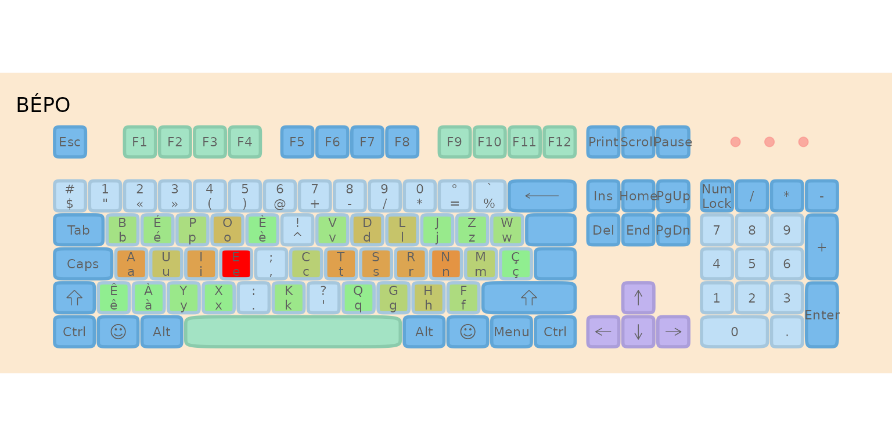
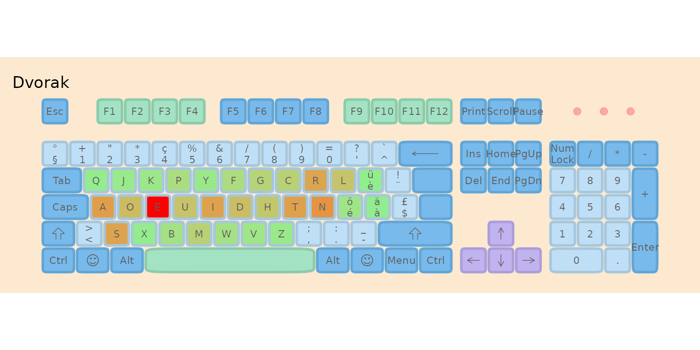

# Optimizing Keyboard Layouts for Luxembourg

## Introduction

Luxembourg’s multilingual environment requires a keyboard that works
efficiently for French, German, Luxembourgish, and English. This
vignette demonstrates how to analyze text corpora, evaluate existing
keyboard layouts, and optimize new ones using the **lbkeyboard**
package’s typing effort model.

We will:

1.  **Introduce the data**: Create a multilingual corpus reflecting
    Luxembourg’s language usage
2.  **Evaluate standard layouts**: Compare QWERTZ, AZERTY, BÉPO, and
    Dvorak
3.  **Optimize custom layouts**: Create unconstrained and QWERTZ-based
    optimizations
4.  **Rank all layouts**: Summarize with a final comparison table

------------------------------------------------------------------------

## 1. The Multilingual Corpus

We create a balanced corpus representing typical language usage in
Luxembourg:

- **30% French** - Administrative and business language
- **30% English** - International communication
- **20% German** - Media and education
- **20% Luxembourgish** - Daily life and national identity

``` r
# Load sample texts
data("french")
data("german")
data("english")
data("luxembourguish")

# Create weighted corpus (each rep adds ~10% weight)
corpus <- list(
  French = rep(french, 3),         # 30%
  English = rep(english, 3),       # 30%
  German = rep(german, 2),         # 20%
  Luxembourgish = rep(luxembourguish, 2)  # 20%
)
#> Warning: input string 'Au commencement, Dieu créa les cieux et la terre.'
#> cannot be translated from 'ANSI_X3.4-1968' to UTF-8, but is valid UTF-8
#> Warning: input string 'La terre était informe et vide: il y avait des ténèbres
#> à la surface de l'abîme, et l'esprit de Dieu se mouvait au-dessus des eaux.'
#> cannot be translated from 'ANSI_X3.4-1968' to UTF-8, but is valid UTF-8
#> Warning: input string 'Dieu dit: Que la lumière soit! Et la lumière fut.'
#> cannot be translated from 'ANSI_X3.4-1968' to UTF-8, but is valid UTF-8
#> Warning: input string 'Dieu vit que la lumière était bonne; et Dieu sépara la
#> lumière d'avec les ténèbres.' cannot be translated from 'ANSI_X3.4-1968' to
#> UTF-8, but is valid UTF-8
#> Warning: input string 'Dieu appela la lumière jour, et il appela les ténèbres
#> nuit. Ainsi, il y eut un soir, et il y eut un matin: ce fut le premier jour.'
#> cannot be translated from 'ANSI_X3.4-1968' to UTF-8, but is valid UTF-8
#> Warning: input string 'Dieu dit: Qu'il y ait une étendue entre les eaux, et
#> qu'elle sépare les eaux d'avec les eaux.' cannot be translated from
#> 'ANSI_X3.4-1968' to UTF-8, but is valid UTF-8
#> Warning: input string 'Et Dieu fit l'étendue, et il sépara les eaux qui sont
#> au-dessous de l'étendue d'avec les eaux qui sont au-dessus de l'étendue. Et
#> cela fut ainsi.' cannot be translated from 'ANSI_X3.4-1968' to UTF-8, but is
#> valid UTF-8
#> Warning: input string 'Dieu appela l'étendue ciel. Ainsi, il y eut un soir, et
#> il y eut un matin: ce fut le second jour.' cannot be translated from
#> 'ANSI_X3.4-1968' to UTF-8, but is valid UTF-8
#> Warning: input string 'Dieu appela le sec terre, et il appela l'amas des eaux
#> mers. Dieu vit que cela était bon.' cannot be translated from 'ANSI_X3.4-1968'
#> to UTF-8, but is valid UTF-8
#> Warning: input string 'Puis Dieu dit: Que la terre produise de la verdure, de
#> l'herbe portant de la semence, des arbres fruitiers donnant du fruit selon leur
#> espèce et ayant en eux leur semence sur la terre. Et cela fut ainsi.' cannot be
#> translated from 'ANSI_X3.4-1968' to UTF-8, but is valid UTF-8
#> Warning: input string 'La terre produisit de la verdure, de l'herbe portant de
#> la semence selon son espèce, et des arbres donnant du fruit et ayant en eux
#> leur semence selon leur espèce. Dieu vit que cela était bon.' cannot be
#> translated from 'ANSI_X3.4-1968' to UTF-8, but is valid UTF-8
#> Warning: input string 'Ainsi, il y eut un soir, et il y eut un matin: ce fut le
#> troisième jour.' cannot be translated from 'ANSI_X3.4-1968' to UTF-8, but is
#> valid UTF-8
#> Warning: input string 'Dieu dit: Qu'il y ait des luminaires dans l'étendue du
#> ciel, pour séparer le jour d'avec la nuit; que ce soient des signes pour
#> marquer les époques, les jours et les années;' cannot be translated from
#> 'ANSI_X3.4-1968' to UTF-8, but is valid UTF-8
#> Warning: input string 'et qu'ils servent de luminaires dans l'étendue du ciel,
#> pour éclairer la terre. Et cela fut ainsi.' cannot be translated from
#> 'ANSI_X3.4-1968' to UTF-8, but is valid UTF-8
#> Warning: input string 'Dieu fit les deux grands luminaires, le plus grand
#> luminaire pour présider au jour, et le plus petit luminaire pour présider à la
#> nuit; il fit aussi les étoiles.' cannot be translated from 'ANSI_X3.4-1968' to
#> UTF-8, but is valid UTF-8
#> Warning: input string 'Dieu les plaça dans l'étendue du ciel, pour éclairer la
#> terre,' cannot be translated from 'ANSI_X3.4-1968' to UTF-8, but is valid UTF-8
#> Warning: input string 'pour présider au jour et à la nuit, et pour séparer la
#> lumière d'avec les ténèbres. Dieu vit que cela était bon.' cannot be translated
#> from 'ANSI_X3.4-1968' to UTF-8, but is valid UTF-8
#> Warning: input string 'Ainsi, il y eut un soir, et il y eut un matin: ce fut le
#> quatrième jour.' cannot be translated from 'ANSI_X3.4-1968' to UTF-8, but is
#> valid UTF-8
#> Warning: input string 'Dieu dit: Que les eaux produisent en abondance des
#> animaux vivants, et que des oiseaux volent sur la terre vers l'étendue du
#> ciel.' cannot be translated from 'ANSI_X3.4-1968' to UTF-8, but is valid UTF-8
#> Warning: input string 'Dieu créa les grands poissons et tous les animaux
#> vivants qui se meuvent, et que les eaux produisirent en abondance selon leur
#> espèce; il créa aussi tout oiseau ailé selon son espèce. Dieu vit que cela
#> était bon.' cannot be translated from 'ANSI_X3.4-1968' to UTF-8, but is valid
#> UTF-8
#> Warning: input string 'Dieu les bénit, en disant: Soyez féconds, multipliez, et
#> remplissez les eaux des mers; et que les oiseaux multiplient sur la terre.'
#> cannot be translated from 'ANSI_X3.4-1968' to UTF-8, but is valid UTF-8
#> Warning: input string 'Ainsi, il y eut un soir, et il y eut un matin: ce fut le
#> cinquième jour.' cannot be translated from 'ANSI_X3.4-1968' to UTF-8, but is
#> valid UTF-8
#> Warning: input string 'Dieu dit: Que la terre produise des animaux vivants
#> selon leur espèce, du bétail, des reptiles et des animaux terrestres, selon
#> leur espèce. Et cela fut ainsi.' cannot be translated from 'ANSI_X3.4-1968' to
#> UTF-8, but is valid UTF-8
#> Warning: input string 'Dieu fit les animaux de la terre selon leur espèce, le
#> bétail selon son espèce, et tous les reptiles de la terre selon leur espèce.
#> Dieu vit que cela était bon.' cannot be translated from 'ANSI_X3.4-1968' to
#> UTF-8, but is valid UTF-8
#> Warning: input string 'Puis Dieu dit: Faisons l'homme à notre image, selon
#> notre ressemblance, et qu'il domine sur les poissons de la mer, sur les oiseaux
#> du ciel, sur le bétail, sur toute la terre, et sur tous les reptiles qui
#> rampent sur la terre.' cannot be translated from 'ANSI_X3.4-1968' to UTF-8, but
#> is valid UTF-8
#> Warning: input string 'Dieu créa l'homme à son image, il le créa à l'image de
#> Dieu, il créa l'homme et la femme.' cannot be translated from 'ANSI_X3.4-1968'
#> to UTF-8, but is valid UTF-8
#> Warning: input string 'Dieu les bénit, et Dieu leur dit: Soyez féconds,
#> multipliez, remplissez la terre, et l'assujettissez; et dominez sur les
#> poissons de la mer, sur les oiseaux du ciel, et sur tout animal qui se meut sur
#> la terre.' cannot be translated from 'ANSI_X3.4-1968' to UTF-8, but is valid
#> UTF-8
#> Warning: input string 'Et Dieu dit: Voici, je vous donne toute herbe portant de
#> la semence et qui est à la surface de toute la terre, et tout arbre ayant en
#> lui du fruit d'arbre et portant de la semence: ce sera votre nourriture.'
#> cannot be translated from 'ANSI_X3.4-1968' to UTF-8, but is valid UTF-8
#> Warning: input string 'Et à tout animal de la terre, à tout oiseau du ciel, et
#> à tout ce qui se meut sur la terre, ayant en soi un souffle de vie, je donne
#> toute herbe verte pour nourriture. Et cela fut ainsi.' cannot be translated
#> from 'ANSI_X3.4-1968' to UTF-8, but is valid UTF-8
#> Warning: input string 'Dieu vit tout ce qu'il avait fait et voici, cela était
#> très bon. Ainsi, il y eut un soir, et il y eut un matin: ce fut le sixième
#> jour.' cannot be translated from 'ANSI_X3.4-1968' to UTF-8, but is valid UTF-8
#> Warning: input string 'Joe Paterno, né le 21 décembre 1926 à Brooklyn et mort
#> le 22 janvier 2012 à State College, est un joueur et entraîneur américain de
#> football américain universitaire. Figure historique et emblématique des Nittany
#> Lions de Penn State entre 1966 et 2011, il est l'entraîneur le plus victorieux
#> de l'histoire du football américain universitaire avec 409 succès en Division
#> I. Son image est toutefois ternie en fin de carrière à cause de soupçons de
#> négligence dans une affaire d'agressions sexuelles sur mineurs.' cannot be
#> translated from 'ANSI_X3.4-1968' to UTF-8, but is valid UTF-8
#> Warning: input string 'Lors de ses brillantes études de droit à l'université
#> Brown, Joe Paterno joue au football américain et est entraîné par Rip Engle. Ce
#> dernier, embauché par l'université de Penn State, le recrute comme entraîneur
#> assistant en 1950. Pendant quinze saisons, l'assistant fait ses preuves avant
#> de devenir entraîneur principal des Nittany Lions en 1965. Surnommé JoePa, il
#> connaît rapidement le succès. Invaincu en 1968 et 1969, il est désiré par
#> plusieurs franchises de la National Football League (NFL), mais refuse pour
#> conserver son rôle d'éducateur. Entraîneur de l'équipe universitaire championne
#> en 1982 et 1986, vainqueur des quatre principaux Bowls universitaires, il
#> intègre le College Football Hall of Fame en 2007 alors qu'il est encore en
#> activité, un accomplissement rare.' cannot be translated from 'ANSI_X3.4-1968'
#> to UTF-8, but is valid UTF-8
#> Warning: input string 'Reconnu pour ses succès sportifs, académiques et son
#> exemplarité, JoePa est adulé comme une icône populaire dans la région de State
#> College. Onze jours après avoir célébré sa 409e victoire avec les Lions, il est
#> démis de ses fonctions à la suite du scandale des agressions sexuelles de
#> l'Université d'État de Pennsylvanie. Accusé d'avoir couvert les abus sexuels de
#> Jerry Sandusky, son image est ternie par cette affaire au retentissement
#> international. Il meurt deux mois plus tard des suites d'un cancer du poumon.'
#> cannot be translated from 'ANSI_X3.4-1968' to UTF-8, but is valid UTF-8
#> Warning: input string 'Chacun peut publier immédiatement du contenu en ligne, à
#> condition de respecter les règles essentielles établies par la Fondation
#> Wikimedia et par la communauté ; par exemple, la vérifiabilité du contenu,
#> l'admissibilité des articles et garder une attitude cordiale.' cannot be
#> translated from 'ANSI_X3.4-1968' to UTF-8, but is valid UTF-8
#> Warning: input string 'De nombreuses pages d’aide sont à votre disposition,
#> notamment pour créer un article, modifier un article ou insérer une image.
#> N’hésitez pas à poser une question pour être aidé dans vos premiers pas,
#> notamment dans un des projets thématiques ou dans divers espaces de
#> discussion.' cannot be translated from 'ANSI_X3.4-1968' to UTF-8, but is valid
#> UTF-8
#> Warning: input string 'Les pages de discussion servent à centraliser les
#> réflexions et les remarques permettant d’améliorer les articles.' cannot be
#> translated from 'ANSI_X3.4-1968' to UTF-8, but is valid UTF-8
#> Warning: input string 'En 1894, l’explorateur Gustav Adolf von Götzen suivait
#> les traces d’un missionnaire en provenance de la cote orientale d’Afrique.
#> Pendant qu’il se rendait au Rwanda, il découvre un petit village des pécheurs
#> appelé Ngoma qui traduit signifie tam tam, par déformation il écrivit Goma.
#> Ngoma devint un poste belge en face de celui de Rubavu (au Rwanda) habité par
#> les Allemands. Au début, la cohabitation entre ces deux postes n’était pas
#> facile. À un certain moment, les chefs coutumiers du Rwanda, en complicité avec
#> les Allemands attaquent les Belges de Goma. Ces derniers se réfugient à Bukavu
#> et laissent les envahisseurs occuper la ville. Après des négociations, les
#> Allemands replient vers le Rwanda et les Belges reprennent leur position
#> initiale comme poste colonial. L’afflux des colonisateurs dans ce village joue
#> un rôle important dans son évolution pour devenir une grande agglomération. Les
#> colonisateurs venaient d’installer le chef lieu du [... truncated]
#> Warning: input string 'En ce moment, Goma reste un poste de transaction
#> lacustre avec Bukavu qui était une ville minière. Plus tard, Rutshuru, Masisi,
#> Kalehe, Gisenyi, etc. déverseront leurs populations dans Goma, à la rechercher
#> de l’emploi au près des colonisateurs. C’est en cette période que vu le jour le
#> quartier Birere (un bidonville de Goma) autour des entrepôts, bureaux et
#> habitations des colons. Le nom Birere (littéralement feuilles de bananier)
#> vient du fait qu’à l’époque, les gens y construisaient en feuilles des
#> bananiers.' cannot be translated from 'ANSI_X3.4-1968' to UTF-8, but is valid
#> UTF-8
#> Warning: input string 'La ville est la base arrière de l'opération Turquoise
#> organisée en 1994 à la fin du génocide rwandais.' cannot be translated from
#> 'ANSI_X3.4-1968' to UTF-8, but is valid UTF-8
#> Warning: input string 'La ville et ses environs abriteront dans des camps
#> autour de 650 000 réfugiés hutus de 1994 jusqu'à la chute du Zaïre, dont
#> certains supposés anciens génocidaires. Selon des ONG, l'AFDL procède à des
#> massacres dans les camps entre 1996 et 19971.' cannot be translated from
#> 'ANSI_X3.4-1968' to UTF-8, but is valid UTF-8
#> Warning: input string 'De 1998 à 2002/2003, la ville, sous contrôle du
#> Rassemblement congolais pour la démocratie (RCD) pro-rwandais échappe au
#> contrôle du gouvernement congolais.' cannot be translated from 'ANSI_X3.4-1968'
#> to UTF-8, but is valid UTF-8
#> Warning: input string 'De nombreux viols, massacres et crimes de guerre y ont
#> été perpétrés entre 1996 et 2006 par les troupes des généraux rebelles du RCD,
#> essentiellement sous les généraux Nkundabatware et Mutebusi.' cannot be
#> translated from 'ANSI_X3.4-1968' to UTF-8, but is valid UTF-8
#> Warning: input string 'En 2002, le Nyiragongo entra en éruption, et une coulée
#> de lave atteignit le centre de la ville. La lave n'a pas atteint le lac Kivu
#> fort heureusement, en effet ce lac est un lac méromictique et un changement
#> brutal de chaleur aurait des conséquences graves : Éruption limnique.' cannot
#> be translated from 'ANSI_X3.4-1968' to UTF-8, but is valid UTF-8
#> Warning: input string 'Débordant de populations fuyant les violences, Goma
#> compte en 2012 plus de 400 000 habitants. Ceux qui ne peuvent pas trouver
#> d'abri remplissent les camps de réfugiés, où l'ONU et les ONG se débattent pour
#> leur fournir nourriture, eau et combustible.' cannot be translated from
#> 'ANSI_X3.4-1968' to UTF-8, but is valid UTF-8
#> Warning: input string 'In 1996, Wales and two partners founded Bomis, a web
#> portal primarily known for featuring adult content. Bomis provided the initial
#> funding for the free peer-reviewed encyclopedia Nupedia (2000–2003). On January
#> 15, 2001, with Larry Sanger and others, Wales launched Wikipedia, a free
#> open-content encyclopedia that enjoyed rapid growth and popularity. As its
#> public profile grew, Wales became its promoter and spokesman. Though he is
#> historically credited as co-founder, he has disputed this, declaring himself
#> the sole founder.' cannot be translated from 'ANSI_X3.4-1968' to UTF-8, but is
#> valid UTF-8
#> Warning: input string 'Jesus is also revered in other religions. In Islam,
#> Jesus (often referred to by his Quranic name ʿĪsā) is considered the
#> penultimate prophet of God and the messiah, who will return before the Day of
#> Judgement. Muslims believe Jesus was born of the virgin Mary (another figure
#> revered in Islam), but was neither God nor a son of God; In contrast, Judaism
#> rejects the belief that Jesus was the awaited messiah, arguing that he did not
#> fulfill messianic prophecies, and was neither divine nor resurrected.' cannot
#> be translated from 'ANSI_X3.4-1968' to UTF-8, but is valid UTF-8
#> Warning: input string 'Formal unification of Germany into the modern
#> nation-state was commenced on 18 August 1866 with the North German
#> Confederation Treaty establishing the Prussia-led North German Confederation
#> later transformed in 1871 into the German Empire. After World War I and the
#> German Revolution of 1918–1919, the Empire was in turn transformed into the
#> semi-presidential Weimar Republic. The Nazi seizure of power in 1933 led to the
#> establishment of a totalitarian dictatorship, World War II, and the Holocaust.
#> After the end of World War II in Europe and a period of Allied occupation, in
#> 1949, Germany as a whole was organized into two separate polities with limited
#> sovereignity: the Federal Republic of Germany, generally known as West Germany,
#> and the German Democratic Republic, East Germany, while Berlin de jure
#> continued its Four Power status. The Federal Republic of Germany was a founding
#> member of the European Economic Community and the European Union, while the
#> German Democratic R [... truncated]
#> Warning: input string 'Over the centuries, the City and Fortress of
#> Luxembourg—of great strategic importance due to its location between the
#> Kingdom of France and the Habsburg territories—was gradually built up to be one
#> of the most reputed fortifications in Europe. ' cannot be translated from
#> 'ANSI_X3.4-1968' to UTF-8, but is valid UTF-8
#> Warning: input string 'Geometrically, this is seen as the sum of the squared
#> distances, parallel to the axis of the dependent variable, between each data
#> point in the set and the corresponding point on the regression surface—the
#> smaller the differences, the better the model fits the data. The resulting
#> estimator can be expressed by a simple formula, especially in the case of a
#> simple linear regression, in which there is a single regressor on the right
#> side of the regression equation.' cannot be translated from 'ANSI_X3.4-1968' to
#> UTF-8, but is valid UTF-8
#> Warning: input string 'The OLS estimator is consistent for the level-one fixed
#> effects when the regressors are exogenous and forms perfect colinearity (rank
#> condition), consistent for the variance estimate of the residuals when
#> regressors have finite fourth moments and—by the Gauss–Markov theorem—optimal
#> in the class of linear unbiased estimators when the errors are homoscedastic
#> and serially uncorrelated. Under these conditions, the method of OLS provides
#> minimum-variance mean-unbiased estimation when the errors have finite
#> variances. Under the additional assumption that the errors are normally
#> distributed with zero mean, OLS is the maximum likelihood estimator that
#> outperforms any non-linear unbiased estimator.' cannot be translated from
#> 'ANSI_X3.4-1968' to UTF-8, but is valid UTF-8
#> Warning: input string 'Und die Erde war wüst und leer, und es war finster auf
#> der Tiefe; und der Geist Gottes schwebte auf dem Wasser.' cannot be translated
#> from 'ANSI_X3.4-1968' to UTF-8, but is valid UTF-8
#> Warning: input string 'Und Gott sah, daß das Licht gut war. Da schied Gott das
#> Licht von der Finsternis' cannot be translated from 'ANSI_X3.4-1968' to UTF-8,
#> but is valid UTF-8
#> Warning: input string 'Da machte Gott die Feste und schied das Wasser unter der
#> Feste von dem Wasser über der Feste. Und es geschah also.' cannot be translated
#> from 'ANSI_X3.4-1968' to UTF-8, but is valid UTF-8
#> Warning: input string 'Und Gott sprach: Es sammle sich das Wasser unter dem
#> Himmel an besondere Örter, daß man das Trockene sehe. Und es geschah also.'
#> cannot be translated from 'ANSI_X3.4-1968' to UTF-8, but is valid UTF-8
#> Warning: input string 'Und Gott nannte das Trockene Erde, und die Sammlung der
#> Wasser nannte er Meer. Und Gott sah, daß es gut war.' cannot be translated from
#> 'ANSI_X3.4-1968' to UTF-8, but is valid UTF-8
#> Warning: input string 'Und Gott sprach: Es lasse die Erde aufgehen Gras und
#> Kraut, das sich besame, und fruchtbare Bäume, da ein jeglicher nach seiner Art
#> Frucht trage und habe seinen eigenen Samen bei sich selbst auf Erden. Und es
#> geschah also.' cannot be translated from 'ANSI_X3.4-1968' to UTF-8, but is
#> valid UTF-8
#> Warning: input string 'Und die Erde ließ aufgehen Gras und Kraut, das sich
#> besamte, ein jegliches nach seiner Art, und Bäume, die da Frucht trugen und
#> ihren eigenen Samen bei sich selbst hatten, ein jeglicher nach seiner Art. Und
#> Gott sah, daß es gut war.' cannot be translated from 'ANSI_X3.4-1968' to UTF-8,
#> but is valid UTF-8
#> Warning: input string 'und seien Lichter an der Feste des Himmels, daß sie
#> scheinen auf Erden. Und es geschah also.' cannot be translated from
#> 'ANSI_X3.4-1968' to UTF-8, but is valid UTF-8
#> Warning: input string 'Und Gott machte zwei große Lichter: ein großes Licht,
#> das den Tag regiere, und ein kleines Licht, das die Nacht regiere, dazu auch
#> Sterne.' cannot be translated from 'ANSI_X3.4-1968' to UTF-8, but is valid
#> UTF-8
#> Warning: input string 'Und Gott setzte sie an die Feste des Himmels, daß sie
#> schienen auf die Erde' cannot be translated from 'ANSI_X3.4-1968' to UTF-8, but
#> is valid UTF-8
#> Warning: input string 'und den Tag und die Nacht regierten und schieden Licht
#> und Finsternis. Und Gott sah, daß es gut war.' cannot be translated from
#> 'ANSI_X3.4-1968' to UTF-8, but is valid UTF-8
#> Warning: input string 'Und Gott sprach: Es errege sich das Wasser mit webenden
#> und lebendigen Tieren, und Gevögel fliege auf Erden unter der Feste des
#> Himmels.' cannot be translated from 'ANSI_X3.4-1968' to UTF-8, but is valid
#> UTF-8
#> Warning: input string 'Und Gott schuf große Walfische und allerlei Getier, daß
#> da lebt und webt, davon das Wasser sich erregte, ein jegliches nach seiner Art,
#> und allerlei gefiedertes Gevögel, ein jegliches nach seiner Art. Und Gott sah,
#> daß es gut war.' cannot be translated from 'ANSI_X3.4-1968' to UTF-8, but is
#> valid UTF-8
#> Warning: input string 'Und Gott segnete sie und sprach: Seid fruchtbar und
#> mehrt euch und erfüllt das Wasser im Meer; und das Gefieder mehre sich auf
#> Erden.' cannot be translated from 'ANSI_X3.4-1968' to UTF-8, but is valid UTF-8
#> Warning: input string 'Da ward aus Abend und Morgen der fünfte Tag.' cannot be
#> translated from 'ANSI_X3.4-1968' to UTF-8, but is valid UTF-8
#> Warning: input string 'Und Gott sprach: Die Erde bringe hervor lebendige Tiere,
#> ein jegliches nach seiner Art: Vieh, Gewürm und Tiere auf Erden, ein jegliches
#> nach seiner Art. Und es geschah also.' cannot be translated from
#> 'ANSI_X3.4-1968' to UTF-8, but is valid UTF-8
#> Warning: input string 'Und Gott machte die Tiere auf Erden, ein jegliches nach
#> seiner Art, und das Vieh nach seiner Art, und allerlei Gewürm auf Erden nach
#> seiner Art. Und Gott sah, daß es gut war.' cannot be translated from
#> 'ANSI_X3.4-1968' to UTF-8, but is valid UTF-8
#> Warning: input string 'Und Gott sprach: Laßt uns Menschen machen, ein Bild, das
#> uns gleich sei, die da herrschen über die Fische im Meer und über die Vögel
#> unter dem Himmel und über das Vieh und über die ganze Erde und über alles
#> Gewürm, das auf Erden kriecht.' cannot be translated from 'ANSI_X3.4-1968' to
#> UTF-8, but is valid UTF-8
#> Warning: input string 'Und Gott segnete sie und sprach zu ihnen: Seid fruchtbar
#> und mehrt euch und füllt die Erde und macht sie euch untertan und herrscht über
#> die Fische im Meer und über die Vögel unter dem Himmel und über alles Getier,
#> das auf Erden kriecht.' cannot be translated from 'ANSI_X3.4-1968' to UTF-8,
#> but is valid UTF-8
#> Warning: input string 'Und Gott sprach: Seht da, ich habe euch gegeben allerlei
#> Kraut, das sich besamt, auf der ganzen Erde und allerlei fruchtbare Bäume, die
#> sich besamen, zu eurer Speise,' cannot be translated from 'ANSI_X3.4-1968' to
#> UTF-8, but is valid UTF-8
#> Warning: input string 'und allem Getier auf Erden und allen Vögeln unter dem
#> Himmel und allem Gewürm, das da lebt auf Erden, daß sie allerlei grünes Kraut
#> essen. Und es geschah also.' cannot be translated from 'ANSI_X3.4-1968' to
#> UTF-8, but is valid UTF-8
#> Warning: input string 'Während des Bürgerkrieges und Völkermords im nahe
#> angrenzenden Ruanda 1994 war Goma eines der Hauptziele für Flüchtlinge. Unter
#> diesen waren nebst Zivilisten auch Mittäter des Genozids. Nachdem über eine
#> Million Flüchtlinge die Stadt erreicht hatten, brach in den Lagern eine
#> Cholera-Epidemie aus, die mehrere Tausend Opfer forderte. In den Jahren 1997
#> und 1998, als der Bürgerkrieg im Kongo nach dem Sturz von Präsident Mobutu Sese
#> Seko eskalierte, eroberten ruandische Regierungstruppen Goma. Im Zuge der
#> Verfolgung von Hutu, die in der Stadt Zuflucht gesucht hatten, töteten sie auch
#> Hunderte Unbeteiligte.' cannot be translated from 'ANSI_X3.4-1968' to UTF-8,
#> but is valid UTF-8
#> Warning: input string 'Im Jahre 2002 wurde die Stadt von einem Lavastrom aus
#> dem etwa 14 km entfernten Nyiragongo im Norden zu großen Teilen zerstört. Viele
#> Gebäude gerade im Stadtzentrum sowie der Flughafen Goma waren betroffen. Von
#> den 3.000 Metern der Start- und Landebahn sind bis heute noch fast 1.000 Meter
#> unter einer Lavaschicht begraben, so dass der internationale Verkehr ihn
#> meidet. Rund 250.000 Einwohner der Stadt mussten flüchten. Es gab 147
#> Todesopfer, viele Flüchtlinge blieben obdachlos oder haben sich am Rande der
#> Lavafelder Notunterkünfte gebaut. Seit April 2009 wird unter Führung der
#> Welthungerhilfe das Rollfeld des Flughafens von der Lava befreit. Die
#> Bedrohung, dass sich bei einer erneuten Eruption Lavamassen aus dem innerhalb
#> des Vulkankraters befindlichen Lavasee erneut ins Tal und auf die Stadt
#> ergießen, besteht nach wie vor.[3]' cannot be translated from 'ANSI_X3.4-1968'
#> to UTF-8, but is valid UTF-8
#> Warning: input string 'Am 15. April 2008 raste nach dem Start vom Flughafen
#> Goma eine Douglas DC-9 mit 79 Passagieren und 6 Besatzungsmitgliedern über das
#> südliche Startbahnende hinaus in das Wohn- und Marktgebiet Birere. Etwa 40
#> Personen aus dem angrenzenden Siedlungsgebiet kamen ums Leben, mindestens 53
#> Passagiere und die 6 Besatzungsmitglieder überlebten jedoch. Das Feuer aus dem
#> brennenden Wrack konnte sich aufgrund des starken Regens nicht ausbreiten,
#> Anwohner konnten das Feuer zusätzlich eindämmen.' cannot be translated from
#> 'ANSI_X3.4-1968' to UTF-8, but is valid UTF-8
#> Warning: input string 'Am 21. November 2012 wurden große Teile der Stadt von
#> der gegen die Zentralregierung unter Präsident Joseph Kabila kämpfenden
#> Rebellenbewegung M23 eingenommen. Dort stationierte UNO-Friedens-Truppen
#> griffen im Gegensatz zu früheren Aktivitäten nicht mehr ein.[5] Am 1. Dezember
#> begannen sie nach Überschreitung eines Ultimatums der Internationalen Konferenz
#> der Großen Seen Afrikas und zwei Resolutionen des UN-Sicherheitsrats, sich aus
#> der Stadt zurückzuziehen.' cannot be translated from 'ANSI_X3.4-1968' to UTF-8,
#> but is valid UTF-8
#> Warning: input string 'Im Jahre 2019 wurden mehrere Einzelfälle von Ebola in
#> der Stadt registriert, nachdem die Ebola Epidemie bereits zuvor im Ostkongo
#> ausgebrochen war.[6]' cannot be translated from 'ANSI_X3.4-1968' to UTF-8, but
#> is valid UTF-8
#> Warning: input string 'Seit 1959 ist Goma Sitz des römisch-katholischen Bistums
#> Goma.' cannot be translated from 'ANSI_X3.4-1968' to UTF-8, but is valid UTF-8
#> Warning: input string 'Die Transporteure werden Frachtführer (in Österreich
#> Frächter) genannt. Sie organisieren nicht den Transport, sondern führen diesen
#> aus, meistens im Auftrag eines Spediteurs. Die Höhe der Fracht wird im
#> Frachtvertrag vereinbart und in der Regel im Frachtbrief festgehalten. Seit mit
#> der Transportrechtsreform 1998 in Deutschland die Erstellung eines
#> Frachtbriefes für nationale Transporte nicht mehr zwingend erforderlich ist,
#> sondern auch Lieferscheine, Ladelisten oder vergleichbare Papiere als
#> Warenbegleitdokument verwendet werden können, wird zunehmend kein Frachtbrief
#> mehr ausgestellt. Beim Frachtbrief gibt es drei Originalausfertigungen. Eine
#> Ausfertigung verbleibt beim Absender, nachdem ihm darauf der Frachtführer die
#> Übernahme des Frachtguts bestätigt hat. Die zweite verbleibt nach Ablieferung
#> des Frachtguts als Ablieferbestätigung beim Frachtführer und die dritte erhält
#> der Empfänger.' cannot be translated from 'ANSI_X3.4-1968' to UTF-8, but is
#> valid UTF [... truncated]
#> Warning: input string 'Für die Verladung des Frachtguts ist der Absender
#> zuständig. Er ist dabei gem. § 412 HGB für eine beförderungssichere Verladung
#> des Frachtguts verantwortlich, wohingegen der Frachtführer für die
#> verkehrssichere Verladung (z. B. Gewichtsverteilung, Einhaltung der zulässigen
#> Achslasten), als auch für die Ladungssicherung zu sorgen hat.' cannot be
#> translated from 'ANSI_X3.4-1968' to UTF-8, but is valid UTF-8
#> Warning: input string 'Bei Kontrollen muss der Frachtbrief den Zoll- und
#> Polizeibehörden, sowie dem Bundesamt für Güterverkehr (BAG) ausgehändigt
#> werden.' cannot be translated from 'ANSI_X3.4-1968' to UTF-8, but is valid
#> UTF-8
#> Warning: input string 'Es gibt anmeldepflichtige Frachtgüter, für deren
#> Transport es einer ausdrücklichen behördlichen Genehmigung bedarf.
#> Schwertransporte erfordern eine behördliche Ausnahmegenehmigung und bei
#> Überschreiten bestimmter Abmessungen sind gemäß § 29 Absatz. 3 StVO (Übermäßige
#> Straßennutzung) definitiv Begleitfahrzeuge und/oder eine Begleitung durch die
#> Polizei vorgeschrieben, um Sicherungsmaßnahmen einzuleiten und für einen
#> reibungslosen Ablauf zu sorgen. Fällt das zu befördernde Frachtgut unter die
#> Gefahrgutverordnung, muss das Transportfahrzeug neben der Einhaltung
#> gefahrgutrelevanter Vorschriften auch mit entsprechenden Warntafeln
#> gekennzeichnet sein. Darüber hinaus benötigt dann der Fahrzeugführer und ein
#> eventueller Beifahrer auch eine ADR-Bescheinigung.' cannot be translated from
#> 'ANSI_X3.4-1968' to UTF-8, but is valid UTF-8
#> Warning: input string 'Die Aufteilung der Frachtkosten zwischen Absender und
#> Empfänger wird über die im Kaufvertrag festgehaltenen Lieferbedingungen
#> geregelt, im internationalen Warenverkehr durch die Incoterms.' cannot be
#> translated from 'ANSI_X3.4-1968' to UTF-8, but is valid UTF-8
#> Warning: input string '26 De Jesus sot zu sengen Apostelen: "Fäert d’Mënschen
#> net! Et ass nämlech näischt zougedeckt, wat net géif opgedeckt ginn, an et ass
#> näischt verbuergen, wat net géif bekannt ginn.' cannot be translated from
#> 'ANSI_X3.4-1968' to UTF-8, but is valid UTF-8
#> Warning: input string '27 Wat ech iech an der däischterer Nuecht soen, dat
#> verzielt am hellen Do! A wat dir an d’Ouer gepëspert kritt, dat verkënnegt op
#> den Diech!' cannot be translated from 'ANSI_X3.4-1968' to UTF-8, but is valid
#> UTF-8
#> Warning: input string '28 Fäert net déi, déi zwar de Kierper doutmaachen, ma
#> déi d’Séil net doutmaache kënnen! Fäert villméi deen, deen esouwuel d’Séil wéi
#> och de Kierper an der Häll zerstéiere kann!' cannot be translated from
#> 'ANSI_X3.4-1968' to UTF-8, but is valid UTF-8
#> Warning: input string '29 Ginn net zwéi Spatze fir een Zantimm verkaaft? An
#> dach, ouni äre Papp fällt net een eenzege vun hinnen op de Buedem erof.' cannot
#> be translated from 'ANSI_X3.4-1968' to UTF-8, but is valid UTF-8
#> Warning: input string '30 Bei iech awer sinn esouguer d’Hoer um Kapp alleguer
#> gezielt.' cannot be translated from 'ANSI_X3.4-1968' to UTF-8, but is valid
#> UTF-8
#> Warning: input string '31 Fäert also net! Dir sidd méi wäert wéi déi sëllege
#> Spatzen.' cannot be translated from 'ANSI_X3.4-1968' to UTF-8, but is valid
#> UTF-8
#> Warning: input string '32 Wien zu mir hält bei de Mënschen, zu deem halen och
#> ech bei mengem Papp am Himmel.' cannot be translated from 'ANSI_X3.4-1968' to
#> UTF-8, but is valid UTF-8
#> Warning: input string '33 Wie mech awer verleegent virun de Mënschen, dee
#> verleegenen och ech viru mengem Papp am Himmel."' cannot be translated from
#> 'ANSI_X3.4-1968' to UTF-8, but is valid UTF-8
#> Warning: input string '38 De Jesus sot zu senge Jünger: "Dir hutt héieren, datt
#> gesot ginn ass: A fir A, an Zant fir Zant.' cannot be translated from
#> 'ANSI_X3.4-1968' to UTF-8, but is valid UTF-8
#> Warning: input string '39 Ech awer soen iech: Leescht deem Béise kee
#> Widderstand! Am Géigendeel: Wann een dir eng op dee rietse Bak gëtt, dann hal
#> him och deen aneren duer!' cannot be translated from 'ANSI_X3.4-1968' to UTF-8,
#> but is valid UTF-8
#> Warning: input string '40 A wann een dir de Prozess maachen an däin Hiem huele
#> wëllt, da looss him och de Mantel!' cannot be translated from 'ANSI_X3.4-1968'
#> to UTF-8, but is valid UTF-8
#> Warning: input string '41 A wann een dech zwéngt, eng Meil mat him ze goen, da
#> géi der zwou mat him!' cannot be translated from 'ANSI_X3.4-1968' to UTF-8, but
#> is valid UTF-8
#> Warning: input string '42 A wann een dech fir eppes freet, da gëff him et, a
#> wann een eppes vun dir léine wëllt, dann dréi him net de Réck!' cannot be
#> translated from 'ANSI_X3.4-1968' to UTF-8, but is valid UTF-8
#> Warning: input string '43 Dir hutt héieren, datt gesot ginn ass: Du solls däin
#> Nächste gär hunn, an du solls däi Feind haassen!' cannot be translated from
#> 'ANSI_X3.4-1968' to UTF-8, but is valid UTF-8
#> Warning: input string '44 Ech awer soen iech: Hutt är Feinde gär a biet fir
#> déi, déi iech verfollegen,' cannot be translated from 'ANSI_X3.4-1968' to
#> UTF-8, but is valid UTF-8
#> Warning: input string '45 fir datt dir Kanner vun ärem Papp am Himmel gitt! Hie
#> léisst nämlech seng Sonn opgoen iwwer deene Béise grad ewéi iwwer deene Gudden,
#> an hie léisst et reenen op déi Gerecht grad ewéi op déi Ongerecht.' cannot be
#> translated from 'ANSI_X3.4-1968' to UTF-8, but is valid UTF-8
#> Warning: input string '46 Wann dir nëmmen déi gär hutt, déi iech gär hunn, wat
#> fir e Loun sollt dir duerfir kréien? Maachen net och d’Steierandreiwer dat?'
#> cannot be translated from 'ANSI_X3.4-1968' to UTF-8, but is valid UTF-8
#> Warning: input string '47 A wann dir nëmmen är Gesëschter gréisst, wat maacht
#> dir dann Extraes? Maachen net och d’Heeden dat?' cannot be translated from
#> 'ANSI_X3.4-1968' to UTF-8, but is valid UTF-8
#> Warning: input string '48 Dir sollt also vollkomme sinn, esou wéi äre Papp am
#> Himmel vollkommen ass."' cannot be translated from 'ANSI_X3.4-1968' to UTF-8,
#> but is valid UTF-8
#> Warning: input string '13 Wéi de Jesus aus Galiläa erof un de Jordan bei de
#> Johannes komm ass, fir sech vun him deefen ze loossen,' cannot be translated
#> from 'ANSI_X3.4-1968' to UTF-8, but is valid UTF-8
#> Warning: input string '14 wollt de Johannes hien dovun ofhalen a sot zu him:
#> “Ech hätt et néideg, fir mech vun dir deefen ze loossen, an du kënns bei
#> mech?”' cannot be translated from 'ANSI_X3.4-1968' to UTF-8, but is valid UTF-8
#> Warning: input string '15 De Jesus huet him geäntwert: “Looss gewäerden! Et ass
#> nämlech un äis, déi ganz Gerechtegkeet z’erfëllen.” Dunn huet de Johannes de
#> Jesus gewäerde gelooss.' cannot be translated from 'ANSI_X3.4-1968' to UTF-8,
#> but is valid UTF-8
#> Warning: input string '16 Soubal wéi de Jesus gedeeft war, ass hien aus dem
#> Waasser eropkomm. A kuck, den Himmel ass opgemaach ginn, an de Jesus huet dem
#> Herrgott säi Geescht gesinn op sech erofkomme wéi eng Dauf.' cannot be
#> translated from 'ANSI_X3.4-1968' to UTF-8, but is valid UTF-8
#> Warning: input string '17 An eng Stëmm aus dem Himmel sot: “Dat hei ass mäi
#> Jong, an ech hunn hie gär; hie steet a menger Gonscht!”' cannot be translated
#> from 'ANSI_X3.4-1968' to UTF-8, but is valid UTF-8
#> Warning: input string '1 Wéi et deen éischten Dag vun der Woch, also den Dag
#> nom Sabbat, hell ginn ass, sinn d’Maria vu Magdala an déi aner Maria nom Graf
#> kucke gaang.' cannot be translated from 'ANSI_X3.4-1968' to UTF-8, but is valid
#> UTF-8
#> Warning: input string '2 An hei, op eemol huet de Buedem ugefaang, ferm ze
#> zidderen: Dem Här säin Engel ass nämlech vum Himmel erofkomm, hien ass dohi
#> gaang, huet de Steen ewechgerullt an huet sech dropgesat.' cannot be translated
#> from 'ANSI_X3.4-1968' to UTF-8, but is valid UTF-8
#> Warning: input string '3 Hien huet ausgesi wéi e Blëtz, an säi Kleed war wäiss
#> wéi Schnéi.' cannot be translated from 'ANSI_X3.4-1968' to UTF-8, but is valid
#> UTF-8
#> Warning: input string '4 D’Wiechter hu geziddert, esou eng Angscht haten si
#> virun him, an si ware wéi dout.' cannot be translated from 'ANSI_X3.4-1968' to
#> UTF-8, but is valid UTF-8
#> Warning: input string '5 Dunn huet den Engel zu de Frae gesot: "Fäert net! Ech
#> weess, dir sicht de Jesus, dee Gekräizegten.' cannot be translated from
#> 'ANSI_X3.4-1968' to UTF-8, but is valid UTF-8
#> Warning: input string '6 Hien ass net hei: Hien ass aus dem Doud erwächt ginn,
#> esou wéi hie gesot hat. Kommt heihinner, kuckt d’Plaz, wou hie louch!' cannot
#> be translated from 'ANSI_X3.4-1968' to UTF-8, but is valid UTF-8
#> Warning: input string '7 An da gitt séier a sot senge Jünger: ’Hien ass aus dem
#> Doud erwächt ginn! Hie geet iech viraus a Galiläa; do kritt dir hien ze
#> gesinn.’ Kuckt, ech hunn iech et gesot!"' cannot be translated from
#> 'ANSI_X3.4-1968' to UTF-8, but is valid UTF-8
#> Warning: input string '8 Huerteg sinn si vum Graf fortgaang, voller Angscht, ma
#> och mat grousser Freed, an si si gelaf, fir de Jünger et ze verzielen.' cannot
#> be translated from 'ANSI_X3.4-1968' to UTF-8, but is valid UTF-8
#> Warning: input string '9 A kuck, de Jesus ass hinne begéint a sot: “Freet
#> iech!” Si sinn op hien duergaang, hunn sech virun him niddergehäit an hunn hien
#> ugebiet.' cannot be translated from 'ANSI_X3.4-1968' to UTF-8, but is valid
#> UTF-8
#> Warning: input string '10 Du sot de Jesus zu hinnen: “Fäert net! Gitt a sot
#> menge Bridder, datt si a Galiläa goe sollen; do kréien si mech ze gesinn.”'
#> cannot be translated from 'ANSI_X3.4-1968' to UTF-8, but is valid UTF-8
#> Warning: input string '5 De Jesus ass bis bei eng Stad a Samaria komm, déi
#> Sychar heescht an déi no bei deem Stéck läit, dat de Jakob sengem Jong Jouseph
#> ginn hat.' cannot be translated from 'ANSI_X3.4-1968' to UTF-8, but is valid
#> UTF-8
#> Warning: input string '6 Do war de Jakobsbur. Well de Jesus midd war vun der
#> Rees, huet hien sech bei de Bur gesat; et war ëm déi sechst Stonn.' cannot be
#> translated from 'ANSI_X3.4-1968' to UTF-8, but is valid UTF-8
#> Warning: input string '7 Du koum eng Fra aus Samaria, fir Waasser ze schäffen.
#> De Jesus sot zu hir: “Gëff mir ze drénken!”' cannot be translated from
#> 'ANSI_X3.4-1968' to UTF-8, but is valid UTF-8
#> Warning: input string '8 Seng Jünger waren nämlech fort an d’Stad gaang, fir
#> eppes z’iessen ze kafen.' cannot be translated from 'ANSI_X3.4-1968' to UTF-8,
#> but is valid UTF-8
#> Warning: input string '9 Du sot déi samaritesch Fra zu him: “Wéi kënnt et, datt
#> s du, e Judd, mech, eng samaritesch Fra, fir eppes ze drénke frees?” – D’Judden
#> halen sech nämlech net mat de Samariter op. –' cannot be translated from
#> 'ANSI_X3.4-1968' to UTF-8, but is valid UTF-8
#> Warning: input string '10 De Jesus huet hir geäntwert: “Wann s du dem Herrgott
#> seng Gof kenne géifs a wann s du wéisst, wien et ass, deen zu dir seet: ’Gëff
#> mir ze drénken!’, da géifs du hie froen, an hie géif dir liewegt Waasser
#> ginn!”' cannot be translated from 'ANSI_X3.4-1968' to UTF-8, but is valid UTF-8
#> Warning: input string '11 D’Fra sot zu him: "Här, du hues näischt fir ze
#> schäffen, an de Pëtz ass déif. Wou hues du dann dat liewegt Waasser hier?'
#> cannot be translated from 'ANSI_X3.4-1968' to UTF-8, but is valid UTF-8
#> Warning: input string '12 Bass du éire méi dichteg wéi eise Papp, de Jakob,
#> deen äis de Pëtz ginn huet a selwer draus gedronk huet, grad ewéi seng Jongen
#> an all säi Véi?”' cannot be translated from 'ANSI_X3.4-1968' to UTF-8, but is
#> valid UTF-8
#> Warning: input string '13 De Jesus huet hir geäntwert: "Jiddereen, dee vun
#> dësem Waasser drénkt, gëtt nees duuschtereg.' cannot be translated from
#> 'ANSI_X3.4-1968' to UTF-8, but is valid UTF-8
#> Warning: input string '14 Wien awer vun deem Waasser drénkt, dat ech him ginn,
#> dee gëtt an all Éiwegkeet net méi duuschtereg, ma dat Waasser, dat ech him
#> ginn, gëtt an him eng Quell mat spruddelegem Waasser, dat éiwegt Liewe
#> schenkt.”' cannot be translated from 'ANSI_X3.4-1968' to UTF-8, but is valid
#> UTF-8
#> Warning: input string '15 D’Fra sot zu him: "Här, gëff mir däers Waasser, fir
#> datt ech net méi duuschtereg ginn an net méi heihinner ze komme brauch, fir
#> Waasser ze schäffen!”' cannot be translated from 'ANSI_X3.4-1968' to UTF-8, but
#> is valid UTF-8
#> Warning: input string '16 Hie sot zu hir: "Géi, ruff däi Mann a komm nees
#> zréck!”' cannot be translated from 'ANSI_X3.4-1968' to UTF-8, but is valid
#> UTF-8
#> Warning: input string '17 D’Fra huet him geäntwert: “Ech hu kee Mann.” De Jesus
#> sot zu hir: "Dat hues du gutt gesot: ’E Mann hunn ech net.’' cannot be
#> translated from 'ANSI_X3.4-1968' to UTF-8, but is valid UTF-8
#> Warning: input string '18 Fënnef Männer hues du nämlech gehat, an deejéinegen,
#> deen s du elo hues, ass net däi Mann. Dat, wat s du gesot hues, ass wouer.”'
#> cannot be translated from 'ANSI_X3.4-1968' to UTF-8, but is valid UTF-8
#> Warning: input string '19 D’Fra sot zu him: "Här, ech gesinn, datt s du e
#> Prophéit bass.' cannot be translated from 'ANSI_X3.4-1968' to UTF-8, but is
#> valid UTF-8
#> Warning: input string '20 Eis Pappen hunn op dësem Bierg ugebiet. Dir awer sot,
#> datt Jerusalem déi Plaz ass, wou een ubiede muss.”' cannot be translated from
#> 'ANSI_X3.4-1968' to UTF-8, but is valid UTF-8
#> Warning: input string '21 De Jesus sot zu hir: "Gleef mir es, Fra, d’Stonn
#> kënnt, wou dir de Papp weder op dësem Bierg nach zu Jerusalem ubiet!' cannot be
#> translated from 'ANSI_X3.4-1968' to UTF-8, but is valid UTF-8
#> Warning: input string '22 Dir biet un, wat dir net kennt; mir bieden un, wat
#> mir kennen. D’Rettung kënnt nämlech vun de Judden.' cannot be translated from
#> 'ANSI_X3.4-1968' to UTF-8, but is valid UTF-8
#> Warning: input string '23 Ma et kënnt eng Stonn – an se ass elo schonn do –,
#> wou déijéineg, déi wierklech ubieden, de Papp am Geescht an an der Wourecht
#> ubieden, well där Mënschen, déi hien esou ubieden, sicht de Papp.' cannot be
#> translated from 'ANSI_X3.4-1968' to UTF-8, but is valid UTF-8
#> Warning: input string '24 Den Herrgott ass Geescht, an déijéineg, déi hien
#> ubieden, mussen am Geescht an an der Wourecht ubieden.”' cannot be translated
#> from 'ANSI_X3.4-1968' to UTF-8, but is valid UTF-8
#> Warning: input string '25 Du sot d’Fra zu him: “Ech weess, datt de Messias
#> kënnt, dee Christus genannt gëtt. Wann hie kënnt, da verkënnegt hien äis
#> alles.”' cannot be translated from 'ANSI_X3.4-1968' to UTF-8, but is valid
#> UTF-8
#> Warning: input string '26 De Jesus sot zu hir: “Ech sinn et, ech, dee mat dir
#> schwätzt.”' cannot be translated from 'ANSI_X3.4-1968' to UTF-8, but is valid
#> UTF-8
#> Warning: input string '27 Iwwerdeems waren dem Jesus seng Jünger zréckkomm. Si
#> hunn sech gewonnert, datt hie mat enger Fra geschwat huet. Trotzdem huet kee
#> gefrot: “Wat sichs du?” oder “Wat schwätz du mat hir?”' cannot be translated
#> from 'ANSI_X3.4-1968' to UTF-8, but is valid UTF-8
#> Warning: input string '28 D’Fra awer huet hire Waasserkrou stoe gelooss an ass
#> fortgaang, hannescht an d’Stad. Do sot si zu de Leit:' cannot be translated
#> from 'ANSI_X3.4-1968' to UTF-8, but is valid UTF-8
#> Warning: input string '29 “Kommt kucken! Do ass e Mënsch, dee mir alles gesot
#> huet, wat ech gemaach hunn! Soll hien éiren de Christus sinn?”' cannot be
#> translated from 'ANSI_X3.4-1968' to UTF-8, but is valid UTF-8
#> Warning: input string '30 Dueropshi sinn d’Leit aus der Stad erausgaang a bei
#> de Jesus komm.' cannot be translated from 'ANSI_X3.4-1968' to UTF-8, but is
#> valid UTF-8
#> Warning: input string '31 An der Tëschenzäit hunn dem Jesus seng Jünger him
#> gefléift: “Rabbi, iess eppes!”' cannot be translated from 'ANSI_X3.4-1968' to
#> UTF-8, but is valid UTF-8
#> Warning: input string '32 Hien awer sot zu hinnen: “Ech hunn e Kascht, deen dir
#> net kennt.”' cannot be translated from 'ANSI_X3.4-1968' to UTF-8, but is valid
#> UTF-8
#> Warning: input string '33 Dunn hunn d’Jünger een deen anere gefrot: “Soll éiren
#> een him eppes z’iesse bruecht hunn?”' cannot be translated from
#> 'ANSI_X3.4-1968' to UTF-8, but is valid UTF-8
#> Warning: input string '34 De Jesus sot zu hinnen: "Mäi Kascht ass et, dat ze
#> maachen, wat deejéinege wëllt, dee mech geschéckt huet, an säi Wierk fäerdeg ze
#> maachen.' cannot be translated from 'ANSI_X3.4-1968' to UTF-8, but is valid
#> UTF-8
#> Warning: input string '35 Sot dir net: ’Et sinn nach véier Méint, an da kënnt
#> d’Rekolt’? Ech awer soen iech: Hieft äre Bléck a kuckt d’Felder, wéi se zeideg
#> si fir d’Rekolt!' cannot be translated from 'ANSI_X3.4-1968' to UTF-8, but is
#> valid UTF-8
#> Warning: input string '36 Scho kritt deen, deen d’Rekolt eranhëlt, säi Loun a
#> sammelt Fruucht fir d’éiwegt Liewen, esou datt si sech allebéid freeën: deen,
#> dee séit, an deen, deen d’Rekolt eranhëlt.' cannot be translated from
#> 'ANSI_X3.4-1968' to UTF-8, but is valid UTF-8
#> Warning: input string '37 An dësem Sënn ass d’Spréchwuert wouer: Deen ee séit,
#> an deen aneren hëlt d’Rekolt eran.' cannot be translated from 'ANSI_X3.4-1968'
#> to UTF-8, but is valid UTF-8
#> Warning: input string '38 Ech hunn iech geschéckt, fir eng Rekolt eranzehuelen,
#> fir déi dir iech net midd gemaach hutt. Anerer hunn sech midd gemaach, an dir
#> profitéiert vun hirer Méi.”' cannot be translated from 'ANSI_X3.4-1968' to
#> UTF-8, but is valid UTF-8
#> Warning: input string '39 Vill vun de Samariter aus där Stad hunn un de Jesus
#> gegleeft wéinst der Fra hirem Wuert. Si hat jo bezeit: “Hien huet mir alles
#> gesot, wat ech gemaach hunn.”' cannot be translated from 'ANSI_X3.4-1968' to
#> UTF-8, but is valid UTF-8
#> Warning: input string '40 Wéi d’Samariter elo bei hie koumen, hunn si hie
#> gebieden, bei hinnen ze bleiwen, an hien ass zwéin Deeg do bliwwen.' cannot be
#> translated from 'ANSI_X3.4-1968' to UTF-8, but is valid UTF-8
#> Warning: input string '41 An et hunn der nach vill méi gegleeft wéinst sengem
#> eegene Wuert,' cannot be translated from 'ANSI_X3.4-1968' to UTF-8, but is
#> valid UTF-8
#> Warning: input string '42 an zu der Fra soten si: “Et ass net méi wéinst denger
#> Ausso, wou mir gleewen – mir hu jo selwer héieren a mir wëssen, datt deen heite
#> wierklech de Retter vun der Welt ass.”' cannot be translated from
#> 'ANSI_X3.4-1968' to UTF-8, but is valid UTF-8
#> Warning: input string '9 Där Deeg een huet de Jesus e Mann, dee Matthäus
#> geheescht huet, beim Oktroishaische sëtze gesinn, an hie sot zu him: “Komm mir
#> no!” Dunn ass de Mann opgestan an ass him nogaang.' cannot be translated from
#> 'ANSI_X3.4-1968' to UTF-8, but is valid UTF-8
#> Warning: input string '10 A wéi de Jesus am Haus bei Dësch war, kuck, du si
#> vill Steierandreiwer a Sënner komm an hunn sech mat him an senge Jünger un den
#> Dësch gesat.' cannot be translated from 'ANSI_X3.4-1968' to UTF-8, but is valid
#> UTF-8
#> Warning: input string '11 D’Pharisäer, déi dat gesinn hunn, soten zu de Jünger:
#> “Firwat ësst äre Meeschter mat de Steierandreiwer an de Sënner?”' cannot be
#> translated from 'ANSI_X3.4-1968' to UTF-8, but is valid UTF-8
#> Warning: input string '12 De Jesus awer huet et héieren a sot: "Et sinn net déi
#> Gesond, déi en Dokter brauchen, ma déi Krank.' cannot be translated from
#> 'ANSI_X3.4-1968' to UTF-8, but is valid UTF-8
#> Warning: input string '13 Dir awer gitt a léiert, wat et heescht:
#> Baarmhäerzegkeet wëll ech, an net Affer! Ech sinn nämlech net komm, fir déi
#> Gerecht ze ruffen, ma d’Sënner."' cannot be translated from 'ANSI_X3.4-1968' to
#> UTF-8, but is valid UTF-8
#> Warning: input string '19 Um Owend vun deem éischten Dag vun der Woch, wéi
#> d’Jünger sech aus Angscht virun de Judden hanner zouenen Dieren opgehal hunn,
#> ass de Jesus komm an huet sech an hir Mëtt gestallt. Hie sot zu hinnen: “Fridde
#> sief mat iech!”' cannot be translated from 'ANSI_X3.4-1968' to UTF-8, but is
#> valid UTF-8
#> Warning: input string '20 Nodeems hien dat gesot hat, huet hien hinnen seng
#> Hänn an seng Säit gewisen. D’Jünger hunn sech gefreet, wéi si den Här gesinn
#> hunn.' cannot be translated from 'ANSI_X3.4-1968' to UTF-8, but is valid UTF-8
#> Warning: input string '21 Du sot de Jesus nach eng Kéier zu hinnen: “Fridde
#> sief mat iech! Wéi de Papp mech geschéckt huet, esou schécken ech iech.”'
#> cannot be translated from 'ANSI_X3.4-1968' to UTF-8, but is valid UTF-8
#> Warning: input string '22 Nodeems hien dat gesot hat, huet hien si ugehaucht a
#> sot zu hinnen: "Emfänkt hellege Geescht!' cannot be translated from
#> 'ANSI_X3.4-1968' to UTF-8, but is valid UTF-8
#> Warning: input string '23 Wiem dir d’Sënnen noloosst, deem sinn se nogelooss;
#> wiem dir se net noloosst, deem sinn se net nogelooss."' cannot be translated
#> from 'ANSI_X3.4-1968' to UTF-8, but is valid UTF-8
#> Warning: input string '24 Den Thomas, ee vun deenen Zwielef, deen Zwilling
#> genannt gouf, war net bei hinnen, wéi de Jesus komm ass.' cannot be translated
#> from 'ANSI_X3.4-1968' to UTF-8, but is valid UTF-8
#> Warning: input string '25 Déi aner Jünger soten zu him: “Mir hunn den Här
#> gesinn!” Hien awer sot zu hinnen: “Wann ech net un sengen Hänn d’Wonn vun den
#> Neel gesinn, a wann ech net mäi Fanger an d’Wonn vun den Neel leeë kann, a wann
#> ech net meng Hand an seng Säit leeë kann, da gleewen ech net!”' cannot be
#> translated from 'ANSI_X3.4-1968' to UTF-8, but is valid UTF-8
#> Warning: input string '26 Aacht Deeg drop waren d’Jünger nees dobannen
#> zesummen, an den Thomas war bei hinnen. Obschonns d’Dieren zougespaart waren,
#> ass de Jesus komm, huet sech an hir Mëtt gestallt a sot: “Fridde sief mat
#> iech!”' cannot be translated from 'ANSI_X3.4-1968' to UTF-8, but is valid UTF-8
#> Warning: input string '27 Du sot hien zum Thomas: “Komm hier mat dengem Fanger,
#> kuck meng Hänn; komm hier mat denger Hand, lee se a meng Säit – a sief net méi
#> ongleeweg, ma gleeweg!”' cannot be translated from 'ANSI_X3.4-1968' to UTF-8,
#> but is valid UTF-8
#> Warning: input string '28 Den Thomas huet him geäntwert: “Mäin Här a mäi
#> Gott!”' cannot be translated from 'ANSI_X3.4-1968' to UTF-8, but is valid UTF-8
#> Warning: input string '29 De Jesus sot zu him: “Well s du mech gesinn hues,
#> gleefs du. Glécklech déi, déi net gesinn an dach gleewen!”' cannot be
#> translated from 'ANSI_X3.4-1968' to UTF-8, but is valid UTF-8
#> Warning: input string '30 Nach vill aner Zeechen, déi net an dësem Buch
#> opgeschriwwe sinn, huet de Jesus bei senge Jünger zou gemaach.' cannot be
#> translated from 'ANSI_X3.4-1968' to UTF-8, but is valid UTF-8
#> Warning: input string '31 Déi hei awer sinn opgeschriwwen, fir datt dir gleeft,
#> datt de Jesus de Christus ass, dem Herrgott säi Jong, a fir datt dir, wann dir
#> gleeft, d’Liewen hutt an sengem Numm.' cannot be translated from
#> 'ANSI_X3.4-1968' to UTF-8, but is valid UTF-8
#> Warning: input string '2 De Johannes hat am Prisong vum Christus senge Wierker
#> héieren. Duerfir huet hien seng Jünger dohi geschéckt,' cannot be translated
#> from 'ANSI_X3.4-1968' to UTF-8, but is valid UTF-8
#> Warning: input string '3 fir hien ze froen: “Bass du deen, dee komme soll, oder
#> solle mir op en anere waarden?”' cannot be translated from 'ANSI_X3.4-1968' to
#> UTF-8, but is valid UTF-8
#> Warning: input string '4 De Jesus huet hinne geäntwert: "Gitt hin an erzielt
#> dem Johannes, wat dir héiert a gesitt:' cannot be translated from
#> 'ANSI_X3.4-1968' to UTF-8, but is valid UTF-8
#> Warning: input string '5 Déi Blann gesinn nees, an déi Schlamm kënnen erëm
#> goen; déi Aussätzeg gi gerengegt, an déi Daf héieren op en Neis; déi Doudeg
#> ginn erwächt, an deenen Aarme gëtt eng gutt Noriicht verkënnegt.' cannot be
#> translated from 'ANSI_X3.4-1968' to UTF-8, but is valid UTF-8
#> Warning: input string '6 A glécklech ass dann deen, deen u mir keen Ustouss
#> hëlt.“7 Wéi dem Johannes seng Jünger fort waren, huet de Jesus ugefaang, mat de
#> Leit iwwer hien ze schwätzen. Hie sot:”Wat wollt dir iech ukucken, wéi dir an
#> d’Wüüst erausgaang sidd? En Hallem, dee vum Wand hin an hier geblose gëtt?'
#> cannot be translated from 'ANSI_X3.4-1968' to UTF-8, but is valid UTF-8
#> Warning: input string '8 Oder wat wollt dir gesinn, wéi dir erausgaang sidd? E
#> Mënsch, deen a Seid a Samett gekleet ass? Kuckt, Leit, déi a Seid a Samett
#> gekleet sinn, déi sinn an de Kinnekshaiser.' cannot be translated from
#> 'ANSI_X3.4-1968' to UTF-8, but is valid UTF-8
#> Warning: input string '9 Oder wat wollt dir gesinn, wéi dir erausgaang sidd? E
#> Prophéit? Jo, ech soen iech, esouguer méi wéi e Prophéit.' cannot be translated
#> from 'ANSI_X3.4-1968' to UTF-8, but is valid UTF-8
#> Warning: input string '10 De Johannes ass et, iwwer dee geschriwwe steet: Kuck,
#> ech schécke mäi Buet virun dir hier: Hie geet virun dir a bereet däi Wee vir.'
#> cannot be translated from 'ANSI_X3.4-1968' to UTF-8, but is valid UTF-8
#> Warning: input string '11 Amen, ech soen iech: Vun all deenen, déi jee vun
#> enger Fra gebuer goufen, ass kee méi grouss wéi de Johannes den Deefer – an
#> dach ass dee Klengsten am Himmelräich méi grouss wéi hien."' cannot be
#> translated from 'ANSI_X3.4-1968' to UTF-8, but is valid UTF-8
#> Warning: input string '15 Wéi d’Engele vun den Hierde fortgaang waren an den
#> Himmel, soten d’Hierden zueneen: “Loosse mer dach bis op Bethlehem goen an äis
#> dat ukucken, wat geschitt ass a wat den Här äis matgedeelt huet!”' cannot be
#> translated from 'ANSI_X3.4-1968' to UTF-8, but is valid UTF-8
#> Warning: input string '16 Si hunn sech geflass, fir dohinner ze goen, an si
#> hunn d’Maria an de Jouseph fonnt an d’Këndchen, dat an enger Krëpp louch.'
#> cannot be translated from 'ANSI_X3.4-1968' to UTF-8, but is valid UTF-8
#> Warning: input string '17 Wéi si dat gesinn hunn, hunn si erzielt, wat hinnen
#> iwwer dëst Kand gesot gi war.' cannot be translated from 'ANSI_X3.4-1968' to
#> UTF-8, but is valid UTF-8
#> Warning: input string '18 All déi, déi et héieren hunn, hunn sech iwwer dat
#> gewonnert, wat d’Hierden hinne soten.' cannot be translated from
#> 'ANSI_X3.4-1968' to UTF-8, but is valid UTF-8
#> Warning: input string '19 D’Maria awer huet sech all dës Wierder gemierkt an an
#> hirem Häerz driwwer nogeduecht.' cannot be translated from 'ANSI_X3.4-1968' to
#> UTF-8, but is valid UTF-8
#> Warning: input string '20 Wéi d’Hierden hannescht bei hir Häerd gaang sinn,
#> hunn si den Herrgott verherrlecht a gelueft fir dat, wat si héieren a gesinn
#> haten – et ass alles esou gewiescht, wéi et hinne gesot gi war.' cannot be
#> translated from 'ANSI_X3.4-1968' to UTF-8, but is valid UTF-8
#> Warning: input string '13 De Jesus sot zu senge Jünger: "Dir sidd d’Salz vun
#> der Äerd! Wann awer dat Salz fad ginn ass, wouduerch kann et dann nees salzeg
#> gemaach ginn? Et daacht näischt méi, et ass just nach gutt, fir erausgehäit a
#> vun de Leit zertrëppelt ze ginn.' cannot be translated from 'ANSI_X3.4-1968' to
#> UTF-8, but is valid UTF-8
#> Warning: input string '14 Dir sidd d’Liicht vun der Welt! Eng Stad, déi uewen
#> um Bierg läit, kann een net verstoppen.' cannot be translated from
#> 'ANSI_X3.4-1968' to UTF-8, but is valid UTF-8
#> Warning: input string '15 Et fänkt ee jo och net eng Luucht un an ’t stellt een
#> se dann ënner e Sieschter, ma ’t stellt een se op de Liichter, an da liicht se
#> fir all déi, déi am Haus sinn.' cannot be translated from 'ANSI_X3.4-1968' to
#> UTF-8, but is valid UTF-8
#> Warning: input string '16 Esou soll äert Liicht virun de Leit liichten, fir
#> datt si är gutt Wierker gesinn an äre Papp am Himmel verherrlechen."' cannot be
#> translated from 'ANSI_X3.4-1968' to UTF-8, but is valid UTF-8
#> Warning: input string '24 De Jesus huet de Leit dat Gläichnes hei erzielt:
#> "D’Himmelräich ass ze vergläiche mat engem Mënsch, dee gudde Som op säi Stéck
#> geséit huet.' cannot be translated from 'ANSI_X3.4-1968' to UTF-8, but is valid
#> UTF-8
#> Warning: input string '25 Wéi alles geschlof huet, koum säi Feind, huet matzen
#> ënner de Weess Onkraut geséit an huet sech ewechgemaach.' cannot be translated
#> from 'ANSI_X3.4-1968' to UTF-8, but is valid UTF-8
#> Warning: input string '26 Wéi d’Hällem grouss gi sinn a Fruucht gedroen hunn,
#> huet och d’Onkraut sech gewisen.' cannot be translated from 'ANSI_X3.4-1968' to
#> UTF-8, but is valid UTF-8
#> Warning: input string '27 Du sinn dem Haushär seng Kniecht bei hie komm a soten
#> zu him: ’Här, hues du net gudde Som op däi Stéck geséit? Wou kënnt dann dat
#> Onkraut hier?’' cannot be translated from 'ANSI_X3.4-1968' to UTF-8, but is
#> valid UTF-8
#> Warning: input string '28 Hien huet hinne geäntwert: ’Dat huet e Feind
#> gemaach!’ Du soten d’Kniecht zu him: ’Solle mir higoen an et zesummerafen?’'
#> cannot be translated from 'ANSI_X3.4-1968' to UTF-8, but is valid UTF-8
#> Warning: input string '29 Hie sot: ’Neen, soss rappt dir, wann dir d’Onkraut
#> zesummeraaft, an engems de Weess mat eraus.' cannot be translated from
#> 'ANSI_X3.4-1968' to UTF-8, but is valid UTF-8
#> Warning: input string '30 Loosst béides matenee wuesse bis d’Rekolt! Da soen
#> ech deenen, déi d’Rekolt eranhuele kommen: Raaft fir d’éischt d’Onkraut a bannt
#> et a Bëndelen zesummen, fir et ze verbrennen; de Weess awer sammelt fir a meng
#> Scheier!”' cannot be translated from 'ANSI_X3.4-1968' to UTF-8, but is valid
#> UTF-8
#> Warning: input string '31 Nach en anert Gläichnes huet de Jesus hinne matginn.
#> Hie sot: "Mat dem Himmelräich ass et wéi mat engem Moschterkär, deen e Mënsch
#> op säi Stéck séit.' cannot be translated from 'ANSI_X3.4-1968' to UTF-8, but is
#> valid UTF-8
#> Warning: input string '32 De Moschterkär ass wuel dee klengste vun alle
#> Somkären, ma wann e bis gewuess ass, gëtt e méi grouss wéi all déi aner
#> Gaardeplanzen – e gëtt e Bam, esou datt d’Vigel vum Himmel kommen an an sengen
#> Äscht hir Näschter bauen.”' cannot be translated from 'ANSI_X3.4-1968' to
#> UTF-8, but is valid UTF-8
#> Warning: input string '33 An nach en anert Gläichnes huet hien hinne verzielt:
#> “Mat dem Himmelräich ass et wéi mat Deessem, deen eng Fra ënner dräi Moosse
#> Miel mëscht, bis dat Ganzt duerchsaiert ass.”' cannot be translated from
#> 'ANSI_X3.4-1968' to UTF-8, but is valid UTF-8
#> Warning: input string '34 Dat alles huet de Jesus deene sëllege Leit a
#> Gläichnesser verzielt – ouni Gläichnesser huet hien hinnen näischt verzielt,'
#> cannot be translated from 'ANSI_X3.4-1968' to UTF-8, but is valid UTF-8
#> Warning: input string '35 fir datt sech dat erfëlle géif, wat duerch de
#> Prophéit gesot gi war: “Dann doen ech mäi Mond op [a schwätzen] a Gläichnesser,
#> da ruffen ech dat aus, wat zënter dem Ufank [vun der Welt] verstoppt war.”'
#> cannot be translated from 'ANSI_X3.4-1968' to UTF-8, but is valid UTF-8
#> Warning: input string '36 Duerno huet de Jesus d’Leit heemgeschéckt an ass
#> hannescht an d’Haus gaang. Seng Jünger si bei hie komm a soten zu him: “Erklär
#> äis d’Gläichnes vum Onkraut um Feld!”' cannot be translated from
#> 'ANSI_X3.4-1968' to UTF-8, but is valid UTF-8
#> Warning: input string '37 Hien huet hinne geäntwert: "Deejéinegen, deen dee
#> gudde Som séit, dat ass de Mënschejong,' cannot be translated from
#> 'ANSI_X3.4-1968' to UTF-8, but is valid UTF-8
#> Warning: input string '38 an d’Feld, dat ass d’Welt; dee gudde Som, dat sinn
#> d’Kanner vum Räich, an d’Onkraut, dat sinn d’Kanner vum Béisen.' cannot be
#> translated from 'ANSI_X3.4-1968' to UTF-8, but is valid UTF-8
#> Warning: input string '39 De Feind, deen et geséit huet, ass den Däiwel,
#> d’Rekolt ass d’Enn vun dëser Welt, an déi, déi d’Rekolt eranhuelen, sinn
#> d’Engelen.' cannot be translated from 'ANSI_X3.4-1968' to UTF-8, but is valid
#> UTF-8
#> Warning: input string '40 Esou wéi d’Onkraut zesummegeraaft an am Feier
#> verbrannt gëtt, esou geet et och um Enn vun dëser Welt.' cannot be translated
#> from 'ANSI_X3.4-1968' to UTF-8, but is valid UTF-8
#> Warning: input string '41 De Mënschejong schéckt dann seng Engelen, an si rafen
#> all dat aus sengem Räich eraus, wat een zum Béise verféiert, an och all déi,
#> déi Onrecht gedoen hunn,' cannot be translated from 'ANSI_X3.4-1968' to UTF-8,
#> but is valid UTF-8
#> Warning: input string '42 an si geheien si an en Uewen, an deem Feier ass ; do
#> gëtt gejéimert a mat den Zänn gegrätscht.' cannot be translated from
#> 'ANSI_X3.4-1968' to UTF-8, but is valid UTF-8
#> Warning: input string '43 Da liichten déi Gerecht wéi d’Sonn an hirem Papp
#> sengem Räich. Wien Oueren huet, dee soll lauschteren!"' cannot be translated
#> from 'ANSI_X3.4-1968' to UTF-8, but is valid UTF-8
#> Warning: input string '25 Där Deeg een huet de Jesus gesot: "Ech luewen dech,
#> Papp, Här vum Himmel a vun der Äerd, well s du dat hei virun deene Verstännegen
#> a Gescheite verbuerge gehal an et deene Klenge bekannt gemaach hues.' cannot be
#> translated from 'ANSI_X3.4-1968' to UTF-8, but is valid UTF-8
#> Warning: input string '27 Ech krut vu mengem Papp alles uvertraut. Et erkennt
#> keen de Jong, ausser dem Papp, an et erkennt keen de Papp, ausser dem Jong an
#> deemjéinegen, deem de Jong et bekannt maache wëllt.' cannot be translated from
#> 'ANSI_X3.4-1968' to UTF-8, but is valid UTF-8
#> Warning: input string '28 Kommt all hier bei mech, déi dir iech kristillegt a
#> schwéier Laaschten ze droen hutt; bei mir kënnt dir raschten.' cannot be
#> translated from 'ANSI_X3.4-1968' to UTF-8, but is valid UTF-8
#> Warning: input string '29 Huelt mäi Jach op iech a léiert vu mir, well ech si
#> vu ganzem Häerz duuss an damiddeg, an dir fannt Rou fir är Séil.' cannot be
#> translated from 'ANSI_X3.4-1968' to UTF-8, but is valid UTF-8
#> Warning: input string '30 Mäi Jach ass nämlech net schwéier ze droen, a meng
#> Laascht ass liicht."' cannot be translated from 'ANSI_X3.4-1968' to UTF-8, but
#> is valid UTF-8
#> Warning: input string '22 Nodeems de Jesus deene ville Leit eppes z’iesse
#> verschaaft hat, huet hien seng Jünger gedoen an den Naache klammen an op déi
#> aner Säit virfueren. Iwwerdeems si fortgefuer sinn, huet hien d’Leit
#> fortgeschéckt.' cannot be translated from 'ANSI_X3.4-1968' to UTF-8, but is
#> valid UTF-8
#> Warning: input string '24 Den Naache war scho vill Stadie vum Land ewech a gouf
#> vun de Wellen hin an hier gerappt, well et war Géigewand.' cannot be translated
#> from 'ANSI_X3.4-1968' to UTF-8, but is valid UTF-8
#> Warning: input string '25 An där véierter Nuetswuecht ass de Jesus iwwer de Séi
#> op d’Jünger duerkomm.' cannot be translated from 'ANSI_X3.4-1968' to UTF-8, but
#> is valid UTF-8
#> Warning: input string '26 Wéi si hien iwwer de Séi komme gesinn hunn, waren si
#> ausser sech a soten: “Et ass e Geescht!”, an si hu vun Angscht Kreesch gedoen.'
#> cannot be translated from 'ANSI_X3.4-1968' to UTF-8, but is valid UTF-8
#> Warning: input string '27 De Jesus huet direkt ugefaang, mat hinnen ze
#> schwätzen, a sot: “Kuraasch, ech sinn et; fäert net!”' cannot be translated
#> from 'ANSI_X3.4-1968' to UTF-8, but is valid UTF-8
#> Warning: input string '28 De Péitrus huet him geäntwert: “Här, wann s du et
#> bass, da gebitt mir, iwwer d’Waasser bei dech ze kommen!”' cannot be translated
#> from 'ANSI_X3.4-1968' to UTF-8, but is valid UTF-8
#> Warning: input string '29 De Jesus sot: “Komm!” Nodeems de Péitrus aus dem
#> Naachen erausgeklomm war, ass hien iwwer d’Waasser op de Jesus duergaang.'
#> cannot be translated from 'ANSI_X3.4-1968' to UTF-8, but is valid UTF-8
#> Warning: input string '30 Wéi hien awer dee staarke Wand gesinn huet, huet hien
#> et mat der Angscht ze doe kritt, a wéi hien ugefaang huet ënnerzegoen, huet hie
#> Kreesch gedoen: “Här, rett mech!”' cannot be translated from 'ANSI_X3.4-1968'
#> to UTF-8, but is valid UTF-8
#> Warning: input string '31 De Jesus huet eenzock d’Hand ausgestreckt an de
#> Péitrus gepaakt. Hie sot zu him: “Du Klenggleewegen! Firwat hues du
#> gezweiwelt?”' cannot be translated from 'ANSI_X3.4-1968' to UTF-8, but is valid
#> UTF-8
#> Warning: input string '33 Déi am Naachen hunn de Jesus ugebiet a soten:
#> “Wierklech, du bass dem Herrgott säi Jong!”' cannot be translated from
#> 'ANSI_X3.4-1968' to UTF-8, but is valid UTF-8
#> Warning: input string '15 De Jesus ass deenen Eelef erschéngen a sot zu hinnen:
#> "Gitt eraus an d’ganz Welt, verkënnegt der ganzer Schëpfung d’Evangelium!'
#> cannot be translated from 'ANSI_X3.4-1968' to UTF-8, but is valid UTF-8
#> Warning: input string '16 Deen, dee gleeft an sech deefe léisst, gëtt gerett;
#> deen awer, deen net gleeft, gëtt veruerteelt.' cannot be translated from
#> 'ANSI_X3.4-1968' to UTF-8, but is valid UTF-8
#> Warning: input string '17 Dës Zeeche begleeden déi, déi gleewen: A mengem Numm
#> dreiwen si Dämonen aus; si schwätzen an neie Sproochen;' cannot be translated
#> from 'ANSI_X3.4-1968' to UTF-8, but is valid UTF-8
#> Warning: input string '18 si huele Schlaangen an d’Hand, a wann si eppes
#> Gëfteges drénken, schuet et hinnen net; si leeë Kranken d’Hänn op, an déi gi
#> gesond."' cannot be translated from 'ANSI_X3.4-1968' to UTF-8, but is valid
#> UTF-8
#> Warning: input string '19 Nodeems eiser Här Jesus dat zu hinne gesot hat, gouf
#> hien op an den Himmel geholl, an hien huet sech op dem Herrgott seng riets Säit
#> gesat.' cannot be translated from 'ANSI_X3.4-1968' to UTF-8, but is valid UTF-8
#> Warning: input string '20 Si awer hunn sech op de Wee gemaach an hunn iwwerall
#> [d’Evangelium] verkënnegt. Den Här war mat hinnen an allem, wat si gemaach
#> hunn, an hien huet d’Wuert bestätegt duerch déi Zeechen, déi et begleet hunn.'
#> cannot be translated from 'ANSI_X3.4-1968' to UTF-8, but is valid UTF-8
#> Warning: input string '7 De Johannes den Deefer ass an der Wüüst opgetratt an
#> huet verkënnegt: "No mir kënnt een, dee méi staark ass wéi ech; ech sinn et net
#> wäert, mech ze bécken an d’Stréckele vun senge Sandale lasszemaachen.' cannot
#> be translated from 'ANSI_X3.4-1968' to UTF-8, but is valid UTF-8
#> Warning: input string '9 Déi Zäit koum de Jesus vun Nazareth a Galiläa erfort,
#> an hie gouf vum Johannes am Jordan gedeeft.' cannot be translated from
#> 'ANSI_X3.4-1968' to UTF-8, but is valid UTF-8
#> Warning: input string '10 Soubal wéi hien aus dem Waasser eropkomm ass, huet
#> hie gesinn, wéi den Himmel opgerappt ginn ass an de Geescht wéi eng Dauf op
#> hien erofkomm ass.' cannot be translated from 'ANSI_X3.4-1968' to UTF-8, but is
#> valid UTF-8
#> Warning: input string '11 An eng Stëmm koum aus dem Himmel: “Du bass mäi Jong,
#> an ech hunn dech gär; du stees a menger Gonscht!”' cannot be translated from
#> 'ANSI_X3.4-1968' to UTF-8, but is valid UTF-8
#> Warning: input string '35 De Jakobus an de Johannes, dem Zebedäus seng Jongen,
#> si bei de Jesus komm an hunn zu him gesot: “Meeschter, mir hätte gär, datt s du
#> äis dat an d’Rei méchs, wat mir dech elo froen.”' cannot be translated from
#> 'ANSI_X3.4-1968' to UTF-8, but is valid UTF-8
#> Warning: input string '36 Hie sot zu hinnen: “Wat soll ech da fir iech an d’Rei
#> maachen?”' cannot be translated from 'ANSI_X3.4-1968' to UTF-8, but is valid
#> UTF-8
#> Warning: input string '37 Si soten zu him: “Looss äis an denger Herrlechkeet
#> deen een op denger rietser Säit an deen aneren op denger lénkser Säit sëtzen!”'
#> cannot be translated from 'ANSI_X3.4-1968' to UTF-8, but is valid UTF-8
#> Warning: input string '38 De Jesus awer huet hinne geäntwert: “Dir wësst net,
#> wat dir do frot! Kënnt dir dann dee Kielech drénken, deen ech drénken, oder mat
#> där Daf gedeeft ginn, mat där ech gedeeft ginn?”' cannot be translated from
#> 'ANSI_X3.4-1968' to UTF-8, but is valid UTF-8
#> Warning: input string '39 Dueropshin hunn si zu him gesot: “Dat kënne mir!” Du
#> sot de Jesus zu hinnen: "Dee Kielech, deen ech drénken, kritt dir ze drénken, a
#> mat där Daf, mat där ech gedeeft ginn, gitt dir gedeeft.' cannot be translated
#> from 'ANSI_X3.4-1968' to UTF-8, but is valid UTF-8
#> Warning: input string '40 Et ass awer net u mir, fir d’Plaz op menger rietser
#> oder menger lénkser Säit ze verginn; duer kommen déi sëtzen, fir déi dës Plaze
#> virbereet gi sinn."' cannot be translated from 'ANSI_X3.4-1968' to UTF-8, but
#> is valid UTF-8
#> Warning: input string '41 Wéi déi zéng aner Jünger dat héieren hunn, hunn si
#> ugefaang, sech iwwer de Jakobus an de Johannes ze iergeren.' cannot be
#> translated from 'ANSI_X3.4-1968' to UTF-8, but is valid UTF-8
#> Warning: input string '42 Dunn huet de Jesus si bei sech geruff a sot zu
#> hinnen: "Dir wësst, datt déijéineg, déi als déi Iewescht gëllen, iwwer hir
#> Vëlleker herrschen, an datt déi Grouss hir Muecht iwwer d’Leit mëssbrauchen.'
#> cannot be translated from 'ANSI_X3.4-1968' to UTF-8, but is valid UTF-8
#> Warning: input string '43 Bei iech awer soll et net esou sinn! Wien ënner iech
#> dee Gréisste gi wëllt, dee soll ären Dénger ginn,' cannot be translated from
#> 'ANSI_X3.4-1968' to UTF-8, but is valid UTF-8
#> Warning: input string '44 a wien ënner iech deen Éischte si wëllt, dee soll de
#> Kniecht vun en alleguer sinn.' cannot be translated from 'ANSI_X3.4-1968' to
#> UTF-8, but is valid UTF-8
#> Warning: input string '45 De Mënschejong ass nämlech net komm, fir bedéngt ze
#> ginn, ma fir ze déngen an säi Liewen hierzeginn als Léisegeld fir der vill."'
#> cannot be translated from 'ANSI_X3.4-1968' to UTF-8, but is valid UTF-8
#> Warning: input string '22 Wéi et un der Zäit war, fir sech dem Moses sengem
#> Gesetz no rengegen ze loossen, hunn de Jouseph an d’Maria de Jesus erop op
#> Jerusalem bruecht, fir hien dem Här ze weien' cannot be translated from
#> 'ANSI_X3.4-1968' to UTF-8, but is valid UTF-8
#> Warning: input string '23 – esou wéi am Här sengem Gesetz geschriwwe steet: All
#> männlecht Kand, dat der Mamm hire Schouss opmécht, soll helleg genannt an dem
#> Här geweit ginn –' cannot be translated from 'ANSI_X3.4-1968' to UTF-8, but is
#> valid UTF-8
#> Warning: input string '24 a fir Affer duerzebréngen – esou wéi am Här sengem
#> Gesetz gesot gëtt: eng Koppel Duerteldauwen oder zwou jonk Dauwen.' cannot be
#> translated from 'ANSI_X3.4-1968' to UTF-8, but is valid UTF-8
#> Warning: input string '25 Zu Jerusalem war e Mann, dee Simeon geheescht huet.
#> Dëse war gerecht a fromm, hien huet drop gewaart, datt Israel getréischt géif,
#> an den hellege Geescht war op him.' cannot be translated from 'ANSI_X3.4-1968'
#> to UTF-8, but is valid UTF-8
#> Warning: input string '26 Vum hellege Geescht war him virausgesot ginn, hie
#> geséich der Doud net, éier hien dem Här säi Christus gesinn hätt.' cannot be
#> translated from 'ANSI_X3.4-1968' to UTF-8, but is valid UTF-8
#> Warning: input string '27 Geleet vum Geescht, ass hien elo an den Tempel komm,
#> a wéi d’Elteren hiert Kand, de Jesus, erabruecht hunn, fir dat, wat vum Gesetz
#> fir hie virgeschriwwe war, ze maachen,' cannot be translated from
#> 'ANSI_X3.4-1968' to UTF-8, but is valid UTF-8
#> Warning: input string '28 huet de Simeon d’Kand an seng Äerm geholl, huet den
#> Herrgott gelueft a sot:' cannot be translated from 'ANSI_X3.4-1968' to UTF-8,
#> but is valid UTF-8
#> Warning: input string '29 "Elo kanns du däin Dénger, Här, a Fridde goe loossen,
#> esou wéi s du gesot hues,' cannot be translated from 'ANSI_X3.4-1968' to UTF-8,
#> but is valid UTF-8
#> Warning: input string '30 well meng Aen hunn d’Rettung gesinn, déi vun dir
#> kënnt' cannot be translated from 'ANSI_X3.4-1968' to UTF-8, but is valid UTF-8
#> Warning: input string '31 an déi s du fir all d’Vëlleker bestëmmt hues,' cannot
#> be translated from 'ANSI_X3.4-1968' to UTF-8, but is valid UTF-8
#> Warning: input string '32 e Liicht, dat Offenbarung bréngt fir d’Heeden an
#> Herrlechkeet fir däi Vollek Israel."' cannot be translated from
#> 'ANSI_X3.4-1968' to UTF-8, but is valid UTF-8
#> Warning: input string '33 Dem Jesus säi Papp an seng Mamm hunn sech gewonnert
#> iwwer dat, wat iwwer d’Kand gesot gouf.' cannot be translated from
#> 'ANSI_X3.4-1968' to UTF-8, but is valid UTF-8
#> Warning: input string '34 Dunn huet de Simeon si geseent, an hie sot zu der
#> Maria, dem Jesus senger Mamm: "Kuck, deen heiten ass agesat, fir datt duerch
#> hien der vill an Israel falen an datt vill anerer opgeriicht ginn, an hien ass
#> agesat, fir en Zeechen ze sinn, deem widdersprach gëtt' cannot be translated
#> from 'ANSI_X3.4-1968' to UTF-8, but is valid UTF-8
#> Warning: input string '35 – dir selwer awer fiert och e Schwäert duerch d’Séil.
#> Esou solle ville Mënschen hir Gedanke bekannt gemaach ginn."' cannot be
#> translated from 'ANSI_X3.4-1968' to UTF-8, but is valid UTF-8
#> Warning: input string '36 Do war och d’Hanna, eng Prophéitin, dem Penuël aus
#> dem Stamm Ascher seng Duechter. Si war scho bei Alter. Als jonkt Meedchen hat
#> si sech bestuet a siwe Joer laang mat hirem Mann gelieft.' cannot be translated
#> from 'ANSI_X3.4-1968' to UTF-8, but is valid UTF-8
#> Warning: input string '37 Elo war si eng Witfra vu 84 Joer, déi net vum Tempel
#> fortgaang ass an dem Herrgott Dag an Nuecht mat Faaschten a Biede gedéngt
#> huet.' cannot be translated from 'ANSI_X3.4-1968' to UTF-8, but is valid UTF-8
#> Warning: input string '38 An dësem Ament ass si dohi komm, huet den Herrgott
#> gelueft an huet all deenen, déi op d’Erléisung vu Jerusalem gewaart hunn, vum
#> Kand erzielt.' cannot be translated from 'ANSI_X3.4-1968' to UTF-8, but is
#> valid UTF-8
#> Warning: input string '39 Nodeems d’Maria an de Jouseph alles erfëllt haten,
#> wat vum Här sengem Gesetz virgeschriwwe war, sinn si a Galiläa an hir Stad
#> Nazareth hanneschtgaang.' cannot be translated from 'ANSI_X3.4-1968' to UTF-8,
#> but is valid UTF-8
#> Warning: input string '40 D’Kand awer ass gewuess an ass staark ginn, et war
#> erfëllt mat Weisheet, an dem Herrgott seng Gnod war op him.' cannot be
#> translated from 'ANSI_X3.4-1968' to UTF-8, but is valid UTF-8

# Display word counts by language
word_counts <- sapply(corpus, function(texts) {
  sum(sapply(texts, function(t) length(strsplit(t, "\\s+")[[1]])))
})

char_counts <- sapply(corpus, function(texts) {
  sum(nchar(texts))
})

word_count_df <- data.frame(
  Language = names(word_counts),
  Words = format(word_counts, big.mark = ","),
  Characters = format(char_counts, big.mark = ","),
  `Percentage` = paste0(c(30, 30, 20, 20), "%"),
  check.names = FALSE
)

knitr::kable(word_count_df, caption = "Corpus composition by language")
```

|               | Language      | Words | Characters | Percentage |
|:--------------|:--------------|:------|:-----------|:-----------|
| French        | French        | 4,845 | 27,948     | 30%        |
| English       | English       | 7,530 | 48,129     | 30%        |
| German        | German        | 2,788 | 17,874     | 20%        |
| Luxembourgish | Luxembourgish | 9,232 | 49,304     | 20%        |

Corpus composition by language

### Letter Frequency Analysis

Let’s analyze which letters are most frequent in each language:

``` r
# Calculate frequencies for each language
freq_french <- letter_freq(paste(corpus$French, collapse = " "))
freq_english <- letter_freq(paste(corpus$English, collapse = " "))
freq_german <- letter_freq(paste(corpus$German, collapse = " "))
freq_lux <- letter_freq(paste(corpus$Luxembourgish, collapse = " "))

# Top 10 for each language
top_n <- 10

# Create comparison table
top_letters <- data.frame(
  Rank = 1:top_n,
  French = paste0(head(freq_french$characters, top_n), " (", 
                  round(head(freq_french$frequencies, top_n) * 100, 1), "%)"),
  English = paste0(head(freq_english$characters, top_n), " (",
                   round(head(freq_english$frequencies, top_n) * 100, 1), "%)"),
  German = paste0(head(freq_german$characters, top_n), " (",
                  round(head(freq_german$frequencies, top_n) * 100, 1), "%)"),
  Luxembourgish = paste0(head(freq_lux$characters, top_n), " (",
                         round(head(freq_lux$frequencies, top_n) * 100, 1), "%)")
)

knitr::kable(top_letters, caption = "Top 10 most frequent letters by language")
```

| Rank | French    | English   | German    | Luxembourgish |
|-----:|:----------|:----------|:----------|:--------------|
|    1 | e (15.4%) | e (12.8%) | e (16.6%) | e (16.2%)     |
|    2 | s (7.8%)  | t (8.5%)  | n (9%)    | n (9.6%)      |
|    3 | i (7.6%)  | a (8.4%)  | r (8.1%)  | s (6.9%)      |
|    4 | t (7.5%)  | o (7.7%)  | a (6.7%)  | a (6.6%)      |
|    5 | a (7.5%)  | i (7.6%)  | d (6.6%)  | i (6.4%)      |
|    6 | u (7%)    | r (7.6%)  | t (6.5%)  | t (6.2%)      |
|    7 | r (6.7%)  | n (7.4%)  | s (6.4%)  | d (5.6%)      |
|    8 | n (6.7%)  | s (6.7%)  | i (6.3%)  | r (5.4%)      |
|    9 | l (6.3%)  | l (4.4%)  | u (4.6%)  | h (5.2%)      |
|   10 | o (4.7%)  | h (4%)    | h (4.4%)  | u (3.8%)      |

Top 10 most frequent letters by language

### Combined Corpus Frequencies

Now let’s look at the overall frequency distribution across all
languages:

``` r
# Combine all texts
all_texts <- unlist(corpus)
freq_all <- letter_freq(paste(all_texts, collapse = " "))

cat("Total corpus size:", format(sum(nchar(all_texts)), big.mark = ","), "characters\n")
#> Total corpus size: 143,255 characters
cat("Unique characters:", nrow(freq_all), "\n\n")
#> Unique characters: 43

# Top 15 letters
freq_top <- head(freq_all, 15)
freq_top$pct <- paste0(round(freq_top$frequencies * 100, 2), "%")

knitr::kable(
  freq_top[, c("characters", "total", "pct")],
  col.names = c("Letter", "Count", "Frequency"),
  caption = "Top 15 most frequent characters in combined corpus"
)
```

| Letter | Count | Frequency |
|:-------|------:|:----------|
| e      | 16908 | 14.9%     |
| n      |  9310 | 8.2%      |
| a      |  8388 | 7.39%     |
| t      |  8249 | 7.27%     |
| i      |  8023 | 7.07%     |
| s      |  7879 | 6.94%     |
| r      |  7676 | 6.76%     |
| o      |  5544 | 4.88%     |
| d      |  5278 | 4.65%     |
| u      |  4710 | 4.15%     |
| l      |  4607 | 4.06%     |
| h      |  4277 | 3.77%     |
| c      |  3251 | 2.86%     |
| m      |  3240 | 2.85%     |
| g      |  2944 | 2.59%     |

Top 15 most frequent characters in combined corpus

Key observations: - **E** is the most frequent letter across all
languages - **N, S, T, R** form the next tier of high-frequency
letters - Accented characters (é, ä, ü, è) have moderate frequencies

------------------------------------------------------------------------

## 2. Evaluating Standard Keyboard Layouts

We evaluate four common keyboard layouts using the package’s typing
effort model. The model considers:

- **Base effort**: Ergonomic cost of reaching each key (home row is
  easiest)
- **Same-finger effort**: Penalty for consecutive keys using the same
  finger
- **Same-hand effort**: Penalty for sequences on the same hand
- **Row change effort**: Penalty for vertical finger movement

### Defining the Layouts

``` r
# QWERTZ layout (Swiss/German - common in Luxembourg)
data("ch_qwertz")

# AZERTY layout (French)
data("afnor_azerty")

# BÉPO layout (Optimized for French)
data("afnor_bepo")

# Dvorak layout - map to standard 10-9-7 key positions
# From the standard Dvorak layout:
#   Top row (positions 3-9): P Y F G C R L
#   Home row (positions 0-9): A O E U I D H T N S
#   Bottom row (positions 1-8): Q J K X B M W V Z
#
# For a 10-9-7 structure that matches QWERTZ template for fair comparison,
# we map letters to their approximate column positions:
dvorak_kb <- ch_qwertz

# Find letter positions in QWERTZ (should be 26 letters: 10 top, 9 home, 7 bottom)
letter_mask <- tolower(dvorak_kb$key) %in% letters
letter_indices <- which(letter_mask)

# Define Dvorak letters in the order they appear on the keyboard by row
# For positions where Dvorak has punctuation on top row (positions 0-2),
# we shift to accommodate the 10-9-7 structure
# Top row (10 keys): apostrophe/comma/period positions get less common letters
# Standard Dvorak letter positions mapped to QWERTZ structure:
dvorak_letters <- c(
  # Top row (10): In Dvorak, positions 0-2 have punctuation, 3-9 have P Y F G C R L
  # For fair comparison, we use the 7 Dvorak top-row letters + 3 from bottom
  "q", "j", "k", "p", "y", "f", "g", "c", "r", "l",
  # Home row (9): Dvorak has 10 (A O E U I D H T N S), we use first 9
  "a", "o", "e", "u", "i", "d", "h", "t", "n",
  # Bottom row (7): Remaining letters
  "s", "x", "b", "m", "w", "v", "z"
)

# Update the keyboard
if (length(letter_indices) == length(dvorak_letters)) {
  dvorak_kb$key[letter_indices] <- dvorak_letters
  dvorak_kb$key_label[letter_indices] <- toupper(dvorak_letters)
}

# Create a simplified Dvorak data frame for effort calculation
# Using the actual Dvorak finger positions (7-10-9 structure)
dvorak <- data.frame(
  key = c(
    "p", "y", "f", "g", "c", "r", "l",                    # top row (7)
    "a", "o", "e", "u", "i", "d", "h", "t", "n", "s",     # home row (10)
    "q", "j", "k", "x", "b", "m", "w", "v", "z"           # bottom row (9)
  ),
  key_label = toupper(c(
    "p", "y", "f", "g", "c", "r", "l",
    "a", "o", "e", "u", "i", "d", "h", "t", "n", "s",
    "q", "j", "k", "x", "b", "m", "w", "v", "z"
  )),
  row = c(rep(1, 7), rep(2, 10), rep(3, 9)),
  number = c(3:9, 0:9, 1:9),  # Actual column positions in Dvorak
  stringsAsFactors = FALSE
)

# Add x_mid and y_mid for effort calculations
dvorak$x_mid <- dvorak$number + c(0, 0.25, 0.5)[dvorak$row]
dvorak$y_mid <- dvorak$row
```

### Calculating Effort Scores

``` r
# Calculate effort for each layout
effort_weights <- list(
  base = 3.0,
  same_finger = 3.0,
  same_hand = 0.5,
  row_change = 0.5,
  trigram = 0.3
)

# Evaluate on combined corpus
standard_efforts <- list(
  QWERTZ = calculate_layout_effort(ch_qwertz, all_texts, 
                                   keys_to_evaluate = letters,
                                   effort_weights = effort_weights),
  AZERTY = calculate_layout_effort(afnor_azerty, all_texts,
                                   keys_to_evaluate = letters,
                                   effort_weights = effort_weights),
  BÉPO = calculate_layout_effort(afnor_bepo, all_texts,
                                 keys_to_evaluate = letters,
                                 effort_weights = effort_weights),
  Dvorak = calculate_layout_effort(dvorak, all_texts,
                                   keys_to_evaluate = letters,
                                   effort_weights = effort_weights)
)

# Create comparison table
standard_df <- data.frame(
  Layout = names(standard_efforts),
  Effort = round(unlist(standard_efforts), 2),
  stringsAsFactors = FALSE
)
standard_df <- standard_df %>%
  mutate(
    Relative = round(Effort / min(Effort) * 100, 1),
    Rank = rank(Effort)
  ) %>%
  arrange(Effort)

knitr::kable(standard_df, 
             caption = "Typing effort for standard keyboard layouts",
             col.names = c("Layout", "Effort Score", "Relative (%)", "Rank"))
```

|        | Layout | Effort Score | Relative (%) | Rank |
|:-------|:-------|-------------:|-------------:|-----:|
| Dvorak | Dvorak |     624181.2 |        100.0 |    1 |
| BÉPO   | BÉPO   |     633624.9 |        101.5 |    2 |
| QWERTZ | QWERTZ |    1094468.2 |        175.3 |    3 |
| AZERTY | AZERTY |    1147510.6 |        183.8 |    4 |

Typing effort for standard keyboard layouts

The effort scores reveal how well each layout is optimized for our
multilingual corpus. Lower scores indicate less physical effort required
to type the same text.

### Layout Heatmaps

Heatmaps show the frequency distribution of keystrokes. Brighter colors
indicate more frequently used keys — ideally these should be on the home
row.

``` r
# QWERTZ heatmap
heatmap_qwertz <- heatmapize(ch_qwertz, freq_all)
p1 <- ggkeyboard(heatmap_qwertz) + ggplot2::ggtitle("QWERTZ")

# AZERTY heatmap  
heatmap_azerty <- heatmapize(afnor_azerty, freq_all)
p2 <- ggkeyboard(heatmap_azerty) + ggplot2::ggtitle("AZERTY")

p1
```


Keyboard layout heatmaps showing letter frequency distribution

``` r
p2
```


``` r
# BÉPO heatmap
heatmap_bepo <- heatmapize(afnor_bepo, freq_all)
p3 <- ggkeyboard(heatmap_bepo) + ggplot2::ggtitle("BÉPO")
p3
```



``` r
# Dvorak heatmap - using dvorak_kb created earlier with proper letter mapping
heatmap_dvorak <- heatmapize(dvorak_kb, freq_all)
p4 <- ggkeyboard(heatmap_dvorak) + ggplot2::ggtitle("Dvorak")
p4
```



------------------------------------------------------------------------

## 3. Optimizing Custom Layouts

Now we use the genetic algorithm to create optimized layouts tailored to
our multilingual corpus.

### Optimization Parameters

``` r
GENERATIONS <- 200
POPULATION_SIZE <- 80
```

### 3.1 Unconstrained Optimization

All 26 letter keys are free to move to find the optimal arrangement:

``` r
result_unconstrained <- optimize_layout(
  text_samples = all_texts,
  generations = GENERATIONS,
  population_size = POPULATION_SIZE,
  effort_weights = effort_weights,
  verbose = FALSE
)
#> Warning: input string 'é' cannot be translated from 'ANSI_X3.4-1968' to UTF-8,
#> but is valid UTF-8
#> Warning: input string 'è' cannot be translated from 'ANSI_X3.4-1968' to UTF-8,
#> but is valid UTF-8
#> Warning: input string 'ä' cannot be translated from 'ANSI_X3.4-1968' to UTF-8,
#> but is valid UTF-8
#> Warning: input string 'ü' cannot be translated from 'ANSI_X3.4-1968' to UTF-8,
#> but is valid UTF-8
#> Warning: input string 'é' cannot be translated from 'ANSI_X3.4-1968' to UTF-8,
#> but is valid UTF-8
#> Warning: input string 'è' cannot be translated from 'ANSI_X3.4-1968' to UTF-8,
#> but is valid UTF-8
#> Warning: input string 'ä' cannot be translated from 'ANSI_X3.4-1968' to UTF-8,
#> but is valid UTF-8
#> Warning: input string 'ü' cannot be translated from 'ANSI_X3.4-1968' to UTF-8,
#> but is valid UTF-8
```

``` r
cat("Unconstrained Optimization:\n")
#> Unconstrained Optimization:
cat("  Initial effort:", round(result_unconstrained$initial_effort, 2), "\n")
#>   Initial effort: 840687.7
cat("  Final effort:", round(result_unconstrained$effort, 2), "\n")
#>   Final effort: 575227
cat("  Improvement:", round(result_unconstrained$improvement, 1), "%\n\n")
#>   Improvement: 31.6 %

print_layout(result_unconstrained$layout)
#> ┌───┬───┬───┬───┬───┬───┬───┬───┬───┬───┐
#> │ Q │ K │ P │ C │ S │ I │ H │ L │ V │ X │
#> ├───┼───┼───┼───┼───┼───┼───┼───┼───┘
#> │ G │ D │ R │ N │ O │ A │ E │ T │ W │
#> ├───┼───┼───┼───┼───┼───┼───┘
#> │ Z │ F │ M │ B │ J │ U │ Y │
#> └───┴───┴───┴───┴───┴───┴───┘
```

``` r
# Create heatmap for unconstrained layout using QWERTZ as template
unconstrained_kb <- ch_qwertz
letter_mask <- tolower(unconstrained_kb$key) %in% letters
letter_indices <- which(letter_mask)

# Get the optimized layout keys
opt_keys <- result_unconstrained$layout$key
if (length(letter_indices) == length(opt_keys)) {
  unconstrained_kb$key[letter_indices] <- opt_keys
  unconstrained_kb$key_label[letter_indices] <- toupper(opt_keys)
}

heatmap_unconstrained <- heatmapize(unconstrained_kb, freq_all)
ggkeyboard(heatmap_unconstrained) + ggplot2::ggtitle("Optimized (Unconstrained)")
```


Unconstrained optimized layout heatmap

### 3.2 QWERTZ with Optimal Home Row

This optimization keeps familiar QWERTZ positions (A, S, D, E) while
placing the next most frequent letters on the home row:

``` r
# Fixed keys for home row: A, S, D, E (positions 0-3)
fixed_home <- c("a", "s", "d", "e")

# Get top frequent letters excluding the fixed ones
freq_letters <- as.character(freq_all$characters)
top_freq_excluding_fixed <- setdiff(freq_letters, fixed_home)

# Next 6 most frequent letters for home row positions 4-9
next_6 <- head(top_freq_excluding_fixed, 6)

# Home row: ASDE (fixed) + next 6 frequent letters
home_row_keys <- c(fixed_home, next_6)

cat("Fixed home row keys (positions 0-3):", paste(fixed_home, collapse = " "), "\n")
cat("Next 6 frequent letters (positions 4-9):", paste(next_6, collapse = " "), "\n")
cat("Full home row:", paste(home_row_keys, collapse = " "), "\n")

# Remaining letters for top and bottom rows
remaining_letters <- setdiff(letters, home_row_keys)

# QWERTZ positions for reference
qwertz_top_row <- c("q", "w", "e", "r", "t", "z", "u", "i", "o", "p")
qwertz_bottom_row <- c("y", "x", "c", "v", "b", "n", "m")

# Keep remaining letters in their QWERTZ positions where possible
top_row_keys <- sapply(qwertz_top_row, function(k) {
  if (k %in% remaining_letters) k else NA
})
bottom_row_keys <- sapply(qwertz_bottom_row, function(k) {
  if (k %in% remaining_letters) k else NA
})

# Letters that need new positions (displaced from home row)
letters_needing_placement <- remaining_letters[!remaining_letters %in% c(top_row_keys, bottom_row_keys)]

# Fill NA positions with displaced letters
fill_idx <- 1
for (i in seq_along(top_row_keys)) {
  if (is.na(top_row_keys[i]) && fill_idx <= length(letters_needing_placement)) {
    top_row_keys[i] <- letters_needing_placement[fill_idx]
    fill_idx <- fill_idx + 1
  }
}
for (i in seq_along(bottom_row_keys)) {
  if (is.na(bottom_row_keys[i]) && fill_idx <= length(letters_needing_placement)) {
    bottom_row_keys[i] <- letters_needing_placement[fill_idx]
    fill_idx <- fill_idx + 1
  }
}

# Remove NAs
top_row_keys <- top_row_keys[!is.na(top_row_keys)]
bottom_row_keys <- bottom_row_keys[!is.na(bottom_row_keys)]

cat("Top row:", paste(top_row_keys, collapse = " "), "\n")
cat("Bottom row:", paste(bottom_row_keys, collapse = " "), "\n")

# Build the full keyboard layout
ext_keys_qwertz <- c(top_row_keys, home_row_keys, bottom_row_keys)

# Fixed keys: ASDE (first 4 home row positions) + letters that stayed in QWERTZ positions
# Movable keys: displaced letters that need optimization
keys_in_original_position <- c(
  intersect(top_row_keys, qwertz_top_row),
  intersect(bottom_row_keys, qwertz_bottom_row)
)
fixed_keys_qwertz <- c(fixed_home, keys_in_original_position)
movable_keys <- setdiff(ext_keys_qwertz, fixed_keys_qwertz)

cat("\nFixed keys:", paste(fixed_keys_qwertz, collapse = " "), "\n")
cat("Movable keys:", paste(movable_keys, collapse = " "), "\n")

# Create keyboard data frame
kb_qwertz_opt <- data.frame(
  key = ext_keys_qwertz,
  key_label = toupper(ext_keys_qwertz),
  row = c(rep(1, length(top_row_keys)), rep(2, 10), rep(3, length(bottom_row_keys))),
  number = c(seq_along(top_row_keys) - 1, 0:9, seq_along(bottom_row_keys) - 1),
  stringsAsFactors = FALSE
)
kb_qwertz_opt$x_mid <- kb_qwertz_opt$number + c(0, 0.25, 0.5)[kb_qwertz_opt$row]
kb_qwertz_opt$y_mid <- kb_qwertz_opt$row

result_qwertz_home <- optimize_layout(
  text_samples = all_texts,
  keyboard = kb_qwertz_opt,
  keys_to_optimize = ext_keys_qwertz,
  rules = list(fix_keys(fixed_keys_qwertz)),
  generations = GENERATIONS,
  population_size = POPULATION_SIZE,
  effort_weights = effort_weights,
  verbose = FALSE
)
```

``` r
cat("QWERTZ Optimal Home Row:\n")
#> QWERTZ Optimal Home Row:
cat("  Keys to relearn:", length(movable_keys), "\n")
#>   Keys to relearn: 12
cat("  Initial effort:", round(result_qwertz_home$initial_effort, 2), "\n")
#>   Initial effort: 601184.1
cat("  Final effort:", round(result_qwertz_home$effort, 2), "\n")
#>   Final effort: 569538.3
cat("  Improvement:", round(result_qwertz_home$improvement, 1), "%\n\n")
#>   Improvement: 5.3 %

print_layout(result_qwertz_home$layout)
#> ┌───┬───┬───┬───┬───┬───┬───┬───┬───┬───┐
#> │ Q │ W │ F │ O │ G │ Z │ L │ K │ J │ P │
#> ├───┼───┼───┼───┼───┼───┼───┼───┼───┘
#> │ A │ S │ D │ E │ H │ N │ T │ R │ I │
#> ├───┼───┼───┼───┼───┼───┼───┘
#> │ U │ Y │ X │ C │ V │ B │ M │
#> └───┴───┴───┴───┴───┴───┴───┘
```

``` r
# Create heatmap for QWERTZ home layout using QWERTZ as template
qwertz_home_kb <- ch_qwertz
letter_mask <- tolower(qwertz_home_kb$key) %in% letters
letter_indices <- which(letter_mask)

# Get the optimized layout keys
opt_keys <- result_qwertz_home$layout$key
if (length(letter_indices) == length(opt_keys)) {
  qwertz_home_kb$key[letter_indices] <- opt_keys
  qwertz_home_kb$key_label[letter_indices] <- toupper(opt_keys)
}

heatmap_qwertz_home <- heatmapize(qwertz_home_kb, freq_all)
ggkeyboard(heatmap_qwertz_home) + ggplot2::ggtitle("Optimized (QWERTZ Home)")
```


QWERTZ optimal home row layout heatmap

### 3.3 QWERTZ with Accented Characters (é, ç, à, ü, ö)

For Luxembourg’s multilingual environment, we also want direct access to
commonly used accented characters without dead key combinations. This
layout extends the QWERTZ optimal home row by adding é, ç, à, ü, and ö
as first-class keys.

``` r
# Define the accented characters we want directly accessible
accent_chars <- c("é", "ç", "à", "ü", "ö")

# Create an extended keyboard with 31 keys (26 letters + 5 accents)
# We'll place accents on the right side of each row for easy pinky access
# Row 1: 11 keys (Q W E R T Z U I O P + ö)
# Row 2: 11 keys (home row with A S D E... + é ü)  
# Row 3: 9 keys (Y X C V B N M + ç à)

# Start with the optimized QWERTZ home row layout
# Get the optimized letter positions from result_qwertz_home
opt_letters <- result_qwertz_home$layout$key

# Build extended layout with accent positions
# Row 1: first 10 letters + ö
ext_row1 <- c(opt_letters[1:10], "ö")
# Row 2: home row letters (positions 11-19) + é, ü  
ext_row2 <- c(opt_letters[11:19], "é", "ü")
# Row 3: bottom row letters (positions 20-26) + ç, à
ext_row3 <- c(opt_letters[20:26], "ç", "à")

ext_keys_accents <- c(ext_row1, ext_row2, ext_row3)

# Create keyboard data frame for extended layout
kb_qwertz_accents <- data.frame(
  key = ext_keys_accents,
  key_label = toupper(ext_keys_accents),
  row = c(rep(1, 11), rep(2, 11), rep(3, 9)),
  number = c(0:10, 0:10, 0:8),
  stringsAsFactors = FALSE
)
kb_qwertz_accents$x_mid <- kb_qwertz_accents$number + c(0, 0.25, 0.5)[kb_qwertz_accents$row]
kb_qwertz_accents$y_mid <- kb_qwertz_accents$row

# Keys to optimize: all letters and accents
all_extended_keys <- ext_keys_accents

# Fixed keys: keep the home row structure (ASDE + next 6 frequent) and accent positions
fixed_keys_accents <- c(fixed_home, next_6, accent_chars)

cat("Extended layout with accents:\n")
cat("  Row 1:", paste(ext_row1, collapse = " "), "\n")
cat("  Row 2:", paste(ext_row2, collapse = " "), "\n")
cat("  Row 3:", paste(ext_row3, collapse = " "), "\n")
cat("  Total keys:", length(ext_keys_accents), "\n")

# Optimize the remaining movable keys
movable_keys_accents <- setdiff(all_extended_keys, fixed_keys_accents)

result_qwertz_accents <- optimize_layout(
  text_samples = all_texts,
  keyboard = kb_qwertz_accents,
  keys_to_optimize = all_extended_keys,
  rules = list(fix_keys(fixed_keys_accents)),
  generations = GENERATIONS,
  population_size = POPULATION_SIZE,
  effort_weights = effort_weights,
  verbose = FALSE
)
```

``` r
cat("QWERTZ with Accented Characters (é, ç, à, ü, ö):\n")
#> QWERTZ with Accented Characters (é, ç, à, ü, ö):
cat("  Total keys:", length(all_extended_keys), "(26 letters + 5 accents)\n")
#>   Total keys: 31 (26 letters + 5 accents)
cat("  Keys to relearn:", length(movable_keys_accents), "\n")
#>   Keys to relearn: 16
cat("  Initial effort:", round(result_qwertz_accents$initial_effort, 2), "\n")
#>   Initial effort: 689036.5
cat("  Final effort:", round(result_qwertz_accents$effort, 2), "\n")
#>   Final effort: 644838.7
cat("  Improvement:", round(result_qwertz_accents$improvement, 1), "%\n\n")
#>   Improvement: 6.4 %

print_layout(result_qwertz_accents$layout)
#> ┌───┬───┬───┬───┬───┬───┬───┬───┬───┬───┬───┐
#> │ Y │ K │ P │ O │ L │ G │ Z │ H │ B │ W │ Ö │
#> ├───┼───┼───┼───┼───┼───┼───┼───┼───┼───┼───┘
#> │ A │ S │ D │ E │ C │ N │ T │ R │ I │ É │ Ü │
#> ├───┼───┼───┼───┼───┼───┼───┼───┼───┘
#> │ U │ X │ V │ Q │ M │ F │ J │ Ç │ À │
#> └───┴───┴───┴───┴───┴───┴───┴───┴───┘
```

``` r
# For the extended layout with accents, we'll create a simple visualization
# using the optimized layout with just print_layout, since ggkeyboard 
# expects specific keyboard structure columns

# Print the layout visually
cat("Optimized QWERTZ + Accents Layout:\n")
#> Optimized QWERTZ + Accents Layout:
print_layout(result_qwertz_accents$layout)
#> ┌───┬───┬───┬───┬───┬───┬───┬───┬───┬───┬───┐
#> │ Y │ K │ P │ O │ L │ G │ Z │ H │ B │ W │ Ö │
#> ├───┼───┼───┼───┼───┼───┼───┼───┼───┼───┼───┘
#> │ A │ S │ D │ E │ C │ N │ T │ R │ I │ É │ Ü │
#> ├───┼───┼───┼───┼───┼───┼───┼───┼───┘
#> │ U │ X │ V │ Q │ M │ F │ J │ Ç │ À │
#> └───┴───┴───┴───┴───┴───┴───┴───┴───┘
```

**Benefits of this layout:**

- Direct access to **é** (most frequent French accent) on home row right
  pinky
- **ü** and **ö** readily accessible for German words
- **ç** for French words like “français”, “reçu”
- **à** for common French preposition “à”
- Maintains the optimized home row positions for high-frequency letters
- No dead key combinations needed for these common accents

------------------------------------------------------------------------

## 4. Summary: Layout Rankings

Here is the final comparison of all evaluated layouts, ranked by typing
effort:

``` r
# Helper function to calculate hand balance for a layout
calculate_hand_balance <- function(kb, freq_df) {
  # Match keys to their frequencies
  kb_lower <- tolower(kb$key)
  freq_lower <- tolower(freq_df$characters)
  
  # Calculate total frequency for left and right hand
  left_freq <- 0
  right_freq <- 0
  
  for (i in seq_len(nrow(kb))) {
    key <- kb_lower[i]
    col <- kb$number[i]
    
    # Find frequency for this key
    freq_idx <- which(freq_lower == key)
    if (length(freq_idx) > 0) {
      key_freq <- freq_df$frequencies[freq_idx[1]]
      if (col < 5) {
        left_freq <- left_freq + key_freq
      } else {
        right_freq <- right_freq + key_freq
      }
    }
  }
  
  total <- left_freq + right_freq
  if (total > 0) {
    left_pct <- round(left_freq / total * 100, 1)
    right_pct <- round(right_freq / total * 100, 1)
  } else {
    left_pct <- 50
    right_pct <- 50
  }
  
  paste0(left_pct, "/", right_pct)
}

# Calculate hand balance for each layout
# Standard layouts
balance_qwertz <- calculate_hand_balance(ch_qwertz, freq_all)
balance_azerty <- calculate_hand_balance(afnor_azerty, freq_all)
balance_bepo <- calculate_hand_balance(afnor_bepo, freq_all)
balance_dvorak <- calculate_hand_balance(dvorak, freq_all)

# Custom layouts
balance_unconstrained <- calculate_hand_balance(result_unconstrained$layout, freq_all)
balance_qwertz_home <- calculate_hand_balance(result_qwertz_home$layout, freq_all)
balance_qwertz_accents <- calculate_hand_balance(result_qwertz_accents$layout, freq_all)

# Combine all results
all_results <- data.frame(
  Layout = c(names(standard_efforts), 
             "Optimized (Unconstrained)", 
             "Optimized (QWERTZ Home)",
             "Optimized (QWERTZ + Accents)"),
  Effort = c(
    unlist(standard_efforts),
    result_unconstrained$effort,
    result_qwertz_home$effort,
    result_qwertz_accents$effort
  ),
  Type = c(rep("Standard", 4), rep("Custom", 3)),
  HandBalance = c(
    balance_qwertz, balance_azerty, balance_bepo, balance_dvorak,
    balance_unconstrained, balance_qwertz_home, balance_qwertz_accents
  ),
  stringsAsFactors = FALSE
)

# Calculate metrics
all_results <- all_results %>%
  arrange(Effort) %>%
  mutate(
    Rank = row_number(),
    Relative = round(Effort / min(Effort) * 100, 1),
    `vs QWERTZ` = paste0(round((1 - Effort / standard_efforts$QWERTZ) * 100, 1), "%")
  ) %>%
  select(Rank, Layout, Type, Effort, Relative, `vs QWERTZ`, HandBalance)

all_results$Effort <- round(all_results$Effort, 2)

knitr::kable(
  all_results,
  caption = "Final layout rankings - Lower effort is better. Hand balance shows Left/Right percentage.",
  col.names = c("Rank", "Layout", "Type", "Effort", "Relative (%)", "vs QWERTZ", "L/R Balance"),
  align = c("c", "l", "l", "r", "r", "r", "c")
)
```

| Rank | Layout | Type | Effort | Relative (%) | vs QWERTZ | L/R Balance |
|:--:|:---|:---|---:|---:|---:|:--:|
| 1 | Optimized (QWERTZ Home) | Custom | 569538.3 | 100.0 | 48% | 55.4/44.6 |
| 2 | Optimized (Unconstrained) | Custom | 575227.0 | 101.0 | 47.4% | 47.3/52.7 |
| 3 | Dvorak | Standard | 624181.2 | 109.6 | 43% | 43.1/56.9 |
| 4 | BÉPO | Standard | 633624.9 | 111.3 | 42.1% | 23.3/76.7 |
| 5 | Optimized (QWERTZ + Accents) | Custom | 644838.7 | 113.2 | 41.1% | 57.5/42.5 |
| 6 | QWERTZ | Standard | 1094468.2 | 192.2 | 0% | 36.6/63.4 |
| 7 | AZERTY | Standard | 1147510.6 | 201.5 | -4.8% | 37.6/62.4 |

Final layout rankings - Lower effort is better. Hand balance shows
Left/Right percentage.

### Key Findings

1.  **Best Standard Layout**: Dvorak performs best among existing
    layouts
2.  **Best Overall**: Optimized (QWERTZ Home) achieves the lowest effort
    score
3.  **QWERTZ Improvement**: The optimized layouts reduce effort by up to
    48% compared to QWERTZ

### Recommendations

| Use Case | Recommended Layout | Notes |
|----|----|----|
| Maximum efficiency | Optimized (Unconstrained) | Requires learning new layout |
| Multilingual (FR/DE/LB) | Optimized (QWERTZ + Accents) | Direct access to é, ç, à, ü, ö |
| Gradual transition | Optimized (QWERTZ Home) | Familiar structure, optimized home row |
| Standard compatibility | Dvorak | No learning curve |
| French focus | BÉPO | Already optimized for French |

------------------------------------------------------------------------

## Session Info

``` r
sessionInfo()
#> R version 4.5.2 (2025-10-31)
#> Platform: x86_64-pc-linux-gnu
#> Running under: Ubuntu 24.04.3 LTS
#> 
#> Matrix products: default
#> BLAS/LAPACK: /nix/store/k8aawsx66xjgd8qhdr24dqaq9s0w8av5-blas-3/lib/libblas.so.3;  LAPACK version 3.12.0
#> 
#> locale:
#>  [1] LC_CTYPE=en_US.UTF-8       LC_NUMERIC=C              
#>  [3] LC_TIME=en_US.UTF-8        LC_COLLATE=en_US.UTF-8    
#>  [5] LC_MONETARY=en_US.UTF-8    LC_MESSAGES=en_US.UTF-8   
#>  [7] LC_PAPER=en_US.UTF-8       LC_NAME=C                 
#>  [9] LC_ADDRESS=C               LC_TELEPHONE=C            
#> [11] LC_MEASUREMENT=en_US.UTF-8 LC_IDENTIFICATION=C       
#> 
#> time zone: Etc/UTC
#> tzcode source: system (glibc)
#> 
#> attached base packages:
#> [1] stats     graphics  grDevices utils     datasets  methods   base     
#> 
#> other attached packages:
#> [1] dplyr_1.1.4      lbkeyboard_0.1.0
#> 
#> loaded via a namespace (and not attached):
#>  [1] sass_0.4.10        generics_0.1.4     prismatic_1.1.2    GA_3.2.4          
#>  [5] stringi_1.8.7      digest_0.6.39      magrittr_2.0.4     evaluate_1.0.5    
#>  [9] grid_4.5.2         RColorBrewer_1.1-3 iterators_1.0.14   fastmap_1.2.0     
#> [13] foreach_1.5.2      jsonlite_2.0.0     purrr_1.2.0        scales_1.4.0      
#> [17] tweenr_2.0.3       codetools_0.2-20   textshaping_1.0.4  jquerylib_0.1.4   
#> [21] cli_3.6.5          rlang_1.1.6        crayon_1.5.3       polyclip_1.10-7   
#> [25] withr_3.0.2        cachem_1.1.0       yaml_2.3.12        otel_0.2.0        
#> [29] tools_4.5.2        ggplot2_4.0.1      vctrs_0.6.5        R6_2.6.1          
#> [33] lifecycle_1.0.4    stringr_1.6.0      fs_1.6.6           htmlwidgets_1.6.4 
#> [37] MASS_7.3-65        ragg_1.5.0         pkgconfig_2.0.3    desc_1.4.3        
#> [41] pkgdown_2.2.0      pillar_1.11.1      bslib_0.9.0        gtable_0.3.6      
#> [45] glue_1.8.0         Rcpp_1.1.0         ggforce_0.5.0      systemfonts_1.3.1 
#> [49] xfun_0.55          tibble_3.3.0       tidyselect_1.2.1   knitr_1.51        
#> [53] farver_2.1.2       htmltools_0.5.9    labeling_0.4.3     rmarkdown_2.30    
#> [57] compiler_4.5.2     S7_0.2.1
```
