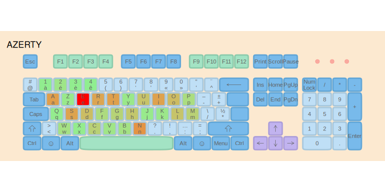
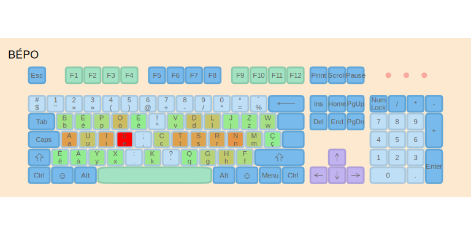
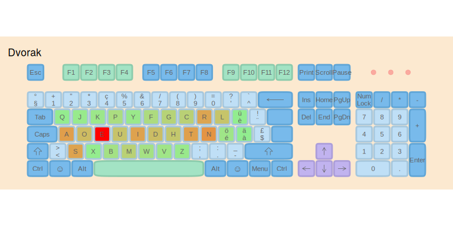

# Optimizing Keyboard Layouts for Luxembourg

## Introduction

Luxembourg’s multilingual environment requires a keyboard that works
efficiently for French, German, Luxembourgish, and English. This
vignette demonstrates how to analyze text corpora, evaluate existing
keyboard layouts, and optimize new ones using the **lbkeyboard**
package’s typing effort model.

We will:

1.  **Introduce the data**: Create a multilingual corpus reflecting
    Luxembourg’s language usage
2.  **Evaluate standard layouts**: Compare QWERTZ, AZERTY, BÉPO, and
    Dvorak
3.  **Optimize custom layouts**: Create unconstrained and QWERTZ-based
    optimizations
4.  **Rank all layouts**: Summarize with a final comparison table

------------------------------------------------------------------------

## 1. The Multilingual Corpus

We create a balanced corpus representing typical language usage in
Luxembourg:

- **30% French** - Administrative and business language
- **30% English** - International communication
- **20% German** - Media and education
- **20% Luxembourgish** - Daily life and national identity

``` r
# Load sample texts
data("french")
data("german")
data("english")
data("luxembourguish")

# Create weighted corpus (each rep adds ~10% weight)
corpus <- list(
  French = rep(french, 3),         # 30%
  English = rep(english, 3),       # 30%
  German = rep(german, 2),         # 20%
  Luxembourgish = rep(luxembourguish, 2)  # 20%
)

# Display word counts by language
word_counts <- sapply(corpus, function(texts) {
  sum(sapply(texts, function(t) length(strsplit(t, "\\s+")[[1]])))
})

char_counts <- sapply(corpus, function(texts) {
  sum(nchar(texts))
})

word_count_df <- data.frame(
  Language = names(word_counts),
  Words = format(word_counts, big.mark = ","),
  Characters = format(char_counts, big.mark = ","),
  `Percentage` = paste0(c(30, 30, 20, 20), "%"),
  check.names = FALSE
)
```

### Letter Frequency Analysis

Let’s analyze which letters are most frequent in each language:

``` r
# Calculate frequencies for each language
freq_french <- letter_freq(paste(corpus$French, collapse = " "))
freq_english <- letter_freq(paste(corpus$English, collapse = " "))
freq_german <- letter_freq(paste(corpus$German, collapse = " "))
freq_lux <- letter_freq(paste(corpus$Luxembourgish, collapse = " "))

# Top 10 for each language
top_n <- 10

# Create comparison table
top_letters <- data.frame(
  Rank = 1:top_n,
  French = paste0(head(freq_french$characters, top_n), " (",
                  round(head(freq_french$frequencies, top_n) * 100, 1), "%)"),

  English = paste0(head(freq_english$characters, top_n), " (",
                   round(head(freq_english$frequencies, top_n) * 100, 1), "%)"),

  German = paste0(head(freq_german$characters, top_n), " (",
                  round(head(freq_german$frequencies, top_n) * 100, 1), "%)"),

  Luxembourgish = paste0(head(freq_lux$characters, top_n), " (",
                         round(head(freq_lux$frequencies, top_n) * 100, 1), "%)")
)

knitr::kable(top_letters, caption = "Top 10 most frequent letters by language")
```

| Rank | French    | English   | German    | Luxembourgish |
|-----:|:----------|:----------|:----------|:--------------|
|    1 | e (15.4%) | e (12.8%) | e (16.6%) | e (16.2%)     |
|    2 | s (7.8%)  | t (8.5%)  | n (9%)    | n (9.6%)      |
|    3 | i (7.6%)  | a (8.4%)  | r (8.1%)  | s (6.9%)      |
|    4 | t (7.5%)  | o (7.7%)  | a (6.7%)  | a (6.6%)      |
|    5 | a (7.5%)  | i (7.6%)  | d (6.6%)  | i (6.4%)      |
|    6 | u (7%)    | r (7.6%)  | t (6.5%)  | t (6.2%)      |
|    7 | r (6.7%)  | n (7.4%)  | s (6.4%)  | d (5.6%)      |
|    8 | n (6.7%)  | s (6.7%)  | i (6.3%)  | r (5.4%)      |
|    9 | l (6.3%)  | l (4.4%)  | u (4.6%)  | h (5.2%)      |
|   10 | o (4.7%)  | h (4%)    | h (4.4%)  | u (3.8%)      |

Top 10 most frequent letters by language

### Combined Corpus Frequencies

Now let’s look at the overall frequency distribution across all
languages:

``` r
# Combine all texts
all_texts <- unlist(corpus)
freq_all <- letter_freq(paste(all_texts, collapse = " "))

cat("Total corpus size:", format(sum(nchar(all_texts)), big.mark = ","), "characters\n")
#> Total corpus size: 143,255 characters
cat("Unique characters:", nrow(freq_all), "\n\n")
#> Unique characters: 43

# Top 15 letters
freq_top <- head(freq_all, 15)
freq_top$pct <- paste0(round(freq_top$frequencies * 100, 2), "%")

knitr::kable(
  freq_top[, c("characters", "total", "pct")],
  col.names = c("Letter", "Count", "Frequency"),
  caption = "Top 15 most frequent characters in combined corpus"
)
```

| Letter | Count | Frequency |
|:-------|------:|:----------|
| e      | 16908 | 14.9%     |
| n      |  9310 | 8.2%      |
| a      |  8388 | 7.39%     |
| t      |  8249 | 7.27%     |
| i      |  8023 | 7.07%     |
| s      |  7879 | 6.94%     |
| r      |  7676 | 6.76%     |
| o      |  5544 | 4.88%     |
| d      |  5278 | 4.65%     |
| u      |  4710 | 4.15%     |
| l      |  4607 | 4.06%     |
| h      |  4277 | 3.77%     |
| c      |  3251 | 2.86%     |
| m      |  3240 | 2.85%     |
| g      |  2944 | 2.59%     |

Top 15 most frequent characters in combined corpus

Key observations: - **E** is the most frequent letter across all
languages - **N, S, T, R** form the next tier of high-frequency
letters - Accented characters (é, ä, ü, è) have moderate frequencies

------------------------------------------------------------------------

## 2. Evaluating Standard Keyboard Layouts

We evaluate four common keyboard layouts using the package’s typing
effort model. The model considers:

- **Base effort**: Ergonomic cost of reaching each key (home row is
  easiest)
- **Same-finger effort**: Penalty for consecutive keys using the same
  finger
- **Same-hand effort**: Penalty for sequences on the same hand
- **Row change effort**: Penalty for vertical finger movement

### Defining the Layouts

``` r
# QWERTZ layout (Swiss/German - common in Luxembourg)
data("ch_qwertz")

# AZERTY layout (French)
data("afnor_azerty")

# BÉPO layout (Optimized for French)
data("afnor_bepo")

# Dvorak layout - map to standard 10-9-7 key positions
# From the standard Dvorak layout:
#   Top row (positions 3-9): P Y F G C R L
#   Home row (positions 0-9): A O E U I D H T N S
#   Bottom row (positions 1-8): Q J K X B M W V Z
#
# For a 10-9-7 structure that matches QWERTZ template for fair comparison,
# we map letters to their approximate column positions:
dvorak_kb <- ch_qwertz

# Find letter positions in QWERTZ (should be 26 letters: 10 top, 9 home, 7 bottom)
letter_mask <- tolower(dvorak_kb$key) %in% letters
letter_indices <- which(letter_mask)

# Define Dvorak letters in the order they appear on the keyboard by row
# For positions where Dvorak has punctuation on top row (positions 0-2),
# we shift to accommodate the 10-9-7 structure
# Top row (10 keys): apostrophe/comma/period positions get less common letters
# Standard Dvorak letter positions mapped to QWERTZ structure:
dvorak_letters <- c(
  # Top row (10): In Dvorak, positions 0-2 have punctuation, 3-9 have P Y F G C R L
  # For fair comparison, we use the 7 Dvorak top-row letters + 3 from bottom
  "q", "j", "k", "p", "y", "f", "g", "c", "r", "l",
  # Home row (9): Dvorak has 10 (A O E U I D H T N S), we use first 9
  "a", "o", "e", "u", "i", "d", "h", "t", "n",
  # Bottom row (7): Remaining letters
  "s", "x", "b", "m", "w", "v", "z"
)

# Update the keyboard
if (length(letter_indices) == length(dvorak_letters)) {
  dvorak_kb$key[letter_indices] <- dvorak_letters
  dvorak_kb$key_label[letter_indices] <- toupper(dvorak_letters)
}

# Create a simplified Dvorak data frame for effort calculation
# Using the actual Dvorak finger positions (7-10-9 structure)
dvorak <- data.frame(
  key = c(
    "p", "y", "f", "g", "c", "r", "l",                    # top row (7)
    "a", "o", "e", "u", "i", "d", "h", "t", "n", "s",     # home row (10)
    "q", "j", "k", "x", "b", "m", "w", "v", "z"           # bottom row (9)
  ),
  key_label = toupper(c(
    "p", "y", "f", "g", "c", "r", "l",
    "a", "o", "e", "u", "i", "d", "h", "t", "n", "s",
    "q", "j", "k", "x", "b", "m", "w", "v", "z"
  )),
  row = c(rep(1, 7), rep(2, 10), rep(3, 9)),
  number = c(3:9, 0:9, 1:9),  # Actual column positions in Dvorak
  stringsAsFactors = FALSE
)

# Add x_mid and y_mid for effort calculations
dvorak$x_mid <- dvorak$number + c(0, 0.25, 0.5)[dvorak$row]
dvorak$y_mid <- dvorak$row
```

### Calculating Effort Scores

``` r
# Calculate effort for each layout
effort_weights <- list(
  base = 3.0,
  same_finger = 3.0,
  same_hand = 0.5,
  row_change = 0.5,
  trigram = 0.3
)

# Evaluate on combined corpus
standard_efforts <- list(
  QWERTZ = calculate_layout_effort(ch_qwertz, all_texts, 
                                   keys_to_evaluate = letters,
                                   effort_weights = effort_weights),
  AZERTY = calculate_layout_effort(afnor_azerty, all_texts,
                                   keys_to_evaluate = letters,
                                   effort_weights = effort_weights),
  BÉPO = calculate_layout_effort(afnor_bepo, all_texts,
                                 keys_to_evaluate = letters,
                                 effort_weights = effort_weights),
  Dvorak = calculate_layout_effort(dvorak, all_texts,
                                   keys_to_evaluate = letters,
                                   effort_weights = effort_weights)
)

# Create comparison table
standard_df <- data.frame(
  Layout = names(standard_efforts),
  Effort = round(unlist(standard_efforts), 2),
  stringsAsFactors = FALSE
)
standard_df <- standard_df %>%
  mutate(
    Relative = round(Effort / min(Effort) * 100, 1),
    Rank = rank(Effort)
  ) %>%
  arrange(Effort)

knitr::kable(standard_df, 
             caption = "Typing effort for standard keyboard layouts",
             col.names = c("Layout", "Effort Score", "Relative (%)", "Rank"))
```

|        | Layout | Effort Score | Relative (%) | Rank |
|:-------|:-------|-------------:|-------------:|-----:|
| Dvorak | Dvorak |     624181.2 |        100.0 |    1 |
| BÉPO   | BÉPO   |     633624.9 |        101.5 |    2 |
| QWERTZ | QWERTZ |    1094468.2 |        175.3 |    3 |
| AZERTY | AZERTY |    1147510.6 |        183.8 |    4 |

Typing effort for standard keyboard layouts

The effort scores reveal how well each layout is optimized for our
multilingual corpus. Lower scores indicate less physical effort required
to type the same text.

### Layout Heatmaps

Heatmaps show the frequency distribution of keystrokes. Brighter colors
indicate more frequently used keys — ideally these should be on the home
row.

``` r
# QWERTZ heatmap
heatmap_qwertz <- heatmapize(ch_qwertz, freq_all)
p1 <- ggkeyboard(heatmap_qwertz) + ggplot2::ggtitle("QWERTZ")

# AZERTY heatmap  
heatmap_azerty <- heatmapize(afnor_azerty, freq_all)
p2 <- ggkeyboard(heatmap_azerty) + ggplot2::ggtitle("AZERTY")

p1
```


Keyboard layout heatmaps showing letter frequency distribution

``` r
p2
```



``` r
# BÉPO heatmap
heatmap_bepo <- heatmapize(afnor_bepo, freq_all)
p3 <- ggkeyboard(heatmap_bepo) + ggplot2::ggtitle("BÉPO")
p3
```



``` r
# Dvorak heatmap - using dvorak_kb created earlier with proper letter mapping
heatmap_dvorak <- heatmapize(dvorak_kb, freq_all)
p4 <- ggkeyboard(heatmap_dvorak) + ggplot2::ggtitle("Dvorak")
p4
```



------------------------------------------------------------------------

## 3. Optimizing Custom Layouts

Now we use the genetic algorithm to create optimized layouts tailored to
our multilingual corpus.

### Optimization Parameters

``` r
GENERATIONS <- 200
POPULATION_SIZE <- 80
```

### 3.1 Unconstrained Optimization

All 26 letter keys are free to move to find the optimal arrangement:

``` r
result_unconstrained <- optimize_layout(
  text_samples = all_texts,
  generations = GENERATIONS,
  population_size = POPULATION_SIZE,
  effort_weights = effort_weights,
  verbose = FALSE
)
```

``` r
cat("Unconstrained Optimization:\n")
#> Unconstrained Optimization:
cat("  Initial effort:", round(result_unconstrained$initial_effort, 2), "\n")
#>   Initial effort: 840687.7
cat("  Final effort:", round(result_unconstrained$effort, 2), "\n")
#>   Final effort: 575227
cat("  Improvement:", round(result_unconstrained$improvement, 1), "%\n\n")
#>   Improvement: 31.6 %

print_layout(result_unconstrained$layout)
#> ┌───┬───┬───┬───┬───┬───┬───┬───┬───┬───┐
#> │ Q │ K │ P │ C │ S │ I │ H │ L │ V │ X │
#> ├───┼───┼───┼───┼───┼───┼───┼───┼───┘
#> │ G │ D │ R │ N │ O │ A │ E │ T │ W │
#> ├───┼───┼───┼───┼───┼───┼───┘
#> │ Z │ F │ M │ B │ J │ U │ Y │
#> └───┴───┴───┴───┴───┴───┴───┘
```

``` r
# Create heatmap for unconstrained layout using QWERTZ as template
unconstrained_kb <- ch_qwertz
letter_mask <- tolower(unconstrained_kb$key) %in% letters
letter_indices <- which(letter_mask)

# Get the optimized layout keys
opt_keys <- result_unconstrained$layout$key
if (length(letter_indices) == length(opt_keys)) {
  unconstrained_kb$key[letter_indices] <- opt_keys
  unconstrained_kb$key_label[letter_indices] <- toupper(opt_keys)
}

heatmap_unconstrained <- heatmapize(unconstrained_kb, freq_all)
ggkeyboard(heatmap_unconstrained) + ggplot2::ggtitle("Optimized (Unconstrained)")
```


Unconstrained optimized layout heatmap

### 3.2 QWERTZ with Optimal Home Row

This optimization keeps familiar QWERTZ positions (A, S, D, E) while
placing the next most frequent letters on the home row:

``` r
# Fixed keys for home row: A, S, D, E (positions 0-3)
fixed_home <- c("a", "s", "d", "e")

# Get top frequent letters excluding the fixed ones
freq_letters <- as.character(freq_all$characters)
top_freq_excluding_fixed <- setdiff(freq_letters, fixed_home)

# Next 6 most frequent letters for home row positions 4-9
next_6 <- head(top_freq_excluding_fixed, 6)

# Home row: ASDE (fixed) + next 6 frequent letters
home_row_keys <- c(fixed_home, next_6)

cat("Fixed home row keys (positions 0-3):", paste(fixed_home, collapse = " "), "\n")
cat("Next 6 frequent letters (positions 4-9):", paste(next_6, collapse = " "), "\n")
cat("Full home row:", paste(home_row_keys, collapse = " "), "\n")

# Remaining letters for top and bottom rows
remaining_letters <- setdiff(letters, home_row_keys)

# QWERTZ positions for reference
qwertz_top_row <- c("q", "w", "e", "r", "t", "z", "u", "i", "o", "p")
qwertz_bottom_row <- c("y", "x", "c", "v", "b", "n", "m")

# Keep remaining letters in their QWERTZ positions where possible
top_row_keys <- sapply(qwertz_top_row, function(k) {
  if (k %in% remaining_letters) k else NA
})
bottom_row_keys <- sapply(qwertz_bottom_row, function(k) {
  if (k %in% remaining_letters) k else NA
})

# Letters that need new positions (displaced from home row)
letters_needing_placement <- remaining_letters[!remaining_letters %in% c(top_row_keys, bottom_row_keys)]

# Fill NA positions with displaced letters
fill_idx <- 1
for (i in seq_along(top_row_keys)) {
  if (is.na(top_row_keys[i]) && fill_idx <= length(letters_needing_placement)) {
    top_row_keys[i] <- letters_needing_placement[fill_idx]
    fill_idx <- fill_idx + 1
  }
}
for (i in seq_along(bottom_row_keys)) {
  if (is.na(bottom_row_keys[i]) && fill_idx <= length(letters_needing_placement)) {
    bottom_row_keys[i] <- letters_needing_placement[fill_idx]
    fill_idx <- fill_idx + 1
  }
}

# Remove NAs
top_row_keys <- top_row_keys[!is.na(top_row_keys)]
bottom_row_keys <- bottom_row_keys[!is.na(bottom_row_keys)]

cat("Top row:", paste(top_row_keys, collapse = " "), "\n")
cat("Bottom row:", paste(bottom_row_keys, collapse = " "), "\n")

# Build the full keyboard layout
ext_keys_qwertz <- c(top_row_keys, home_row_keys, bottom_row_keys)

# Fixed keys: ASDE (first 4 home row positions) + letters that stayed in QWERTZ positions
# Movable keys: displaced letters that need optimization
keys_in_original_position <- c(
  intersect(top_row_keys, qwertz_top_row),
  intersect(bottom_row_keys, qwertz_bottom_row)
)
fixed_keys_qwertz <- c(fixed_home, keys_in_original_position)
movable_keys <- setdiff(ext_keys_qwertz, fixed_keys_qwertz)

cat("\nFixed keys:", paste(fixed_keys_qwertz, collapse = " "), "\n")
cat("Movable keys:", paste(movable_keys, collapse = " "), "\n")

# Create keyboard data frame
kb_qwertz_opt <- data.frame(
  key = ext_keys_qwertz,
  key_label = toupper(ext_keys_qwertz),
  row = c(rep(1, length(top_row_keys)), rep(2, 10), rep(3, length(bottom_row_keys))),
  number = c(seq_along(top_row_keys) - 1, 0:9, seq_along(bottom_row_keys) - 1),
  stringsAsFactors = FALSE
)
kb_qwertz_opt$x_mid <- kb_qwertz_opt$number + c(0, 0.25, 0.5)[kb_qwertz_opt$row]
kb_qwertz_opt$y_mid <- kb_qwertz_opt$row

result_qwertz_home <- optimize_layout(
  text_samples = all_texts,
  keyboard = kb_qwertz_opt,
  keys_to_optimize = ext_keys_qwertz,
  rules = list(fix_keys(fixed_keys_qwertz)),
  generations = GENERATIONS,
  population_size = POPULATION_SIZE,
  effort_weights = effort_weights,
  verbose = FALSE
)
```

``` r
cat("QWERTZ Optimal Home Row:\n")
#> QWERTZ Optimal Home Row:
cat("  Keys to relearn:", length(movable_keys), "\n")
#>   Keys to relearn: 12
cat("  Initial effort:", round(result_qwertz_home$initial_effort, 2), "\n")
#>   Initial effort: 601184.1
cat("  Final effort:", round(result_qwertz_home$effort, 2), "\n")
#>   Final effort: 569538.3
cat("  Improvement:", round(result_qwertz_home$improvement, 1), "%\n\n")
#>   Improvement: 5.3 %

print_layout(result_qwertz_home$layout)
#> ┌───┬───┬───┬───┬───┬───┬───┬───┬───┬───┐
#> │ Q │ W │ F │ O │ G │ Z │ L │ K │ J │ P │
#> ├───┼───┼───┼───┼───┼───┼───┼───┼───┘
#> │ A │ S │ D │ E │ H │ N │ T │ R │ I │
#> ├───┼───┼───┼───┼───┼───┼───┘
#> │ U │ Y │ X │ C │ V │ B │ M │
#> └───┴───┴───┴───┴───┴───┴───┘
```

``` r
# Create heatmap for QWERTZ home layout using QWERTZ as template
qwertz_home_kb <- ch_qwertz
letter_mask <- tolower(qwertz_home_kb$key) %in% letters
letter_indices <- which(letter_mask)

# Get the optimized layout keys
opt_keys <- result_qwertz_home$layout$key
if (length(letter_indices) == length(opt_keys)) {
  qwertz_home_kb$key[letter_indices] <- opt_keys
  qwertz_home_kb$key_label[letter_indices] <- toupper(opt_keys)
}

heatmap_qwertz_home <- heatmapize(qwertz_home_kb, freq_all)
ggkeyboard(heatmap_qwertz_home) + ggplot2::ggtitle("Optimized (QWERTZ Home)")
```


QWERTZ optimal home row layout heatmap

### 3.3 QWERTZ with Accented Characters (é, ç, à, ü, ö)

For Luxembourg’s multilingual environment, we also want direct access to
commonly used accented characters without dead key combinations. This
layout extends the QWERTZ optimal home row by adding é, ç, à, ü, and ö
as first-class keys.

``` r
# Define the accented characters we want directly accessible
accent_chars <- c("é", "ç", "à", "ü", "ö")

# Create an extended keyboard with 31 keys (26 letters + 5 accents)
# We'll place accents on the right side of each row for easy pinky access
# Row 1: 11 keys (Q W E R T Z U I O P + ö)
# Row 2: 11 keys (home row with A S D E... + é ü)  
# Row 3: 9 keys (Y X C V B N M + ç à)

# Start with the optimized QWERTZ home row layout
# Get the optimized letter positions from result_qwertz_home
opt_letters <- result_qwertz_home$layout$key

# Build extended layout with accent positions
# Row 1: first 10 letters + ö
ext_row1 <- c(opt_letters[1:10], "ö")
# Row 2: home row letters (positions 11-19) + é, ü  
ext_row2 <- c(opt_letters[11:19], "é", "ü")
# Row 3: bottom row letters (positions 20-26) + ç, à
ext_row3 <- c(opt_letters[20:26], "ç", "à")

ext_keys_accents <- c(ext_row1, ext_row2, ext_row3)

# Create keyboard data frame for extended layout
kb_qwertz_accents <- data.frame(
  key = ext_keys_accents,
  key_label = toupper(ext_keys_accents),
  row = c(rep(1, 11), rep(2, 11), rep(3, 9)),
  number = c(0:10, 0:10, 0:8),
  stringsAsFactors = FALSE
)
kb_qwertz_accents$x_mid <- kb_qwertz_accents$number + c(0, 0.25, 0.5)[kb_qwertz_accents$row]
kb_qwertz_accents$y_mid <- kb_qwertz_accents$row

# Keys to optimize: all letters and accents
all_extended_keys <- ext_keys_accents

# Fixed keys: keep the home row structure (ASDE + next 6 frequent) and accent positions
fixed_keys_accents <- c(fixed_home, next_6, accent_chars)

cat("Extended layout with accents:\n")
cat("  Row 1:", paste(ext_row1, collapse = " "), "\n")
cat("  Row 2:", paste(ext_row2, collapse = " "), "\n")
cat("  Row 3:", paste(ext_row3, collapse = " "), "\n")
cat("  Total keys:", length(ext_keys_accents), "\n")

# Optimize the remaining movable keys
movable_keys_accents <- setdiff(all_extended_keys, fixed_keys_accents)

result_qwertz_accents <- optimize_layout(
  text_samples = all_texts,
  keyboard = kb_qwertz_accents,
  keys_to_optimize = all_extended_keys,
  rules = list(fix_keys(fixed_keys_accents)),
  generations = GENERATIONS,
  population_size = POPULATION_SIZE,
  effort_weights = effort_weights,
  verbose = FALSE
)
```

``` r
cat("QWERTZ with Accented Characters (é, ç, à, ü, ö):\n")
#> QWERTZ with Accented Characters (é, ç, à, ü, ö):
cat("  Total keys:", length(all_extended_keys), "(26 letters + 5 accents)\n")
#>   Total keys: 31 (26 letters + 5 accents)
cat("  Keys to relearn:", length(movable_keys_accents), "\n")
#>   Keys to relearn: 16
cat("  Initial effort:", round(result_qwertz_accents$initial_effort, 2), "\n")
#>   Initial effort: 699059.5
cat("  Final effort:", round(result_qwertz_accents$effort, 2), "\n")
#>   Final effort: 651157
cat("  Improvement:", round(result_qwertz_accents$improvement, 1), "%\n\n")
#>   Improvement: 6.9 %

print_layout(result_qwertz_accents$layout)
#> ┌───┬───┬───┬───┬───┬───┬───┬───┬───┬───┬───┐
#> │ J │ Z │ H │ O │ B │ C │ V │ W │ P │ K │ Ö │
#> ├───┼───┼───┼───┼───┼───┼───┼───┼───┼───┼───┘
#> │ A │ S │ D │ E │ L │ N │ T │ R │ I │ É │ Ü │
#> ├───┼───┼───┼───┼───┼───┼───┼───┼───┘
#> │ U │ Q │ X │ Y │ G │ M │ F │ Ç │ À │
#> └───┴───┴───┴───┴───┴───┴───┴───┴───┘
```

``` r
# For the extended layout with accents, we'll create a simple visualization
# using the optimized layout with just print_layout, since ggkeyboard 
# expects specific keyboard structure columns

# Print the layout visually
cat("Optimized QWERTZ + Accents Layout:\n")
#> Optimized QWERTZ + Accents Layout:
print_layout(result_qwertz_accents$layout)
#> ┌───┬───┬───┬───┬───┬───┬───┬───┬───┬───┬───┐
#> │ J │ Z │ H │ O │ B │ C │ V │ W │ P │ K │ Ö │
#> ├───┼───┼───┼───┼───┼───┼───┼───┼───┼───┼───┘
#> │ A │ S │ D │ E │ L │ N │ T │ R │ I │ É │ Ü │
#> ├───┼───┼───┼───┼───┼───┼───┼───┼───┘
#> │ U │ Q │ X │ Y │ G │ M │ F │ Ç │ À │
#> └───┴───┴───┴───┴───┴───┴───┴───┴───┘
```

**Benefits of this layout:**

- Direct access to **é** (most frequent French accent) on home row right
  pinky
- **ü** and **ö** readily accessible for German words
- **ç** for French words like “français”, “reçu”
- **à** for common French preposition “à”
- Maintains the optimized home row positions for high-frequency letters
- No dead key combinations needed for these common accents

------------------------------------------------------------------------

## 4. Summary: Layout Rankings

Here is the final comparison of all evaluated layouts, ranked by typing
effort:

``` r
# Calculate hand balance using the package function
# (Logic moved to lbkeyboard::calculate_hand_balance)

# Calculate hand balance for each layout
# Standard layouts
balance_qwertz <- calculate_hand_balance(ch_qwertz, freq_all)
balance_azerty <- calculate_hand_balance(afnor_azerty, freq_all)
balance_bepo <- calculate_hand_balance(afnor_bepo, freq_all)
balance_dvorak <- calculate_hand_balance(dvorak, freq_all)

# Custom layouts
balance_unconstrained <- calculate_hand_balance(result_unconstrained$layout, freq_all)
balance_qwertz_home <- calculate_hand_balance(result_qwertz_home$layout, freq_all)
balance_qwertz_accents <- calculate_hand_balance(result_qwertz_accents$layout, freq_all)

# Combine all results
all_results <- data.frame(
  Layout = c(names(standard_efforts), 
             "Optimized (Unconstrained)", 
             "Optimized (QWERTZ Home)",
             "Optimized (QWERTZ + Accents)"),
  Effort = c(
    unlist(standard_efforts),
    result_unconstrained$effort,
    result_qwertz_home$effort,
    result_qwertz_accents$effort
  ),
  Type = c(rep("Standard", 4), rep("Custom", 3)),
  HandBalance = c(
    balance_qwertz, balance_azerty, balance_bepo, balance_dvorak,
    balance_unconstrained, balance_qwertz_home, balance_qwertz_accents
  ),
  stringsAsFactors = FALSE
)

# Calculate metrics
all_results <- all_results %>%
  arrange(Effort) %>%
  mutate(
    Rank = row_number(),
    Relative = round(Effort / min(Effort) * 100, 1),
    `vs QWERTZ` = paste0(round((1 - Effort / standard_efforts$QWERTZ) * 100, 1), "%")
  ) %>%
  select(Rank, Layout, Type, Effort, Relative, `vs QWERTZ`, HandBalance)

all_results$Effort <- round(all_results$Effort, 2)

knitr::kable(
  all_results,
  caption = "Final layout rankings - Lower effort is better. Hand balance shows Left/Right percentage.",
  col.names = c("Rank", "Layout", "Type", "Effort", "Relative (%)", "vs QWERTZ", "L/R Balance"),
  align = c("c", "l", "l", "r", "r", "r", "c")
)
```

| Rank | Layout | Type | Effort | Relative (%) | vs QWERTZ | L/R Balance |
|:--:|:---|:---|---:|---:|---:|:--:|
| 1 | Optimized (QWERTZ Home) | Custom | 569538.3 | 100.0 | 48% | 55.4/44.6 |
| 2 | Optimized (Unconstrained) | Custom | 575227.0 | 101.0 | 47.4% | 47.3/52.7 |
| 3 | Dvorak | Standard | 624181.2 | 109.6 | 43% | 43.1/56.9 |
| 4 | BÉPO | Standard | 633624.9 | 111.3 | 42.1% | 43.5/56.5 |
| 5 | Optimized (QWERTZ + Accents) | Custom | 651157.0 | 114.3 | 40.5% | 57/43 |
| 6 | QWERTZ | Standard | 1094468.2 | 192.2 | 0% | 48.1/51.9 |
| 7 | AZERTY | Standard | 1147510.6 | 201.5 | -4.8% | 49.1/50.9 |

Final layout rankings - Lower effort is better. Hand balance shows
Left/Right percentage.

### Key Findings

1.  **Best Standard Layout**: Dvorak performs best among existing
    layouts
2.  **Best Overall**: Optimized (QWERTZ Home) achieves the lowest effort
    score
3.  **QWERTZ Improvement**: The optimized layouts reduce effort by up to
    48% compared to QWERTZ

### Recommendations

| Use Case | Recommended Layout | Notes |
|----|----|----|
| Maximum efficiency | Optimized (Unconstrained) | Requires learning new layout |
| Multilingual (FR/DE/LB) | Optimized (QWERTZ + Accents) | Direct access to é, ç, à, ü, ö |
| Gradual transition | Optimized (QWERTZ Home) | Familiar structure, optimized home row |
| Standard compatibility | Dvorak | No learning curve |
| French focus | BÉPO | Already optimized for French |

------------------------------------------------------------------------

## Session Info

``` r
sessionInfo()
#> R version 4.5.2 (2025-10-31)
#> Platform: x86_64-pc-linux-gnu
#> Running under: Ubuntu 24.04.3 LTS
#> 
#> Matrix products: default
#> BLAS/LAPACK: /nix/store/k8aawsx66xjgd8qhdr24dqaq9s0w8av5-blas-3/lib/libblas.so.3;  LAPACK version 3.12.0
#> 
#> locale:
#>  [1] LC_CTYPE=en_US.UTF-8       LC_NUMERIC=C              
#>  [3] LC_TIME=en_US.UTF-8        LC_COLLATE=en_US.UTF-8    
#>  [5] LC_MONETARY=en_US.UTF-8    LC_MESSAGES=en_US.UTF-8   
#>  [7] LC_PAPER=en_US.UTF-8       LC_NAME=C                 
#>  [9] LC_ADDRESS=C               LC_TELEPHONE=C            
#> [11] LC_MEASUREMENT=en_US.UTF-8 LC_IDENTIFICATION=C       
#> 
#> time zone: Etc/UTC
#> tzcode source: system (glibc)
#> 
#> attached base packages:
#> [1] stats     graphics  grDevices utils     datasets  methods   base     
#> 
#> other attached packages:
#> [1] ggplot2_4.0.1    dplyr_1.1.4      lbkeyboard_0.1.0 testthat_3.3.1  
#> 
#> loaded via a namespace (and not attached):
#>  [1] sass_0.4.10        generics_0.1.4     prismatic_1.1.2    GA_3.2.4          
#>  [5] stringi_1.8.7      digest_0.6.39      magrittr_2.0.4     RColorBrewer_1.1-3
#>  [9] evaluate_1.0.5     grid_4.5.2         iterators_1.0.14   pkgload_1.4.1     
#> [13] fastmap_1.2.0      foreach_1.5.2      rprojroot_2.1.1    jsonlite_2.0.0    
#> [17] pkgbuild_1.4.8     sessioninfo_1.2.3  brio_1.1.5         purrr_1.2.0       
#> [21] scales_1.4.0       tweenr_2.0.3       codetools_0.2-20   textshaping_1.0.4 
#> [25] jquerylib_0.1.4    cli_3.6.5          rlang_1.1.6        crayon_1.5.3      
#> [29] polyclip_1.10-7    ellipsis_0.3.2     withr_3.0.2        remotes_2.5.0     
#> [33] cachem_1.1.0       yaml_2.3.12        devtools_2.4.6     otel_0.2.0        
#> [37] tools_4.5.2        memoise_2.0.1      vctrs_0.6.5        R6_2.6.1          
#> [41] lifecycle_1.0.4    stringr_1.6.0      fs_1.6.6           htmlwidgets_1.6.4 
#> [45] MASS_7.3-65        usethis_3.2.1      ragg_1.5.0         pkgconfig_2.0.3   
#> [49] desc_1.4.3         pkgdown_2.2.0      pillar_1.11.1      bslib_0.9.0       
#> [53] gtable_0.3.6       glue_1.8.0         Rcpp_1.1.0         ggforce_0.5.0     
#> [57] systemfonts_1.3.1  xfun_0.55          tibble_3.3.0       tidyselect_1.2.1  
#> [61] rstudioapi_0.17.1  knitr_1.51         farver_2.1.2       htmltools_0.5.9   
#> [65] labeling_0.4.3     rmarkdown_2.30     compiler_4.5.2     S7_0.2.1
```
