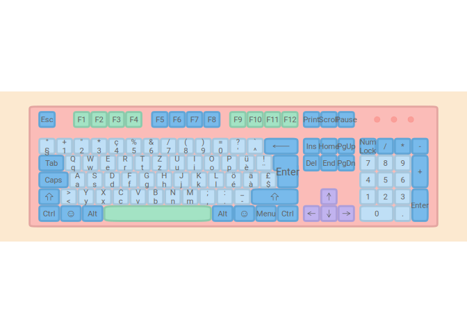
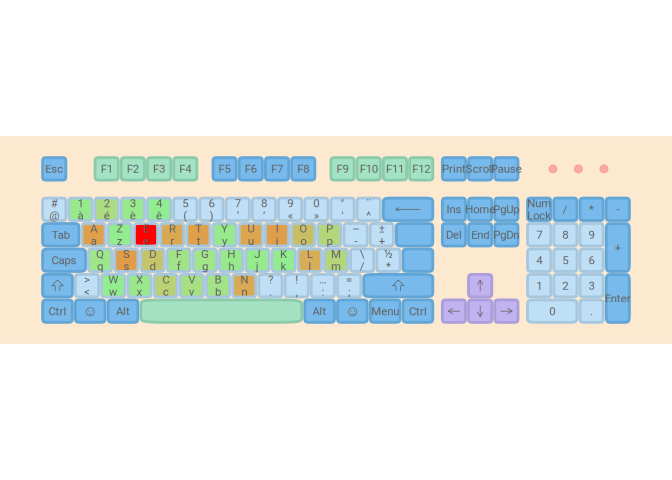

# lbkeyboard

lbkeyboard provides several functions to generate optimized keyboard
layouts for Luxembourg; this means that the layout needs to work well
with French, German, Luxembourguish and English. These 4 languages are
the most used languages in the country, with French being (very likely)
the most used language.

## Installation

You can install the development version of lbkeyboard from
[GitHub](https://github.com/) with:

``` r
# install.packages("devtools")
devtools::install_github("b-rodrigues/lbkeyboard")
```

## Example

For now, this package only allows you to create a plot of several
layouts.

``` r
library(lbkeyboard)
## basic example code
```

Here is the BÉPO layout:

``` r
ggkeyboard(keyboard = afnor_bepo, layout = "iso")
```


and here the AZERTY layout:

``` r
ggkeyboard(keyboard = afnor_azerty, layout = "iso")
```


AZERTY and BÉPO are the layouts used in France; AZERTY is, by a very
wide margin, the most used layout in France. BÉPO is an optimized layout
for the French layout.

In Luxembourg, the most used layout is the Swiss French (or German,
depending on the user’s preferences):

``` r
ggkeyboard(keyboard = ch_qwertz, layout = "iso")
```



It is also possible to generate heatmaps. First, let’s load some French
text:

``` r
data("french")
```

Then, let’s compute the frequency of the letters:

``` r
letter_freq_df <- letter_freq(french)
```

Let’s add the colours:

``` r
heatmap_azerty <- heatmapize(afnor_azerty, letter_freq_df)
```

Let’s plot the heatmap:

``` r
ggkeyboard(heatmap_azerty)
#> Warning: Removed 1 rows containing non-finite values (stat_ellip).
#> Warning: Removed 6 rows containing non-finite values (stat_ellip).
```



Let’s compare to the BÉPO layout:

``` r
heatmap_bepo <- heatmapize(afnor_bepo, letter_freq_df)
ggkeyboard(heatmap_bepo)
#> Warning: Removed 1 rows containing non-finite values (stat_ellip).
#> Warning: Removed 5 rows containing non-finite values (stat_ellip).
```


Let’s compare heatmaps for Swiss German (QWERTZ) and BÉPO for the German
language:

``` r
data("german")
letter_freq_de <- letter_freq(german)

heatmap_qwertz <- heatmapize(ch_qwertz, letter_freq_de)
heatmap_bepo_de <- heatmapize(afnor_bepo, letter_freq_de)

ggkeyboard(heatmap_qwertz)
#> Warning: Removed 1 rows containing non-finite values (stat_ellip).
#> Warning: Removed 4 rows containing non-finite values (stat_ellip).
```


``` r
ggkeyboard(heatmap_bepo_de)
#> Warning: Removed 1 rows containing non-finite values (stat_ellip).
#> Removed 4 rows containing non-finite values (stat_ellip).
```


Even though BÉPO is originally a layout optimized for the French
language, we can see from the heatmap that the most frequently used
letters are in the home row, which is not the case for the Swiss German
(QWERTZ layout).

Let’s also generate some heatmaps for English:

``` r
data("english")
letter_freq_en <- letter_freq(english)

heatmap_qwertz <- heatmapize(ch_qwertz, letter_freq_en)
heatmap_bepo_en <- heatmapize(afnor_bepo, letter_freq_en)

ggkeyboard(heatmap_qwertz)
#> Warning: Removed 1 rows containing non-finite values (stat_ellip).
#> Warning: Removed 3 rows containing non-finite values (stat_ellip).
```


``` r
ggkeyboard(heatmap_bepo_en)
#> Warning: Removed 1 rows containing non-finite values (stat_ellip).
#> Removed 3 rows containing non-finite values (stat_ellip).
```


Here again, we see that the BÉPO layout seems to fare better than the
QWERTZ layout.

## Optimization algorithm

TBD

## Acknowledgment

This package uses some code from my fork of the
[ggkeyboard](https://github.com/b-rodrigues/ggkeyboard) package
(original package can be found
[here](https://github.com/sharlagelfand/ggkeyboard).
